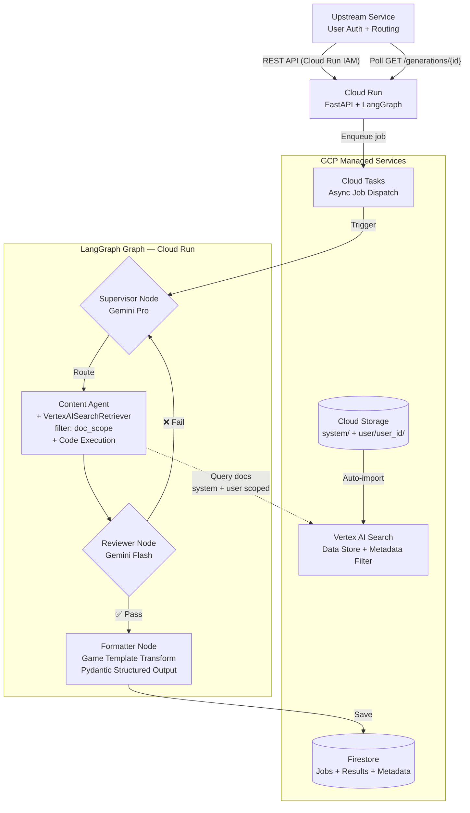
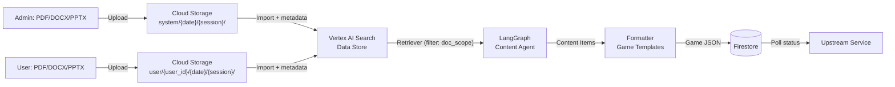

````markdown
---
phase: design
title: System Design & Architecture
description: Define the technical architecture, components, and data models
---

# System Design & Architecture

## Architecture Overview

**What is the high-level system structure?**

Architecture uses 100% GCP Managed Services. **LangGraph** is the sole core for business logic. **Vertex AI Search** completely replaces RAG pipeline. The system supports **two document sources**: system docs (Admin managed, always available) + user docs (personal, optional). Users can generate games immediately without uploading.

**AI Service is an internal microservice** — it does not receive requests directly from end-users. All requests come from **Upstream Service** (which has already authenticated the user). Generation requests run **async-first** via Cloud Tasks.

### High-Level Architecture


````

### Core Design

#### 1. LangGraph as the Center

All business logic resides in LangGraph StateGraph:

- **Routing logic** = Supervisor node + conditional edges (routes to specialized agent based on content type)
- **Domain logic** = Specialized agent nodes:
  - **Math Agent** (Phase 1): Code Execution for calculations
  - **Story Agent** (Phase 2): GraphRAG for narrative/timeline
  - **Visual Agent** (Phase 3): Multimodal Vision for images
  - **Structure Agent** (Phase 4): Table extraction for structured data
- **Quality control** = Reviewer node + feedback loop edges
- **Output formatting** = Formatter node + Game Template system
- **State management** = LangGraph checkpoint (Firestore)

Extension = add node + edge to graph, don't change core structure. Each specialized agent is a separate node.

#### 2. Dual Document Sources

The system supports two document sources:

| Source          | GCS prefix        | Managed By | Metadata `user_id` |
| --------------- | ----------------- | ---------- | ------------------ |
| **System docs** | `system/`         | Admin      | `"__system__"`     |
| **User docs**   | `user/{user_id}/` | User       | `"{user_id}"`      |

```
GCS Bucket Structure:
gs://edu-game-docs-{project_id}/
├── system/                              # Admin-managed shared docs
│   ├── 2026-03-01/
│   │   └── {session_1}/
│   │       ├── math-11-textbook.pdf
│   │       └── physics-12-textbook.pdf
│   └── 2026-03-03/
│       └── {session_2}/
│           └── chemistry-10-textbook.pdf
├── user/                                # User personal docs
│   ├── {user_id}/
│   │   ├── 2026-03-03/
│   │   │   ├── {session_1}/
│   │   │   │   ├── math-11-lesson-plan.pdf
│   │   │   │   └── derivatives-slides.pptx
│   │   │   └── {session_2}/
│   │   │       └── physics-curriculum.docx
│   │   └── 2026-03-04/
│   │       └── ...
```

- **Admin upload:** GCS `system/{date}/{session}/` + metadata `user_id="__system__"`
- **User upload:** GCS `user/{user_id}/{date}/{session}/` + metadata `user_id="{user_id}"`
- **Query scoping (doc_scope):**
  - `"user"` → filter `user_id: ANY("{user_id}")`
  - `"system"` → filter `user_id: ANY("__system__")`
  - `"all"` (default) → filter `user_id: ANY("{user_id}", "__system__")` + **post-retrieval re-ranking: user docs ranked first, system docs supplement** (user-first)
- → User A cannot access User B's documents. User A can access system docs.

#### 3. Flexible Game Template System

```
Content Agent generates → Educational Content Items (generic Q&A)
                            ↓
Formatter receives game_types[] → applies Game Templates → output per type
```

All game types are based on Q&A foundation:

- **Content Items:** `{ question, answer, explanation, topic, difficulty, context_source }`
- **Game Template:** Pydantic schema + formatter prompt → transforms content items → game-specific JSON
- Adding game type = add 1 Pydantic model + 1 formatter prompt. No graph changes.

### Key Components

| Component                | Responsibility                                                                        | Model/Tech                                       |
| ------------------------ | ------------------------------------------------------------------------------------- | ------------------------------------------------ |
| **FastAPI Gateway**      | REST API, input validation, Cloud Run IAM auth, async job dispatch                    | FastAPI on Cloud Run                             |
| **Supervisor Node**      | Analyze request → classify content type → route to appropriate specialized agent      | Gemini Pro                                       |
| **Math Agent Node**      | Query Vertex AI Search + generate math content → Code Execution for calculations      | Gemini Pro + Code Exec + VertexAISearchRetriever |
| **Story Agent Node**     | Query Vertex AI Search + generate narrative content → GraphRAG for timeline/causality | Gemini Pro + GraphRAG (Phase 2)                  |
| **Visual Agent Node**    | Query Vertex AI Search + process images → Multimodal Vision for spatial analysis      | Gemini Pro Multimodal (Phase 3)                  |
| **Structure Agent Node** | Query Vertex AI Search + extract tables → Pattern matching for structured data        | Gemini Pro + Table Parser (Phase 4)              |
| **Reviewer Node**        | Check quality, grounding, accuracy                                                    | Gemini Flash                                     |
| **Formatter Node**       | Transform content items → game-specific JSON via templates                            | Gemini Flash + Structured Output                 |
| **Vertex AI Search**     | Document indexing + semantic retrieval + metadata filtering                           | Discovery Engine Data Store                      |
| **Firestore**            | Store JSON output, metadata, generations, user info                                   | Firestore Native Mode                            |
| **Cloud Storage**        | User document storage (`user/{user_id}/`) + system docs (`system/`)                   | GCS                                              |

### Technology Stack

| Layer          | Technology                                             | Rationale                                                               |
| -------------- | ------------------------------------------------------ | ----------------------------------------------------------------------- |
| Language       | Python 3.12+                                           | LangChain/LangGraph ecosystem                                           |
| API Framework  | FastAPI                                                | Async, type-safe, OpenAPI docs                                          |
| **Core Logic** | **LangGraph**                                          | **Stateful agent graph, feedback loop, checkpoint, extensible**         |
| LLM Framework  | LangChain Core                                         | Prompt templates, structured output, tool calling                       |
| LLM Provider   | Gemini Pro/Flash (Vertex AI)                           | Native agentic, code execution                                          |
| **Knowledge**  | **Vertex AI Search (Discovery Engine)**                | **Zero-code RAG: auto-index docs, semantic retrieval, metadata filter** |
| Retriever      | `VertexAISearchRetriever` (langchain-google-community) | LangChain-native, plugs into LangGraph                                  |
| Database       | Firestore                                              | Serverless, JSON-native, zero ops                                       |
| Object Storage | Cloud Storage                                          | Document upload: `system/` + `user/{user_id}/` folder isolation         |
| Deployment     | Cloud Run                                              | Serverless, auto-scale 0→N                                              |
| Async Jobs     | Cloud Tasks                                            | Reliable async dispatch, retry, dead-letter queue                       |
| Secrets        | Secret Manager                                         | Service configuration                                                   |
| Monitoring     | Cloud Logging + Cloud Trace                            | Structured logs, request tracing                                        |

## Data Models

**What data do we need to manage?**

### Core Entities

#### GenerationRequest (API Input)

```python
class GenerationRequest(BaseModel):
    user_id: str                           # Required: scope docs per user
    document_ids: list[str] | None = None  # Optional: specific documents
    topic: str | None = None               # Chapter/topic to focus on
    game_types: list[GameType]             # QUIZ | FLASHCARD | FILL_BLANK | ...
    num_questions: int = 10
    difficulty: DifficultyLevel = "medium"  # easy | medium | hard
    doc_scope: DocScope = "all"            # "user" | "system" | "all"
    language: str = "vi"
```

#### GameType (Extensible Enum)

```python
class GameType(str, Enum):
    QUIZ = "quiz"
    FLASHCARD = "flashcard"
    FILL_BLANK = "fill_blank"
    ADVENTURE = "adventure"      # Phase 2
    MATCHING = "matching"        # Phase 2
    TRUE_FALSE = "true_false"    # Phase 2
    ORDERING = "ordering"        # Phase 2
```

#### Educational Content Item (Internal — Q&A foundation)

```python
class ContentItem(BaseModel):
    """Base educational content — Q&A at its core."""
    question: str
    answer: str
    explanation: str
    topic: str
    difficulty: DifficultyLevel
    context_source: str                    # Which doc/page the content is from
    doc_scope: str                         # "system" or "user" — tracks origin
    computation_trace: str | None = None   # Code execution trace if math
```

#### Game-Specific Output Schemas (Templates)

```python
# --- Quiz ---
class QuizQuestion(BaseModel):
    id: str
    question: str
    options: list[QuizOption]              # 4 options
    correct_answer_index: int              # 0-3
    explanation: str
    difficulty: DifficultyLevel
    topic: str
    computation_trace: str | None = None

class QuizOption(BaseModel):
    text: str
    is_correct: bool

# --- Flashcard ---
class Flashcard(BaseModel):
    id: str
    front: str                             # Concept / formula / question
    back: str                              # Explanation + example
    topic: str
    difficulty: DifficultyLevel
    tags: list[str] = []

# --- Fill-in-blank ---
class FillBlankQuestion(BaseModel):
    id: str
    template: str                          # "Fe + __ HCl → ..."
    blanks: list[BlankSlot]
    explanation: str
    difficulty: DifficultyLevel
    topic: str

class BlankSlot(BaseModel):
    position: int
    correct_answer: str
    hint: str | None = None

# --- Adventure Q&A (future) ---
class AdventureNode(BaseModel):
    id: str
    narrative: str                         # Story context
    question: str
    choices: list[AdventureChoice]
    correct_choice_index: int
    consequence: str                       # What happens next
    topic: str

class AdventureChoice(BaseModel):
    text: str
    is_correct: bool
    feedback: str

# --- Matching (future) ---
class MatchingGame(BaseModel):
    id: str
    pairs: list[MatchPair]
    category: str
    topic: str

class MatchPair(BaseModel):
    left: str
    right: str
```

#### Game Template Registry

```python
GAME_TEMPLATES: dict[GameType, type[BaseModel]] = {
    GameType.QUIZ: QuizQuestion,
    GameType.FLASHCARD: Flashcard,
    GameType.FILL_BLANK: FillBlankQuestion,
    GameType.ADVENTURE: AdventureNode,      # Phase 2
    GameType.MATCHING: MatchingGame,         # Phase 2
}
# Adding new game type = add entry here + define Pydantic model
```

#### Unified Response

```python
class GameContentResponse(BaseModel):
    request_id: str
    user_id: str
    generated_at: datetime
    content: dict[str, list[dict]]         # { "quiz": [...], "flashcard": [...] }
    metadata: GenerationMetadata

class GenerationMetadata(BaseModel):
    total_generated: int
    total_passed_review: int
    total_rejected: int
    generation_time_seconds: float
    model_used: str
    vertex_search_queries: int
    game_types_generated: list[str]
    cost_estimate_usd: float | None = None
```

#### Document Record (Firestore)

```python
class DocumentRecord(BaseModel):
    document_id: str
    user_id: str                           # "__system__" for admin docs
    filename: str
    file_format: str                       # pdf | docx | pptx
    gcs_uri: str
    upload_date: str                       # YYYY-MM-DD
    session_id: str
    index_status: str                      # uploading | indexing | ready | failed
    subject: str | None = None
    scope: str = "user"                    # "user" | "system"
    created_at: datetime
```

#### LangGraph State

```python
class AgentState(TypedDict):
    request: GenerationRequest
    doc_scope: str                         # "user" | "system" | "all"
    search_context: list[str]              # Retrieved from Vertex AI Search
    content_items: list[dict]              # Generated ContentItems (generic Q&A)
    reviewed_items: list[dict]             # After reviewer pass
    rejected_items: list[dict]             # Failed review
    iteration_count: int                   # For feedback loop max retry
    final_output: GameContentResponse | None
    errors: list[str]
```

### Data Flow



## API Design

**How do components communicate?**

### External REST API

#### POST /api/v1/documents/upload

Upload user document → GCS → trigger Vertex AI Search Data Store import.

```
Request: multipart/form-data {
  file: PDF/DOCX/PPTX,
  user_id: str,
  subject: str (optional)
}
Response: {
  document_id, user_id, filename, file_format,
  gcs_uri, index_status: "indexing", scope: "user"
}
```

#### POST /api/v1/admin/documents/upload

Admin uploads system document → GCS `system/` → AI Search Data Store import.
Upstream calls with admin context (Cloud Run IAM).

```
Request: multipart/form-data {
  file: PDF/DOCX/PPTX,
  subject: str,
  grade: str (optional, e.g. "11")
}
Response: {
  document_id, user_id: "__system__", filename, file_format,
  gcs_uri, index_status: "indexing", scope: "system"
}
```

#### GET /api/v1/admin/documents

List all system documents. Upstream calls with admin context.

```
Response: { documents: DocumentRecord[], total: int }
```

#### DELETE /api/v1/admin/documents/{document_id}

Delete a system document. Upstream calls with admin context.

```
Response: { deleted: true }
```

#### GET /api/v1/documents/{document_id}/status

Check indexing status in Vertex AI Search.

```
Response: { document_id, index_status: "ready" | "indexing" | "failed" }
```

#### GET /api/v1/users/{user_id}/documents

List all documents for a user.

```
Response: { documents: DocumentRecord[], total: int }
```

#### POST /api/v1/generate

Generate game content (async). Returns `request_id` immediately, processes in background via Cloud Tasks.

```
Request: GenerationRequest (JSON) — includes user_id, doc_scope, topic, game_types...
Response: 202 { request_id, status: "processing", created_at }
```

#### GET /api/v1/generations/{request_id}

Get generation status and results.

```
Response: {
  request_id, status: "processing" | "completed" | "failed",
  content: GameContentResponse | null,
  error: string | null,
  created_at, completed_at
}
```

#### GET /api/v1/game-types

List available game types + their schemas.

```
Response: { game_types: [{ type, description, schema_example }] }
```

### Authentication (Service-to-service)

AI Service is an **internal service** — it only receives requests from Upstream Service that has already authenticated users.

- **Cloud Run IAM:** Upstream service account is granted `roles/run.invoker` → only upstream can call
- **Trusted `user_id`:** Upstream passes `user_id` in request body (already verified user at upstream)
- **Admin operations:** Upstream calls with `scope: "system"` — upstream has already authorized admin
- No API Key, no `X-User-Id` header, no `X-Admin-Key`

### Internal: API ↔ Cloud Tasks ↔ LangGraph ↔ GCP Services

- **API → Cloud Tasks:** Dispatch generation job via `google-cloud-tasks` SDK
- **Cloud Tasks → LangGraph:** Trigger execution endpoint on Cloud Run
- **LangGraph → Vertex AI Search:** via `VertexAISearchRetriever` + metadata filter (doc_scope-aware)
- **LangGraph → Gemini:** via `ChatVertexAI` (langchain-google-vertexai)
- **LangGraph → Firestore:** via `google-cloud-firestore` SDK
- **LangGraph Checkpoint:** Firestore or custom async checkpointer

## Component Breakdown

**What are the major building blocks?**

### Source Code Structure

```
src/
├── api/                        # FastAPI layer
│   ├── routes/
│   │   ├── documents.py        # User upload, list, status
│   │   ├── admin.py            # Admin upload/list/delete system docs
│   │   ├── generate.py         # Generate game content
│   │   └── game_types.py       # List available game types
│   ├── schemas/                # Pydantic request/response
│   │   ├── requests.py
│   │   ├── responses.py
│   │   └── game_content.py     # All game type schemas
│   └── deps.py                 # Cloud Run IAM verification, user_id extraction from body
├── graph/                      # LangGraph — ALL business logic
│   ├── builder.py              # StateGraph definition & compile
│   ├── state.py                # AgentState TypedDict
│   └── nodes/
│       ├── supervisor.py       # Routing logic (classify content type → route to specialist)
│       ├── math_agent.py       # Phase 1: Math/Physics/Chem + Code Execution
│       ├── story_agent.py      # Phase 2: History/Literature + GraphRAG
│       ├── visual_agent.py     # Phase 3: Geography/Biology + Multimodal Vision
│       ├── structure_agent.py  # Phase 4: Grammar/Tables + Table Extraction
│       ├── reviewer.py         # Quality check (Gemini Flash)
│       └── formatter.py        # Game template transform (Pydantic structured output)
├── templates/                  # Game type templates
│   ├── registry.py             # GAME_TEMPLATES dict
│   ├── quiz.py                 # Quiz schema + formatter prompt
│   ├── flashcard.py            # Flashcard schema + formatter prompt
│   └── fill_blank.py           # Fill-in-blank schema + formatter prompt
├── services/                   # GCP service wrappers (stateless)
│   ├── vertex_search.py        # VertexAISearchRetriever factory + doc_scope filter + user-first re-ranking
│   ├── llm.py                  # ChatVertexAI Pro/Flash factory
│   ├── document_store.py       # GCS upload (system/ + user/{user_id}/) + AI Search import
│   ├── firestore.py            # Firestore CRUD
│   └── task_queue.py           # Cloud Tasks dispatch for async generation
├── config/
│   └── settings.py             # Pydantic BaseSettings
└── main.py                     # FastAPI app init
```

### Key Design: `graph/` is the brain, `templates/` is the vocabulary

- `graph/builder.py` — defines the full `StateGraph`: nodes, edges, conditional routing, feedback loop
- `graph/nodes/*` — each node is a self-contained function that reads/writes `AgentState`
- `templates/*` — each game type has a schema (Pydantic) + formatter prompt
- Adding new agent = new file in `nodes/` + register in `builder.py`
- Adding new game type = new file in `templates/` + register in `registry.py`

## Design Decisions

**Why did we choose this approach?**

### DD-1: Vertex AI Search replaces self-built RAG pipeline

- **Decision:** Vertex AI Search (Discovery Engine) Data Store for knowledge retrieval.
- **Rationale:** Zero code indexing/chunking/embedding. Upload docs → auto-index → query via `VertexAISearchRetriever`. Team has no infra → managed service.
- **Trade-off:** Depends on GCP pricing. Less control than custom RAG. But for Phase 1, speed >> customization.

### DD-2: LangGraph as sole core logic with 4-Pillar Strategy

- **Decision:** All business logic resides in LangGraph StateGraph. Specialized agents per content type (Math, Story, Visual, Structure).
- **Rationale:** Each data type has unique challenges (LLM calculates incorrectly for math, loses context for history, can't read images, breaks tables). Specialized agents handle each pillar optimally. Extensible — adding agent = adding node.
- **Trade-off:** LangGraph learning curve + more complex routing, but investment worthwhile for quality and multi-agent roadmap.

### DD-3: Firestore replaces PostgreSQL for Phase 1

- **Decision:** Firestore Native Mode for database.
- **Rationale:** Serverless, JSON-native, generous free tier. Cloud SQL requires provisioning.
- **Trade-off:** No SQL queries. But initial phases only need key-value CRUD for JSON content.

### DD-4: Gemini Flash for Reviewer & Formatter

- **Decision:** Gemini Flash for review + formatting. Pro only for Supervisor + Content Agent.
- **Rationale:** Reviewer checks simple logic. Formatter only reformats. Saves 90%+ cost.

### DD-5: GCS folder structure for document isolation

- **Decision:** `system/{YYYY-MM-DD}/{session_id}/` for admin docs, `user/{user_id}/{YYYY-MM-DD}/{session_id}/` for user docs.
- **Rationale:** Same bucket, same Data Store. Clear GCS paths (`system/` vs `user/`). Differentiation via `user_id` metadata in AI Search (`__system__` vs real user_id).
- **Trade-off:** Must ensure metadata filter works correctly with `ANY()` filter for multi-value. Validate via PoC.

### DD-6: Game Template system replaces hardcoded game types

- **Decision:** Content Agent generates generic content items → Formatter transforms via game templates.
- **Rationale:** Extensible. Adding game type = adding schema + prompt. No changes to LangGraph graph, no changes to Content Agent logic.
- **Trade-off:** Extra abstraction layer. But big payoff when roadmap has 7+ game types.

### DD-7: Async-first lifecycle

- **Decision:** All generation requests are async via Cloud Tasks + polling.
- **Rationale:** AI Service is an internal service in the middle of the pipeline (Upstream → AI → Game Service). Generation processing takes time (AI Search + LLM + review loop). Sync causes timeout, blocks upstream resources. Async-first is simpler than hybrid.
- **Trade-off:** Upstream needs to implement polling logic. But since it's service-to-service, polling is a natural pattern.

### DD-8: Dual document sources (system + user)

- **Decision:** System docs (Admin) + User docs (personal) coexist in 1 Data Store. `doc_scope` param determines query source. `doc_scope="all"` uses **user-first**: query both sources, post-retrieval re-ranking with user docs ranked first.
- **Rationale:** System needs to have data ready before users upload. Admin provides textbooks/standard curricula. Users can generate games immediately without uploading. If users have their own docs, prioritize those.
- **Trade-off:** Same Data Store → metadata filter must be accurate. Re-ranking adds 1 post-processing step but ensures user-first.

### DD-9: Service-to-service auth (Cloud Run IAM)

- **Decision:** Use Cloud Run IAM for service-to-service auth. `user_id` is a trusted value from upstream.
- **Rationale:** AI Service is an internal microservice, only receives requests from upstream service that has already authenticated users. No need to build auth layer (API Key, JWT). Cloud Run IAM = zero code, native GCP.
- **Trade-off:** Depends on upstream service for user auth. If AI Service needs to expose public → upgrade to Firebase Auth (Option A in Risk doc).

## Non-Functional Requirements

**How should the system perform?**

### Performance

- 10 questions < 60s, 50 questions < 5 minutes
- Concurrent: ≥ 10 requests (Cloud Run auto-scale)
- Vertex AI Search query: < 2s
- Document indexing: < 15 minutes for 50MB file

### Scalability

- Cloud Run: auto-scale 0→N instances
- Vertex AI Search: managed, scalable
- Firestore: auto-scale reads/writes
- GCS: unlimited storage per user
- Stateless API (state in Firestore + LangGraph checkpoint)

### Security

- **Service-to-service auth:** Cloud Run IAM — only upstream service (with `roles/run.invoker`) can call AI Service
- **Trusted `user_id`:** Upstream has verified user → `user_id` in request body is trustworthy. AI Service uses directly to scope data
- Document isolation: user_id metadata filtering in AI Search. System docs accessible to all users.
- **Privacy:** User docs are private (scoped). System docs are shared. Consent policy on upload (see Requirements → Privacy & Data Consent).
- File upload: 50MB limit, PDF/DOCX/PPTX only (magic bytes check)
- GCS: uniform bucket-level access
- Cloud Run: IAM-controlled invocation
- No PII in generated content

### Reliability

- LangGraph checkpoint: resume from last node on crash
- Retry logic: exponential backoff for Gemini/AI Search API calls
- Max 3 feedback loop iterations (prevent infinite loop)
- Cloud Run SLA: 99.95%

### Observability

- Structured JSON logging → Cloud Logging
- Request tracing → Cloud Trace
- Metrics: generation latency, success rate, token usage, AI Search queries, cost/request
- Per-user metrics: documents uploaded, generations count
- Alert: error rate > 5%, p95 latency > 120s

```

```
