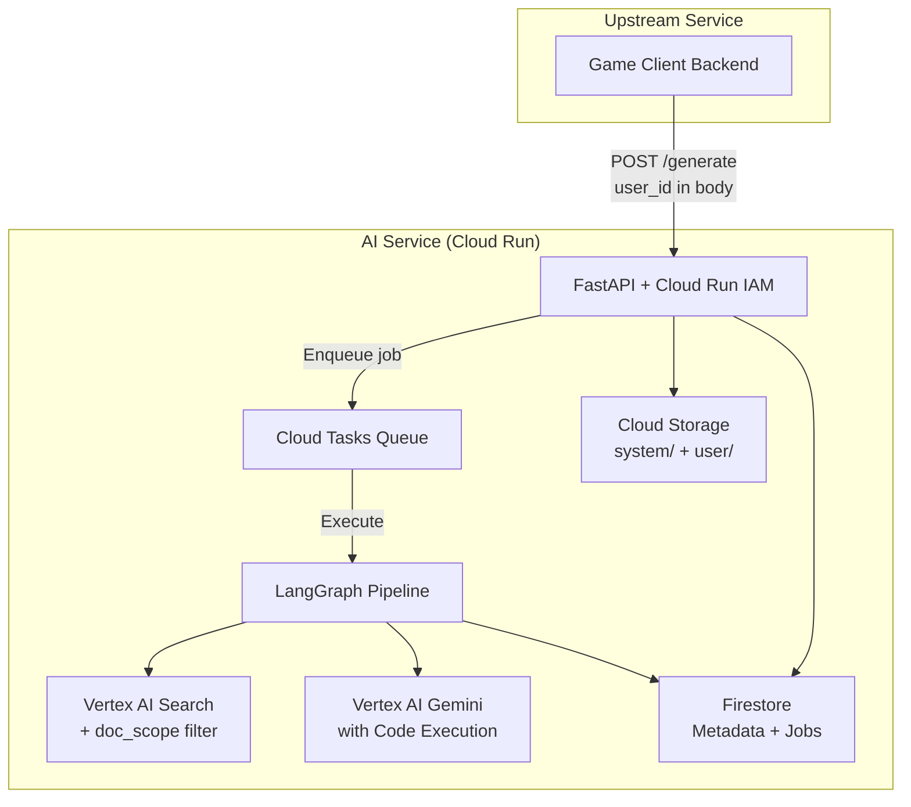
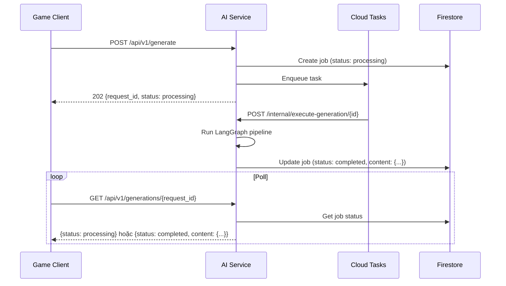
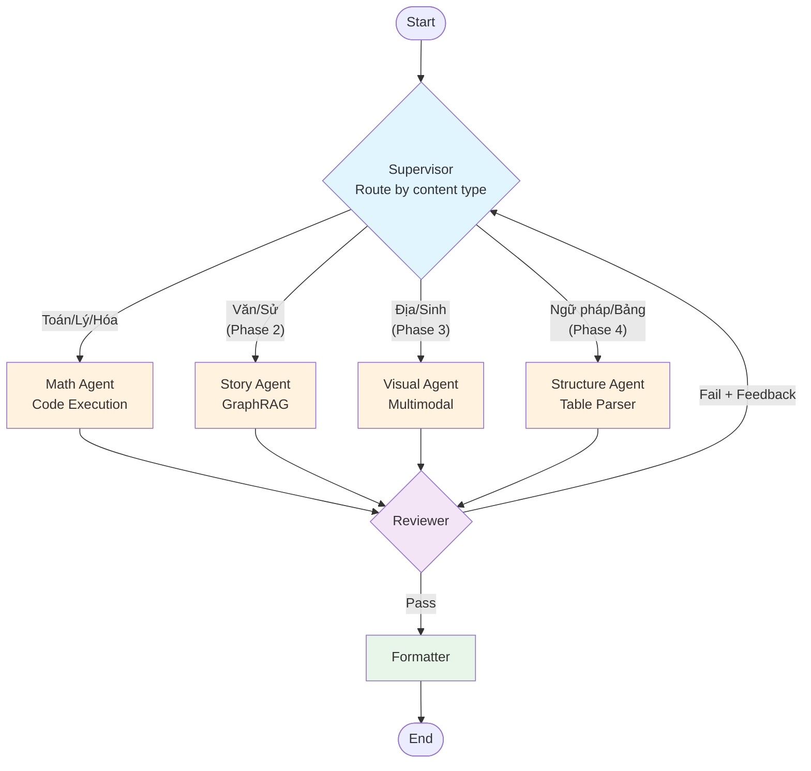

# Thiết kế: Edu Game AI Service

## Tổng quan Kiến trúc

**High-level view:**



---

## Mô hình Dữ liệu

**Dữ liệu cốt lõi là gì?**

### AgentState (graph/state.py)

```python
class AgentState(TypedDict):
    request: GenerationRequest       # Input từ API
    user_id: str                     # User ID từ request body (trusted)
    doc_scope: str                   # "user" | "system" | "all"
    retrieved_docs: list[Document]   # Từ Vertex AI Search (filtered + reranked)
    content_items: list[ContentItem] # Từ Content Agent
    review_results: list[ReviewResult] # Từ Reviewer
    final_output: GameContentResponse # Structured per game type
    iteration_count: int             # Feedback loop counter
```

### GenerationRequest (api/schemas/requests.py)

```python
class GenerationRequest(BaseModel):
    user_id: str                                       # Required — từ upstream
    topic: str | None = None                           # Chủ đề (optional, AI suy luận từ docs)
    game_types: list[GameType] = ["quiz"]              # quiz | flashcard | fill_blank
    num_questions: int = 10                            # Số câu mong muốn
    difficulty: str = "medium"                         # easy | medium | hard
    doc_scope: str = "all"                             # "user" | "system" | "all"
```

### GameContentResponse (api/schemas/responses.py)

```python
class GameContentResponse(BaseModel):
    request_id: str
    user_id: str
    topic: str
    doc_scope: str                                     # Echo back scope used
    content: dict[str, list]                           # {"quiz": [...], "flashcard": [...]}
    metadata: GenerationMetadata
    created_at: datetime
```

### ContentItem (api/schemas/game_content.py)

```python
class ContentItem(BaseModel):
    """Generic content item từ Content Agent.
    Sau đó được Formatter transform thành game-specific schema.
    """
    question: str
    answer: str
    explanation: str | None = None
    difficulty: str = "medium"
    source_doc_id: str | None = None   # Reference to retrieved doc (user doc hoặc system doc)
```

### Game-Specific Schemas (api/schemas/game_content.py)

```python
class QuizQuestion(BaseModel):
    question: str
    options: list[str]                # Exactly 4
    correct_answer_index: int         # 0-3
    explanation: str | None = None
    difficulty: str

class Flashcard(BaseModel):
    front: str                        # Question/prompt
    back: str                         # Answer/explanation
    difficulty: str

class FillBlankQuestion(BaseModel):
    sentence: str                     # "Đạo hàm của x^2 là ___"
    blank_answer: str                 # "2x"
    difficulty: str
```

### DocumentRecord (Firestore: `documents/{doc_id}`)

```python
class DocumentRecord(BaseModel):
    doc_id: str                       # UUID
    user_id: str                      # User owner hoặc "__system__"
    scope: str                        # "user" | "system"
    gcs_uri: str                      # gs://bucket/system/... hoặc gs://bucket/user/{user_id}/...
    file_name: str
    file_format: str                  # pdf | docx | pptx
    upload_date: datetime
    indexing_status: str              # pending | completed | failed
    ai_search_doc_id: str | None      # Reference trong Data Store
```

### JobRecord (Firestore: `jobs/{request_id}`)

```python
class JobRecord(BaseModel):
    """Async job status tracking."""
    request_id: str                   # UUID
    user_id: str
    status: str                       # processing | completed | failed
    request: dict                     # Original GenerationRequest
    content: dict | None              # Result khi completed
    error: str | None                 # Error message khi failed
    created_at: datetime
    completed_at: datetime | None
```

---

## Thiết kế API

**Các endpoints là gì?**

### Xác thực

- **AuthN:** Cloud Run IAM (service-to-service)
  - Deploy với `--no-allow-unauthenticated`
  - Upstream service cần `roles/run.invoker` permission
  - Không cần API key, header, hay JWT — GCP xác minh IAM identity tự động
- **User Identity:** Trusted `user_id` trong request body
  - Upstream đã xác thực user → AI Service tin tưởng user_id
  - Tất cả data scoping dựa trên user_id từ body

### Async API Pattern



### Endpoints

#### POST /api/v1/generate

Tạo generation request mới. Async via Cloud Tasks. Trả về ngay với request_id.

```json
// Request
{
  "user_id": "user-123",
  "topic": "Đạo hàm cơ bản",
  "game_types": ["quiz", "flashcard"],
  "num_questions": 10,
  "difficulty": "medium",
  "doc_scope": "all"
}

// Response 202 Accepted
{
  "request_id": "req-abc-123",
  "status": "processing",
  "created_at": "2024-01-15T10:30:00Z"
}
```

#### GET /api/v1/generations/{request_id}

Poll cho job status và kết quả.

```json
// Response khi processing
{
  "request_id": "req-abc-123",
  "status": "processing",
  "created_at": "2024-01-15T10:30:00Z"
}

// Response khi completed
{
  "request_id": "req-abc-123",
  "user_id": "user-123",
  "topic": "Đạo hàm cơ bản",
  "doc_scope": "all",
  "status": "completed",
  "content": {
    "quiz": [
      {
        "question": "Đạo hàm của f(x) = x³ là?",
        "options": ["3x²", "x²", "3x", "x³"],
        "correct_answer_index": 0,
        "explanation": "Áp dụng công thức: (xⁿ)' = n·xⁿ⁻¹",
        "difficulty": "medium"
      }
    ],
    "flashcard": [
      {
        "front": "Công thức đạo hàm của xⁿ?",
        "back": "(xⁿ)' = n·xⁿ⁻¹",
        "difficulty": "easy"
      }
    ]
  },
  "metadata": {
    "model": "gemini-2.0-flash",
    "total_tokens": 1250,
    "generation_time_ms": 8500,
    "ai_search_queries": 3,
    "doc_sources": ["user-doc-1", "__system__-doc-2"]
  },
  "created_at": "2024-01-15T10:30:00Z",
  "completed_at": "2024-01-15T10:30:45Z"
}
```

#### POST /internal/execute-generation/{request_id}

Internal endpoint được Cloud Tasks gọi. Không dành cho direct calls.

#### POST /api/v1/documents/upload

Upload user document. File lưu vào `user/{user_id}/`.

```
POST /api/v1/documents/upload
Content-Type: multipart/form-data

user_id: "user-123"
session_id: "session-456"
file: <binary>
```

```json
// Response 201
{
  "doc_id": "doc-xyz-789",
  "user_id": "user-123",
  "scope": "user",
  "gcs_uri": "gs://edu-game-docs-xxx/user/user-123/2024-01-15/session-456/giao-an.pdf",
  "indexing_status": "pending"
}
```

#### GET /api/v1/users/{user_id}/documents

Liệt kê documents của user.

```json
// Response
{
  "documents": [
    {
      "doc_id": "doc-xyz-789",
      "file_name": "giao-an.pdf",
      "file_format": "pdf",
      "upload_date": "2024-01-15T10:00:00Z",
      "indexing_status": "completed"
    }
  ]
}
```

#### Admin Endpoints

**POST /api/v1/admin/documents/upload** — Upload system document.

```
POST /api/v1/admin/documents/upload
Content-Type: multipart/form-data

scope: "system"
session_id: "admin-session-001"
file: <binary>
```

```json
// Response 201
{
  "doc_id": "doc-sys-001",
  "user_id": "__system__",
  "scope": "system",
  "gcs_uri": "gs://edu-game-docs-xxx/system/2024-01-15/admin-session-001/sgk-toan-11.pdf",
  "indexing_status": "pending"
}
```

**GET /api/v1/admin/documents** — Liệt kê system documents.

```json
// Response
{
  "documents": [
    {
      "doc_id": "doc-sys-001",
      "file_name": "sgk-toan-11.pdf",
      "file_format": "pdf",
      "upload_date": "2024-01-15T09:00:00Z",
      "indexing_status": "completed"
    }
  ]
}
```

**DELETE /api/v1/admin/documents/{doc_id}** — Xóa system document.

```json
// Response 204 No Content
```

#### GET /api/v1/game-types

Liệt kê các game types được hỗ trợ.

```json
// Response
{
  "game_types": [
    {
      "type": "quiz",
      "description": "Trắc nghiệm 4 đáp án",
      "schema": { ... }
    },
    {
      "type": "flashcard",
      "description": "Flashcard trước/sau",
      "schema": { ... }
    },
    {
      "type": "fill_blank",
      "description": "Câu điền vào chỗ trống",
      "schema": { ... }
    }
  ]
}
```

---

## Phân rã Thành phần

**LangGraph nodes là gì?**

### Chiến lược 4-Pillar

Hệ thống sử dụng **specialized agents** theo loại nội dung:

| Cột trụ                 | Agent               | Môn học                | Công cụ                | Phase   |
| ----------------------- | ------------------- | ---------------------- | ---------------------- | ------- |
| Logic & Tính toán       | **Math Agent**      | Toán, Lý, Hóa          | Code Execution + SymPy | Phase 1 |
| Tường thuật & Ngữ nghĩa | **Story Agent**     | Văn, Sử                | GraphRAG + Timeline    | Phase 2 |
| Không gian & Hình ảnh   | **Visual Agent**    | Địa, Sinh              | Multimodal Vision      | Phase 3 |
| Cấu trúc & Taxonomy     | **Structure Agent** | Ngữ pháp, Bảng hóa học | Table Extraction       | Phase 4 |



    style CA fill:#fff3e0
    style REV fill:#f3e5f5
    style FMT fill:#e8f5e9

### 1. Supervisor Node

- **Nhiệm vụ**: Phân tích loại nội dung → route tới specialized agent phù hợp
- **Input**: GenerationRequest
- **Output**: Route tới Math/Story/Visual/Structure Agent dựa trên content type
- **Logic**: Phân loại theo 4-Pillar Strategy → conditional edge

### 2. Math Agent Node (Phase 1)

- **Nhiệm vụ**: Xử lý nội dung Toán/Lý/Hóa — cần tính toán chính xác
- **Input**: State với topic, user_id, doc_scope
- **Output**: list[ContentItem] với computation traces
- **Công cụ**:
  - VertexAISearchRetriever với doc_scope filter
  - ChatVertexAI (Gemini Pro) + **Code Execution**
  - SymPy, NumPy cho symbolic math

### 3. Story Agent Node (Phase 2)

- **Nhiệm vụ**: Xử lý nội dung Văn/Sử — cần hiểu timeline và quan hệ nhân quả
- **Input**: State với topic, user_id, doc_scope
- **Output**: list[ContentItem] với timeline/causality context
- **Công cụ**:
  - VertexAISearchRetriever + **GraphRAG** (optional Neo4j)
  - Entity extraction, timeline logic

### 4. Visual Agent Node (Phase 3)

- **Nhiệm vụ**: Xử lý nội dung Địa lý/Sinh học — cần phân tích hình ảnh
- **Input**: State với topic, images
- **Output**: list[ContentItem] từ image analysis
- **Công cụ**:
  - **Gemini Multimodal Vision** cho image understanding
  - Image captioning, spatial analysis

### 5. Structure Agent Node (Phase 4)

- **Nhiệm vụ**: Xử lý nội dung cấu trúc — ngữ pháp, bảng biểu
- **Input**: State với structured content
- **Output**: list[ContentItem] từ table/pattern extraction
- **Công cụ**:
  - **Table Parser** (LlamaParse hoặc custom)
  - Pattern matching, structured extraction

### 6. Reviewer Node

- **Nhiệm vụ**: Kiểm tra chất lượng và độ chính xác
- **Input**: list[ContentItem] từ bất kỳ specialized agent nào
- **Output**: list[ReviewResult] với pass/fail per item
- **Model**: Gemini Flash (fast, cheap cho validation)
- **Tiêu chí**:
  - Đáp án đúng (sử dụng Code Execution xác minh)
  - Grounded trong source docs (user hoặc system, tùy doc_scope)
  - Độ khó phù hợp

### 7. Formatter Node

- **Nhiệm vụ**: Transform generic content → game-specific schema (via template)
- **Input**: list[ContentItem] đã pass review, requested game_types
- **Output**: GameContentResponse với structured data per type
- **Logic**:

```python
for game_type in request.game_types:
    template = GAME_TEMPLATES[game_type]
    formatted = llm.with_structured_output(template.schema).invoke(...)
    results[game_type] = formatted
```

---

## Quyết định Thiết kế

**Tại sao chọn những giải pháp này?**

### D1: LangGraph với Chiến lược 4-Pillar

- **Quyết định**: Dùng LangGraph StateGraph với specialized agents theo 4-Pillar Strategy
- **Lý do**: Mỗi loại nội dung có thách thức riêng (LLM tính sai math, mất context history, không đọc được hình, vỡ bảng). Specialized agents xử lý tối ưu từng pillar.
- **Trade-off**: Complexity cao hơn, routing phức tạp hơn, nhưng chất lượng tốt hơn đáng kể

### D2: Tách Specialized Agents và Formatter

- **Quyết định**: Specialized agents (Math, Story, Visual, Structure) riêng biệt, Formatter chung
- **Lý do**: Mỗi agent tối ưu cho 1 pillar. Formatter là chung cho tất cả game types.
- **Trade-off**: Nhiều agents hơn, nhưng maintainability và accuracy tốt hơn

### D3: Vertex AI Search thay vì vector embedding tự build

- **Quyết định**: Dùng Vertex AI Search (Agent Builder) với `VertexAISearchRetriever`
- **Lý do**: Managed indexing, chunking, và retrieval. Không cần maintain embedding pipeline.
- **Trade-off**: Lock-in GCP, chi phí cao hơn tự build, nhưng time-to-market nhanh hơn đáng kể

### D4: Doc Scope Filtering

- **Quyết định**: 3 doc_scope options: "user", "system", "all" (default: "all")
- **Lý do**: Flexibility cho UX — có thể chỉ dùng system docs, chỉ user docs, hoặc cả hai
- **user-first**: Khi "all", user docs được ưu tiên hiển thị trước trong kết quả
- **Trade-off**: Phức tạp hơn 1 lựa chọn đơn, nhưng flexible cho nhiều use cases

### D5: Cloud Run IAM Authentication

- **Quyết định**: Dùng Cloud Run IAM service-to-service thay vì API key hoặc custom JWT auth
- **Lý do**: Zero custom code, GCP quản lý tự động, audit logging sẵn có, IAM permissions granular
- **Trade-off**: Phụ thuộc GCP hoàn toàn cho auth, nhưng đã all-in GCP rồi

### D6: Async Generation via Cloud Tasks

- **Quyết định**: POST /generate trả về 202 ngay lập tức, xử lý qua Cloud Tasks, client poll cho kết quả
- **Lý do**: Tránh HTTP timeout cho long-running generations, scalable job queue, retry built-in
- **Trade-off**: Complexity cao hơn sync API, client cần implement polling, nhưng production-ready hơn

### D7: GCS Path Separation

- **Quyết định**: `system/` cho admin docs, `user/{user_id}/` cho user docs
- **Lý do**: Clear separation, dễ audit, future-proof cho ACL granular
- **Trade-off**: Cần sync path structure với metadata user_id filter

### D8: Metadata Filter + User-first Re-ranking

- **Quyết định**: Sử dụng AI Search metadata filter để scope queries, sau đó re-rank user docs lên trước cho doc_scope="all"
- **Lý do**: Native filtering là efficient (indexed), re-ranking là simple sort post-retrieval
- **Trade-off**: Re-ranking là O(n) nhưng n nhỏ (max_documents ~5-10)

### D9: Trusted user_id từ Upstream

- **Quyết định**: AI Service không xác thực user, tin tưởng user_id từ upstream đã verified
- **Lý do**: Internal service, upstream (Game Client backend) đã handle user auth. Double auth là waste.
- **Trade-off**: Phụ thuộc hoàn toàn vào upstream security, nhưng đây là internal architecture choice

---

## Thiết kế Bảo mật

**Làm sao đảm bảo an toàn?**

### Xác thực

- **Service-to-service**: Cloud Run IAM — chỉ cho phép service accounts có `roles/run.invoker`
- **User identity**: Trusted `user_id` từ request body, upstream đã xác thực

### Ủy quyền

- **Admin ops**: Upstream quyết định ai là admin, gọi `/admin/*` routes với admin context
- **User scoping**: Tất cả queries lọc theo user_id hoặc `__system__` dựa trên doc_scope
- **Internal endpoints**: `/internal/*` chỉ Cloud Tasks gọi (verify header `X-CloudTasks-TaskName`)

### Bảo vệ Dữ liệu

- **GCS**: Uniform bucket-level access, files namespace theo `system/` hoặc `user/{user_id}/`
- **Firestore**: Security rules enforce user_id match (nếu cần)
- **AI Search**: Metadata filter ngăn cross-user access
- **Privacy**: User docs là private, system docs là shared. Documents không dùng để train models.

### Logging & Audit

- Structured logs với `user_id`, `request_id`, `doc_scope`
- Cloud Audit Logs cho IAM events
- Không log PII không cần thiết

---

## Cân nhắc Hiệu suất

**Làm sao đảm bảo performance?**

- **Target**: <60s cho 10 câu (p95), async + poll pattern
- **Bottleneck**: LLM generation (~40-50s cho 10 câu), AI Search query (~1-2s)
- **Mitigation**:
  - Gemini Flash cho Reviewer/Formatter (fast)
  - Batch trong 1 LLM call khi có thể
  - Cloud Tasks với retry và dead-letter queue
  - AI Search pre-indexed cho fast retrieval
- **Async benefit**: No HTTP timeout, client không block, retry tự động

---

## Chiến lược Mở rộng

**Làm sao để scale?**

- **Phase 1**: Cloud Run auto-scaling, max 10 concurrent (đủ cho <100 DAU)
- **Phase 2+**: Cloud Tasks concurrency control, multiple instances, regional deployment
- **AI Search**: Managed scaling, không cần config
- **Firestore**: Auto-scaling, no config needed
