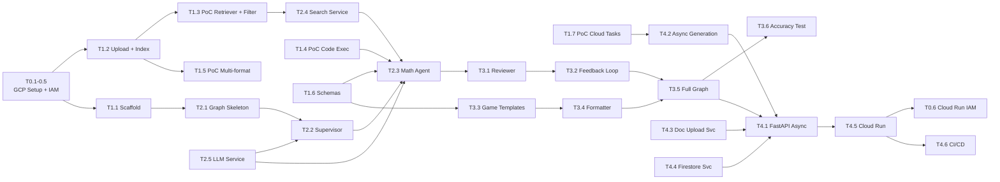

````markdown
---
phase: planning
title: Project Planning & Task Breakdown
description: Break down work into actionable tasks and estimate timeline
---

# Project Planning & Task Breakdown

## Milestones

**What are the major checkpoints?**

- [ ] **M0: GCP Project Setup** (Days 1-2) — Enable APIs (incl. Cloud Tasks), create resources, Cloud Run IAM for upstream, verify billing
- [ ] **M1: PoC & Scaffold** (Week 1) — AI Search Data Store, Code Execution test, LangGraph skeleton, async PoC, schemas
- [ ] **M2: Core LangGraph Pipeline** (Week 2) — Full graph: Supervisor → Math Agent → Reviewer → Formatter
- [ ] **M3: Quality & Tuning** (Week 3) — Feedback loop, game templates, prompt tuning, accuracy ≥ 98%
- [ ] **M4: Deploy & API** (Week 4) — Cloud Run, async REST API, Cloud Tasks dispatch, document upload, handoff

## Task Breakdown

**What specific work needs to be done?**

### Phase 0: GCP Project Setup (Days 1-2)

- [ ] **T0.1: Enable required GCP APIs**

  ```bash
  gcloud config set project green-mercury-485016-n1

  # Core APIs
  gcloud services enable aiplatform.googleapis.com
  gcloud services enable discoveryengine.googleapis.com
  gcloud services enable run.googleapis.com
  gcloud services enable firestore.googleapis.com
  gcloud services enable storage.googleapis.com
  gcloud services enable secretmanager.googleapis.com
  gcloud services enable cloudtasks.googleapis.com

  # CI/CD & Monitoring
  gcloud services enable cloudbuild.googleapis.com
  gcloud services enable logging.googleapis.com
  gcloud services enable cloudtrace.googleapis.com
  ```
````

- **Validate:** `gcloud services list --enabled | grep -c googleapis` ≥ 10

- [ ] **T0.2: Create GCS bucket for document upload**

  ```bash
  # Create bucket with uniform access
  gsutil mb -b on -l asia-southeast1 gs://edu-game-docs-green-mercury-485016-n1

  # Verify
  gsutil ls gs://edu-game-docs-green-mercury-485016-n1
  ```

- [ ] **T0.3: Create Firestore database**

  ```bash
  gcloud firestore databases create --location=asia-southeast1
  ```

- [ ] **T0.4: Create Vertex AI Search Data Store**
  - Option A (Console): Agent Builder → Data Stores → Create → Cloud Storage → point to bucket
  - Option B (gcloud):
    ```bash
    # Create data store
    curl -X POST \
      -H "Authorization: Bearer $(gcloud auth print-access-token)" \
      -H "Content-Type: application/json" \
      "https://discoveryengine.googleapis.com/v1/projects/green-mercury-485016-n1/locations/global/collections/default_collection/dataStores?dataStoreId=edu-game-docs" \
      -d '{
        "displayName": "edu-game-docs",
        "industryVertical": "GENERIC",
        "contentConfig": "CONTENT_REQUIRED",
        "solutionTypes": ["SOLUTION_TYPE_SEARCH"]
      }'
    ```
  - Create Search App linking to Data Store
  - **Validate:** Data Store visible in Console

- [ ] **T0.5: Create Service Account & IAM**

  ```bash
  # Create service account
  gcloud iam service-accounts create edu-game-ai \
    --display-name="Edu Game AI Service"

  SA_EMAIL=edu-game-ai@green-mercury-485016-n1.iam.gserviceaccount.com

  # Grant roles
  gcloud projects add-iam-policy-binding green-mercury-485016-n1 \
    --member="serviceAccount:$SA_EMAIL" \
    --role="roles/aiplatform.user"
  gcloud projects add-iam-policy-binding green-mercury-485016-n1 \
    --member="serviceAccount:$SA_EMAIL" \
    --role="roles/discoveryengine.editor"
  gcloud projects add-iam-policy-binding green-mercury-485016-n1 \
    --member="serviceAccount:$SA_EMAIL" \
    --role="roles/storage.objectAdmin"
  gcloud projects add-iam-policy-binding green-mercury-485016-n1 \
    --member="serviceAccount:$SA_EMAIL" \
    --role="roles/datastore.user"
  gcloud projects add-iam-policy-binding green-mercury-485016-n1 \
    --member="serviceAccount:$SA_EMAIL" \
    --role="roles/secretmanager.secretAccessor"
  gcloud projects add-iam-policy-binding green-mercury-485016-n1 \
    --member="serviceAccount:$SA_EMAIL" \
    --role="roles/cloudtasks.enqueuer"
  ```

- [ ] **T0.6: Setup Cloud Run IAM for Upstream Service**

  ```bash
  # Upstream service account is granted invoke permission for AI Service
  # (Run after Cloud Run deploy in Phase 4, but plan from the start)
  UPSTREAM_SA=upstream-svc@green-mercury-485016-n1.iam.gserviceaccount.com

  gcloud run services add-iam-policy-binding edu-game-ai-service \
    --member="serviceAccount:$UPSTREAM_SA" \
    --role="roles/run.invoker" \
    --region=asia-southeast1
  ```

  - **Note:** Run this command after T4.4 (deploy Cloud Run). Create upstream service account first if not existing.
  - **Validate:** Only upstream service can call AI Service (test with curl without auth → 403)

- [ ] **T0.7: Upload initial system docs**
  - Upload standard textbooks/curricula to GCS: `system/2026-03-03/initial/`
  - Import to Vertex AI Search Data Store with metadata: `user_id="__system__"`, `subject`, `grade`
  - Wait for indexing (~10-15 minutes)
  - **Validate:** Query system docs in Console → verify extractive answers

### Phase 1: PoC & Scaffold (Week 1)

- [x] **T1.1: Project scaffold** ✅ Verified 2026-03-06
  - Python 3.12+ project (pyproject.toml) ✅
  - Conda env `AIservice` with all dependencies installed ✅
  - Dependencies: `langgraph`, `langchain-google-vertexai`, `langchain-google-community[vertexai]`, `google-cloud-discoveryengine`, `fastapi`, `google-cloud-firestore`, `google-cloud-storage`, `google-cloud-tasks`, `structlog` ✅
  - Linter/formatter: ruff, mypy ✅ (in pyproject.toml)
  - `.env` + `src/config/settings.py` (Pydantic Settings) ✅
  - `src/config/logging.py` (structlog: console/JSON) ✅

- [x] **T1.2: GCP Resources Setup** ✅ Verified 2026-03-07
  - GCS Bucket: `documents-development-bucket` ✅ (folders: `system/`, `users/`)
  - Firestore: `aiservice-store` ✅ (asia-southeast1)
  - AI Search Data Store: `aiservice-datastore-m1_1772802306291` ✅
  - Test documents uploaded: `math_grade10_system.txt`, `lesson_plan_user.txt` ✅
  - AI Search import: 2/2 documents indexed ✅

- [ ] **T1.3: PoC VertexAISearchRetriever + metadata filter + doc_scope**
  - Write script to test `VertexAISearchRetriever` querying Data Store
  - Test metadata filtering: only return docs with `user_id == "test-user"` (user scope)
  - Test metadata filtering: only return docs with `user_id == "__system__"` (system scope)
  - Test combined filter: `user_id: ANY("test-user", "__system__")` (all scope)
  - Test extractive answers/segments from Vietnamese documents
  - Measure latency, evaluate retrieval quality
  - **Validate:** Retriever scoped per doc_scope + context has sufficient quality

- [ ] **T1.4: PoC Gemini Code Execution**
  - Test Gemini Pro Code Execution (advanced mode)
  - Submit derivative/integral problems → verify results
  - Confirm sandbox supports SymPy/NumPy
  - **Validate:** 100% correct answers for 10 test problems

- [ ] **T1.5: PoC multi-format upload**
  - Test upload PDF, DOCX, PPTX to GCS
  - Test Vertex AI Search indexing for all 3 formats
  - **Validate:** AI Search returns results for all formats

- [ ] **T1.6: Pydantic schemas**
  - Create all models: `GenerationRequest` (with `doc_scope`), `ContentItem`, `QuizQuestion`, `Flashcard`, `FillBlankQuestion`, `GameContentResponse`, `DocumentRecord` (with `scope`), `AgentState`
  - Game Template registry: `GAME_TEMPLATES` dict
  - Unit tests for schema validation

- [ ] **T1.7: PoC Cloud Tasks async dispatch**
  - Create Cloud Tasks queue: `gcloud tasks queues create generation-queue --location=asia-southeast1`
  - Write test script: enqueue task → Cloud Tasks triggers HTTP endpoint on Cloud Run
  - Test retry logic (task fail → auto retry)
  - **Validate:** Task enqueue < 100ms, execution trigger successful

### Phase 2: Core LangGraph Pipeline (Week 2)

- [ ] **T2.1: LangGraph State & Graph skeleton**
  - `AgentState` TypedDict
  - `StateGraph` in `graph/builder.py` — nodes + edges placeholder
  - Compile graph, test basic flow

- [ ] **T2.2: Supervisor node**
  - Receive request → analyze content → routing decision
  - Determine `doc_scope` from request (default: "all")
  - Phase 1: route to Math Agent for Math/Physics/Chemistry
  - Phase 2+: conditional edges to Story/Visual/Structure agents
  - Output: updated state with routing info + doc_scope

- [ ] **T2.3: Math Agent node (Phase 1 — Logic & Computational)**
  - Specialized for Math/Physics/Chemistry content
  - Integrate `VertexAISearchRetriever` → query context (filter by `doc_scope`)
    - `doc_scope="user"`: filter `user_id` only
    - `doc_scope="system"`: filter `user_id="__system__"` only
    - `doc_scope="all"`: filter `user_id` OR `"__system__"` + **post-retrieval re-ranking (user docs ranked first)**
  - Prompt engineering: generate **content items** (generic Q&A) from retrieved context
  - Integrate Code Execution tool for calculations (when math/physics/chemistry detected)
  - Handle difficulty levels
  - Output: `content_items` in state

- [ ] **T2.4: Vertex AI Search service wrapper**
  - `services/vertex_search.py` — factory for `VertexAISearchRetriever`
  - Config: project_id, data_store_id, location, max_documents
  - Metadata filter builder: `doc_scope`, `user_id`, optional `subject`, `document_id`
  - Support 3 modes: user-only, system-only, combined (all) with user-first re-ranking

- [ ] **T2.5: LLM service factory**
  - `services/llm.py` — factory for `ChatVertexAI` Pro/Flash
  - Config-driven model selection
  - Retry logic + error handling
  - Token usage tracking

### Phase 3: Quality & Game Templates (Week 3)

- [ ] **T3.1: Reviewer node**
  - Prompt: check accuracy, grounding, quality, relevance to user's docs
  - Gemini Flash (cheap, fast)
  - Output: pass/fail + reason per content item
  - Update state: `reviewed_items` + `rejected_items`

- [ ] **T3.2: Feedback loop**
  - Conditional edge: Reviewer fail → Supervisor → Math Agent retry
  - Max iteration: 3 (configurable)
  - Track `iteration_count` in state
  - Graceful termination: partial results if max reached

- [ ] **T3.3: Game template system**
  - `templates/registry.py` — GAME_TEMPLATES dict
  - `templates/quiz.py` — QuizQuestion schema + prompt
  - `templates/flashcard.py` — Flashcard schema + prompt
  - `templates/fill_blank.py` — FillBlankQuestion schema + prompt
  - Unit tests: content items → game-specific output

- [ ] **T3.4: Formatter node**
  - Receive reviewed content items + `game_types[]`
  - Get template for each game type from registry
  - `with_structured_output()` per game type schema
  - Dedup check
  - Output: `final_output` in state

- [ ] **T3.5: Full graph assembly & test**
  - Connect all nodes + edges in `builder.py`
  - Checkpoint persistence (Firestore)
  - Integration test: full pipeline E2E

- [ ] **T3.6: Prompt tuning & accuracy testing**
  - Test with 50+ math/physics/chemistry problems
  - Measure accuracy rate
  - Tune prompts for Supervisor, Math Agent, Reviewer
  - Target: ≥ 98% accuracy

### Phase 4: Deploy & API (Week 4)

- [ ] **T4.1: FastAPI endpoints (async-first)**
  - POST /api/v1/documents/upload (user docs)
  - GET /api/v1/documents/{document_id}/status
  - GET /api/v1/users/{user_id}/documents
  - POST /api/v1/admin/documents/upload (system docs, upstream admin context)
  - GET /api/v1/admin/documents (list system docs)
  - DELETE /api/v1/admin/documents/{document_id}
  - POST /api/v1/generate → **async: returns 202 { request_id }, enqueues Cloud Tasks**
  - GET /api/v1/generations/{request_id} → **status + result polling**
  - GET /api/v1/game-types
  - Cloud Run IAM verification middleware (verify caller is upstream service)
  - `user_id` extraction from request body (trusted from upstream)
  - Error handling & validation

- [ ] **T4.2: Async generation service (Cloud Tasks)**
  - `services/task_queue.py` — Cloud Tasks client, enqueue generation job
  - Internal endpoint: POST /internal/execute-generation/{request_id} (only Cloud Tasks calls)
  - Job status tracking in Firestore: `processing` → `completed` / `failed`
  - Retry policy: max 3 retries, exponential backoff
  - Dead-letter queue for failed jobs

- [ ] **T4.3: Document upload service**
  - `services/document_store.py` — GCS upload (`system/` for admin, `user/{user_id}/` for users) + trigger AI Search import
  - File validation: PDF/DOCX/PPTX only, 50MB max (magic bytes)
  - Track indexing status in Firestore
  - Metadata attachment: user_id (or `__system__`), upload_date, session_id, scope
  - Privacy: consent flag in upload request (refer to Requirements → Privacy & Data Consent)

- [ ] **T4.4: Firestore service**
  - `services/firestore.py` — CRUD for generations, documents, user records, **job status tracking**
  - LangGraph checkpoint storage

- [ ] **T4.5: Docker & Cloud Run deploy**
  - Dockerfile (multi-stage build)
  - docker-compose.yml for local dev
  - Deploy Cloud Run (**--no-allow-unauthenticated** — Cloud Run IAM only)
  - Environment variables via Secret Manager
  - IAM: service account permissions for Vertex AI, Firestore, GCS, AI Search, Cloud Tasks
  - Cloud Tasks queue creation: `generation-queue` (asia-southeast1)
  - **Post-deploy:** Grant upstream service `roles/run.invoker` (T0.6)

- [ ] **T4.6: CI/CD**
  - GitHub Actions: lint → test → build → deploy Cloud Run
  - Auto deploy on push to main

- [ ] **T4.7: Documentation & handoff**
  - OpenAPI docs (auto-generated by FastAPI)
  - README: GCP setup guide, architecture diagram
  - Sample request/response for Game Client team
  - Game Template how-to: guide for adding new game types

## Dependencies

**What needs to happen in what order?**



### External Dependencies

- GCP project `green-mercury-485016-n1` + billing account
- Test documents: lesson plans/curricula/slides (PDF, DOCX, PPTX) in Vietnamese
- Game Client team: JSON schema agreement

## Timeline & Estimates

| Phase                        | Duration    | Effort   | Deliverable                                                                       |
| ---------------------------- | ----------- | -------- | --------------------------------------------------------------------------------- |
| Phase 0: GCP Setup           | 2 days      | ~4h      | All APIs enabled, resources created, IAM configured                               |
| Phase 1: PoC & Scaffold      | 4 days      | ~20h     | PoC passed (retriever + filter + code exec + multi-format + Cloud Tasks), schemas |
| Phase 2: Core Pipeline       | 5 days      | ~25h     | Full LangGraph pipeline working E2E                                               |
| Phase 3: Quality & Templates | 5 days      | ~24h     | Game templates, feedback loop, accuracy ≥ 98%                                     |
| Phase 4: Deploy & API        | 5 days      | ~25h     | Async API live on Cloud Run, Cloud Tasks, CI/CD, doc upload                       |
| **Total**                    | **4 weeks** | **~98h** | **Production live**                                                               |

## Risks & Mitigation

| Risk                                             | Impact | Prob   | Mitigation                                                               |
| ------------------------------------------------ | ------ | ------ | ------------------------------------------------------------------------ |
| Vertex AI Search poor with Vietnamese DOCX/PPTX  | High   | Medium | Validate early in PoC T1.5. Fallback: convert to PDF before upload       |
| Vertex AI Search metadata filtering not accurate | High   | Medium | Validate in PoC T1.3. Fallback: separate Data Store per user (expensive) |
| Code Execution sandbox missing libraries         | Medium | Medium | Validate in PoC T1.4. Fallback: custom Python REPL tool                  |
| Accuracy < 98%                                   | High   | Medium | Add iteration rounds. Heavy prompt tuning                                |
| Cloud Run cold start slow                        | Medium | Medium | `min-instances=1`, warm-up endpoint                                      |
| Vertex AI Search pricing exceeds budget          | Medium | Low    | Monitor query volume. GCP budget alert                                   |
| GCP project billing not setup                    | High   | Low    | T0 includes verify billing before enabling APIs                          |

## Resources Needed

### Team

- 1 AI/Backend Engineer (primary)
- 1 Game Developer (coordinate JSON schema)

### GCP Services (ALL need to be setup from the start)

| Service          | API                              | Status      |
| ---------------- | -------------------------------- | ----------- |
| Vertex AI        | `aiplatform.googleapis.com`      | ✅ Enabled  |
| Vertex AI Search | `discoveryengine.googleapis.com` | ✅ Enabled  |
| Cloud Run        | `run.googleapis.com`             | ✅ Enabled  |
| Firestore        | `firestore.googleapis.com`       | ✅ Enabled  |
| Cloud Storage    | `storage.googleapis.com`         | ✅ Enabled  |
| Secret Manager   | `secretmanager.googleapis.com`   | ✅ Enabled  |
| Cloud Tasks      | `cloudtasks.googleapis.com`      | Need enable |
| Cloud Build      | `cloudbuild.googleapis.com`      | ✅ Enabled  |
| Cloud Logging    | `logging.googleapis.com`         | ✅ Enabled  |
| Cloud Trace      | `cloudtrace.googleapis.com`      | ✅ Enabled  |

### Estimated Monthly Cost

- Cloud Run: $0-10 (free tier)
- Gemini API: $3-10
- Vertex AI Search: $2-10 (query-based pricing)
- Firestore: $0-5 (free tier covers Phase 1)
- Cloud Storage: < $1
- Cloud Tasks: $0 (free tier: 1M tasks/month)
- **Total: ~$10-25/month**

> **Note:** No specific cost statistics yet because system is in development phase. Will update after PoC.

```

```
