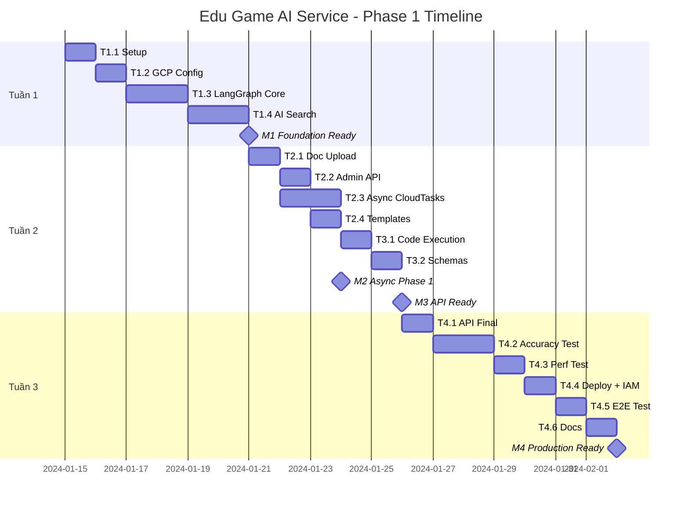

# Kế hoạch: Edu Game AI Service

## Tổng quan

**Phase 1: 2-3 tuần (10-15 ngày làm việc) — Focus: Math/Physics/Chemistry**

Đây là một internal microservice: AI-powered content generation cho educational games, với Cloud Run IAM auth và async-first processing via Cloud Tasks.

### Chiến lược 4-Pillar

| Phase       | Focus         | Agent                          | Timeline  |
| ----------- | ------------- | ------------------------------ | --------- |
| **Phase 1** | Toán/Lý/Hóa   | Math Agent + Code Execution    | 2-3 tuần  |
| **Phase 2** | Văn/Sử        | Story Agent + GraphRAG         | +2 tuần   |
| **Phase 3** | Địa/Sinh      | Visual Agent + Multimodal      | +2 tuần   |
| **Phase 4** | Ngữ pháp/Bảng | Structure Agent + Table Parser | +1-2 tuần |

---

## Các Phụ thuộc

**Những gì cần sẵn sàng trước khi bắt đầu?**

### Phụ thuộc Kỹ thuật

- [x] GCP Project `green-mercury-485016-n1` đã setup ✅
- [x] APIs đã enable: Vertex AI, Discovery Engine, Cloud Run, Firestore, Storage, Cloud Tasks ✅
- [x] Vertex AI Search Data Store đã tạo và link bucket ✅ `aiservice-datastore-m1_1772802306291`
- [x] Search Engine App: `gp-mathagent_1773042630372` (SEARCH_TIER_ENTERPRISE + SEARCH_ADD_ON_LLM) ✅ (upgraded 2026-03-09)
- [x] Cloud Tasks queue `generation-queue` đã tạo ✅
- [ ] Upstream service account với `roles/run.invoker` (sau T4.4)
- [ ] Service account `edu-game-ai@...` với quyền cần thiết

### Phụ thuộc Con người

- [ ] Game Client team: Agreement JSON schema (cần trước T4.1)
- [ ] Game Client team: Integration test slot (cần cuối T4)

---

## Các Mốc Quan trọng

**Những deliverables chính là gì?**

| Mốc    | Tên                          | Tiêu chí Hoàn thành                                                            | Ngày Mục tiêu                                       |
| ------ | ---------------------------- | ------------------------------------------------------------------------------ | --------------------------------------------------- |
| **M1** | Nền tảng Sẵn sàng            | LangGraph pipeline chạy local, Vertex AI Search hoạt động với fixtures         | Cuối Tuần 1                                         |
| **M2** | Async + Multi-tenant Phase 1 | POST /generate → async → poll works, doc_scope filtering đúng, user-first      | Giữa Tuần 2                                         |
| **M3** | API Sẵn sàng Tích hợp        | Tất cả endpoints hoạt động, Admin API done, schema finalized với Game Client   | Cuối Tuần 2                                         |
| **M4** | Production Ready             | Cloud Run deploy, Cloud Run IAM verified, 98% accuracy, latency <60s, E2E pass | ⏸️ **DEFERRED** — Sau khi hoàn thành tất cả Pillars |

---

## Phân rã Nhiệm vụ

**Công việc được chia nhỏ như thế nào?**

### Tuần 1: Nền tảng (T1.x)

#### T1.1: Thiết lập Dự án (0.5 ngày) ✅ Xác nhận 2026-03-06

- [x] Init repo với cấu trúc thư mục ✅
- [x] Conda env `AIservice` với dependencies: `langchain-google-vertexai`, `langchain-google-community`, `langgraph`, `fastapi`, `google-cloud-*` ✅
- [x] Configure `.env` với GCP credentials ✅
- [x] Setup logging (`src/config/logging.py` - structlog console/JSON) ✅

#### T1.2: Cấu hình GCP (1 ngày) ✅ Xác nhận 2026-03-08

- [x] GCS bucket `documents-development-bucket` với folders: `system/`, `users/` ✅
- [x] Firestore database: `aiservice-store` ✅
- [x] Vertex AI Search Data Store: `aiservice-datastore-m1_1772802306291` ✅
- [x] Upload fixture files: `math_grade10_system.txt`, `lesson_plan_user.txt` ✅
- [x] AI Search import: 2/2 documents indexed ✅
- [x] Tạo Cloud Tasks queue `generation-queue` ✅
- [x] Verify service account permissions (user credentials for dev) ✅

#### T1.3: LangGraph Cốt lõi (2 ngày) ✅ Xác nhận 2026-03-08

- [x] Định nghĩa `AgentState` TypedDict với `doc_scope` ✅ `src/graph/state.py`
- [x] Implement Supervisor node (extract user_id, doc_scope, route) ✅ `src/graph/nodes/supervisor.py`
- [x] Implement Content Agent node (query AI Search + LLM generate) → **Phase 1: Math Agent** ✅ `src/graph/nodes/math_agent.py`
- [x] Implement Reviewer node (Gemini Flash validation) ✅ `src/graph/nodes/reviewer.py`
- [x] Implement Formatter node (template-based transform) ✅ `src/graph/nodes/formatter.py`
- [x] Build StateGraph với edges ✅ `src/graph/builder.py`
- [x] Test local với hardcoded input ✅ `notebooks/test_graph_pipeline.ipynb`

#### T1.4: Vertex AI Search Integration (1.5 ngày) ✅ Xác nhận 2026-03-08

- [x] Implement `vertex_search.py` với 3 filter modes: ✅
  - `doc_scope="user"` → `user_id: ANY("{user_id}")`
  - `doc_scope="system"` → `user_id: ANY("__system__")`
  - `doc_scope="all"` → `user_id: ANY("{user_id}", "__system__")`
- [x] Implement user-first re-ranking cho `doc_scope="all"` ✅
- [x] Search Engine ID: `gp-mathagent_1773042630372` ✅
- [x] 225 textbook PDFs đã indexed trong datastore ✅ (2026-03-09)
- [x] Test retrieval với indexed PDFs — `test_vertex_search.ipynb` 10/10 cells PASS ✅
- [x] Verify metadata filter hoạt động đúng — `test_vertex_search.ipynb` extractive answers + multi-query ✅

**Deliverable Tuần 1**: Pipeline chạy local, AI Search trả về kết quả đúng với scope

---

### Tuần 2: Tính năng + Async (T2.x, T3.x)

#### T2.1: Document Upload Service (1 ngày) ✅ Implemented 2026-03-09

- [x] Implement `document_store.py`: ✅
  - Upload user docs: `user/{user_id}/{date}/{session}/` ✅
  - Upload system docs: `system/{date}/{session}/` ✅
  - Set metadata `user_id` (user hoặc `__system__`) ✅
- [x] Trigger AI Search incremental import ✅
- [ ] Lưu DocumentRecord vào Firestore (cần API layer)
- [x] Handle PDF/DOCX/PPTX validation (extension + MIME type) ✅
- [x] Implement 50MB size limit ✅
- [x] Constants centralized trong `src/config/constants.py` ✅

#### T2.2: Admin API (0.5 ngày) ✅ Verified 2026-03-11 (code-level)

- [x] POST `/api/v1/admin/documents/upload` với scope="system" ✅
- [x] GET `/api/v1/admin/documents` — list system docs ✅
- [x] DELETE `/api/v1/admin/documents/{doc_id}` — delete system doc ✅
- [x] Verify admin docs có `user_id: "__system__"` trong metadata ✅

#### T2.3: Cloud Tasks Async (1.5 ngày) ✅ Verified local-first 2026-03-11

- [x] Implement `task_queue.py` — enqueue generation job ✅
- [x] Implement `firestore.py` — Job lifecycle CRUD ✅
  - create_job, get_job, update_job, complete_job, fail_job ✅
  - Document records: save/get/delete/list ✅
- [x] POST `/api/v1/generate`: ✅ Verified 2026-03-11 (code-level)
  - Tạo job record (status: processing)
  - Enqueue Cloud Task
  - Return 202 với request_id
- [x] POST `/internal/execute-generation/{id}`: ✅ Verified 2026-03-11 (code-level)
  - Verify X-CloudTasks header
  - Run LangGraph pipeline
  - Update job record (completed/failed)
- [x] GET `/api/v1/generations/{id}` — poll job status ✅ Verified 2026-03-11 (code-level)
- [x] Local async fallback (không cần Cloud Run) cho môi trường develop ✅ Verified 2026-03-11 (`test_week2_local_session_2026_03_11.ipynb`)

#### T2.4: Game Template System (1 ngày) ✅ Partially Implemented 2026-03-09

- [x] Quiz, Flashcard, FillBlank sub-formatters inline trong `src/graph/nodes/formatter.py` ✅
- [x] Structured output với `with_structured_output()` per game type ✅
- [ ] Extract ra separate `templates/registry.py` module (optional refactor)
- [x] Test generation mỗi loại (quiz, flashcard, fill_blank) ✅ Verified 2026-03-11 (`test_week2_local_session_2026_03_11.ipynb`)

#### T3.1: Code Execution cho STEM (1 ngày) ✅ Implemented 2026-03-20

- [x] Enable Code Execution trong Gemini config — `bind_tools([{"code_execution": {}}])` ✅
- [x] Update Math Agent prompt yêu cầu dùng Python cho calculations ✅
- [x] Two-phase approach: Phase 1 code exec + Phase 2 structured parsing ✅
- [ ] Test với 20 câu toán/lý/hóa từ golden set
- [ ] Handle execution timeout gracefully

#### T3.2: Pydantic Schemas Finalize (0.5 ngày) ✅ Implemented 2026-03-09

- [x] All request/response/game content schemas implemented trong `src/api/schemas/` ✅
- [x] Generate OpenAPI spec → `docs/openapi.json` ✅ 2026-03-20 (10 endpoints)
- [ ] Review với Game Client team (async meeting nếu cần)
- [ ] Confirm schema compatibility

**Deliverable Tuần 2**: Tất cả endpoints hoạt động async, admin API done, doc_scope filtering works, user-first verified

---

### Tuần 3: Production Hardening (T4.x) — ⏸️ DEFERRED

> **Ghi chú:** Phase này được hoãn cho đến khi hoàn thành tất cả các luồng nội dung chính (Pillars 1-4).
> Hiện tại chỉ có Pillar 1 (Toán/Lý/Hóa qua Math Agent) đã triển khai.
> Deploy sẽ là phase cuối cùng sau khi hoàn thành: Pillar 2 (Story Agent — Văn/Sử),
> Pillar 3 (Visual Agent — Địa/Sinh), và Pillar 4 (Structure Agent — Ngữ pháp/Bảng).

#### T4.1: API Hoàn thiện (1 ngày) ✅ Implemented 2026-03-20

- [x] GET `/api/v1/users/{user_id}/documents` — list user docs ✅
- [x] POST `/api/v1/users/{user_id}/documents/upload` — upload user docs ✅
- [x] GET `/api/v1/game-types` — list supported types với schemas ✅
- [x] Error handling thống nhất — `src/api/errors.py` (validation + unhandled) ✅
- [ ] Timeout handling for polling endpoints

#### T4.2: Accuracy Testing (1.5 ngày)

- [ ] Golden test set: 100 câu STEM (toán, lý, hóa, sinh) tiếng Việt
- [ ] Run pipeline, so sánh với expected answers
- [ ] Target: ≥ 98% accuracy
- [ ] Debug và fix prompt/logic nếu dưới target

#### T4.3: Performance Testing (1 ngày)

- [ ] Benchmark: 10 câu < 60s (p95) với async + poll
- [ ] Benchmark: 10 concurrent requests → all succeed
- [ ] Identify bottlenecks, tune nếu cần
- [ ] Test Cloud Tasks queue behavior under load

#### T4.4: Deployment & IAM (1 ngày) ✅ Partially Implemented 2026-03-20

- [x] Dockerfile optimized (multi-stage, slim base) ✅
- [x] `.dockerignore` configured ✅
- [x] Deploy script `scripts/deploy.sh` ✅
- [ ] Cloud Run deploy với `--no-allow-unauthenticated`
- [ ] Grant upstream service account `roles/run.invoker`
- [ ] Grant Cloud Tasks service account invoke permission
- [ ] Verify IAM end-to-end (upstream → AI Service → Cloud Tasks → internal endpoint)
- [ ] Health check endpoint

#### T4.5: E2E Testing (0.5 ngày)

- [ ] Test với Upstream Service integration (nếu có)
- [ ] Full flow: upload (user) → generate (async) → poll → valid response
- [ ] Full flow: generate từ system docs (no user upload)
- [ ] Full flow: doc_scope="all" với cả user + system docs → user-first verified
- [ ] Admin flow: upload system doc → user generate từ đó
- [ ] Verify Cloud Run IAM blocks unauthorized callers
- [ ] Verify internal endpoints reject direct calls

#### T4.6: Documentation (0.5 ngày)

- [ ] API documentation trong README
- [ ] Deployment guide
- [ ] Integration guide cho Game Client
- [ ] IAM setup checklist

**Deliverable Tuần 3**: ⏸️ DEFERRED — Production-ready service sẽ triển khai sau khi hoàn thành tất cả Pillars

---

## Timeline Chi tiết

---

## Ước tính Nỗ lực

**Mỗi task mất bao lâu?**

| Tuần      | Nhiệm vụ                                       | Ngày          |
| --------- | ---------------------------------------------- | ------------- |
| T1        | Setup + GCP + LangGraph + Search               | 5             |
| T2        | Upload + Admin + Async + Templates + Code Exec | 5.5           |
| T3        | API + Testing + Deploy + E2E                   | 5             |
| **Total** |                                                | **15.5 ngày** |

Buffer: 1-2 ngày cho unexpected issues.

---

## Đánh giá Rủi ro

**Những gì có thể đi sai?**

| Rủi ro                                  | Khả năng   | Tác động   | Giảm thiểu                                     |
| --------------------------------------- | ---------- | ---------- | ---------------------------------------------- |
| AI Search indexing chậm/fail            | Trung bình | Cao        | Test indexing sớm (T1.2), có fallback fixtures |
| Gemini accuracy dưới 98%                | Trung bình | Cao        | Buffer time cho prompt tuning (T4.2)           |
| IAM config phức tạp hơn dự kiến         | Trung bình | Trung bình | Document rõ setup steps, test sớm              |
| Cloud Tasks integration issues          | Trung bình | Trung bình | Test async flow sớm ở T2.3                     |
| Game Client schema changes late         | Thấp       | Trung bình | Lock schema sau T3.2                           |
| DOCX/PPTX extraction kém                | Trung bình | Trung bình | Test sớm với real files                        |
| Code Execution timeout cho complex math | Trung bình | Trung bình | Simplify prompt, limit complexity              |

---

## Định nghĩa Done

**Làm sao biết Phase 1 xong?**

> **Ghi chú:** Các mục liên quan đến deploy (Cloud Run, IAM, Cloud Tasks) được hoãn đến phase cuối cùng.

- [ ] Tất cả endpoints respond đúng
- [ ] Async flow hoạt động: POST → 202 → poll → completed
- [ ] ⏸️ ~~Cloud Run deployed với `--no-allow-unauthenticated`~~ (DEFERRED)
- [ ] ⏸️ ~~Cloud Run IAM verified (chỉ upstream gọi được)~~ (DEFERRED)
- [ ] ⏸️ ~~Cloud Tasks flow verified (internal endpoints secure)~~ (DEFERRED)
- [ ] 3 game types: quiz, flashcard, fill_blank
- [ ] 3 file formats: PDF, DOCX, PPTX
- [ ] doc_scope filtering đúng: user, system, all
- [ ] User-first re-ranking verified cho doc_scope="all"
- [ ] Admin API: upload, list, delete system docs
- [ ] Multi-user isolation verified
- [ ] System docs accessible by all users
- [ ] Accuracy ≥ 98% trên golden test set
- [ ] Latency <60s cho 10 câu (p95)
- [ ] E2E test passed với upstream integration
- [ ] Documentation cho Game Client team
