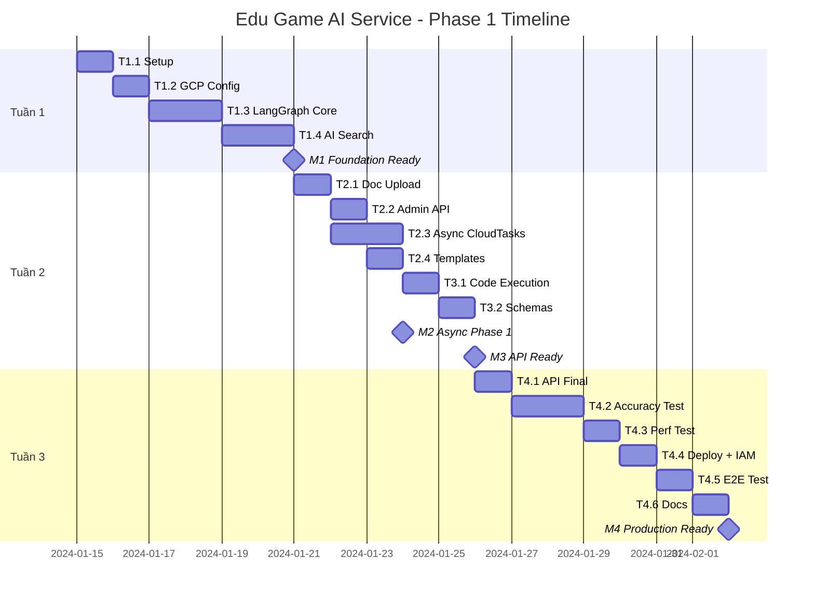

# Kế hoạch: Edu Game AI Service

## Tổng quan

**Phase 1: 2-3 tuần (10-15 ngày làm việc) — Focus: Math/Physics/Chemistry**

Đây là một internal microservice: AI-powered content generation cho educational games, với Cloud Run IAM auth và async-first processing via Cloud Tasks.

### Chiến lược 4-Pillar

| Phase       | Focus         | Agent                          | Timeline  |
| ----------- | ------------- | ------------------------------ | --------- |
| **Phase 1** | Toán/Lý/Hóa   | Math Agent + Code Execution    | 2-3 tuần  |
| **Phase 2** | Văn/Sử        | Story Agent + GraphRAG         | +2 tuần   |
| **Phase 3** | Địa/Sinh      | Visual Agent + Multimodal      | +2 tuần   |
| **Phase 4** | Ngữ pháp/Bảng | Structure Agent + Table Parser | +1-2 tuần |

---

## Các Phụ thuộc

**Những gì cần sẵn sàng trước khi bắt đầu?**

### Phụ thuộc Kỹ thuật

- [x] GCP Project `green-mercury-485016-n1` đã setup
- [x] APIs đã enable: Vertex AI, Discovery Engine, Cloud Run, Firestore, Storage, Cloud Tasks
- [ ] Vertex AI Search Data Store đã tạo và link bucket
- [ ] Cloud Tasks queue `generation-queue` đã tạo
- [ ] Upstream service account với `roles/run.invoker` (sau T4.4)
- [ ] Service account `edu-game-ai@...` với quyền cần thiết

### Phụ thuộc Con người

- [ ] Game Client team: Agreement JSON schema (cần trước T4.1)
- [ ] Game Client team: Integration test slot (cần cuối T4)

---

## Các Mốc Quan trọng

**Những deliverables chính là gì?**

| Mốc    | Tên                          | Tiêu chí Hoàn thành                                                            | Ngày Mục tiêu |
| ------ | ---------------------------- | ------------------------------------------------------------------------------ | ------------- |
| **M1** | Nền tảng Sẵn sàng            | LangGraph pipeline chạy local, Vertex AI Search hoạt động với fixtures         | Cuối Tuần 1   |
| **M2** | Async + Multi-tenant Phase 1 | POST /generate → async → poll works, doc_scope filtering đúng, user-first      | Giữa Tuần 2   |
| **M3** | API Sẵn sàng Tích hợp        | Tất cả endpoints hoạt động, Admin API done, schema finalized với Game Client   | Cuối Tuần 2   |
| **M4** | Production Ready             | Cloud Run deploy, Cloud Run IAM verified, 98% accuracy, latency <60s, E2E pass | Cuối Tuần 3   |

---

## Phân rã Nhiệm vụ

**Công việc được chia nhỏ như thế nào?**

### Tuần 1: Nền tảng (T1.x)

#### T1.1: Thiết lập Dự án (0.5 ngày) ✅ Xác nhận 2026-03-06

- [x] Init repo với cấu trúc thư mục ✅
- [x] Conda env `AIservice` với dependencies: `langchain-google-vertexai`, `langchain-google-community`, `langgraph`, `fastapi`, `google-cloud-*` ✅
- [x] Configure `.env` với GCP credentials ✅
- [x] Setup logging (`src/config/logging.py` - structlog console/JSON) ✅

#### T1.2: Cấu hình GCP (1 ngày) ✅ Xác nhận 2026-03-06

- [x] GCS bucket `documents-development-bucket` với folders: `system/`, `users/` ✅
- [x] Firestore database: `aiservice-store` ✅
- [x] Vertex AI Search Data Store: `aiservice-datastore-m1` ✅ (linked to bucket)
- [ ] Upload fixture PDFs test indexing (pending)
- [ ] Tạo Cloud Tasks queue `generation-queue` (recommend - free tier)
- [ ] Verify service account permissions

#### T1.3: LangGraph Cốt lõi (2 ngày)

- [ ] Định nghĩa `AgentState` TypedDict với `doc_scope`
- [ ] Implement Supervisor node (extract user_id, doc_scope, route)
- [ ] Implement Content Agent node (query AI Search + LLM generate) → **Phase 1: Math Agent**
- [ ] Implement Reviewer node (Gemini Flash validation)
- [ ] Implement Formatter node (template-based transform)
- [ ] Build StateGraph với edges
- [ ] Test local với hardcoded input

#### T1.4: Vertex AI Search Integration (1.5 ngày)

- [ ] Implement `vertex_search.py` với 3 filter modes:
  - `doc_scope="user"` → `user_id: ANY("{user_id}")`
  - `doc_scope="system"` → `user_id: ANY("__system__")`
  - `doc_scope="all"` → `user_id: ANY("{user_id}", "__system__")`
- [ ] Implement user-first re-ranking cho `doc_scope="all"`
- [ ] Test retrieval với fixture docs
- [ ] Verify metadata filter hoạt động đúng

**Deliverable Tuần 1**: Pipeline chạy local, AI Search trả về kết quả đúng với scope

---

### Tuần 2: Tính năng + Async (T2.x, T3.x)

#### T2.1: Document Upload Service (1 ngày)

- [ ] Implement `document_store.py`:
  - Upload user docs: `user/{user_id}/{date}/{session}/`
  - Upload system docs: `system/{date}/{session}/`
  - Set metadata `user_id` (user hoặc `__system__`)
- [ ] Trigger AI Search incremental import
- [ ] Lưu DocumentRecord vào Firestore
- [ ] Handle PDF/DOCX/PPTX validation (magic bytes + extension)
- [ ] Implement 50MB size limit

#### T2.2: Admin API (0.5 ngày)

- [ ] POST `/api/v1/admin/documents/upload` với scope="system"
- [ ] GET `/api/v1/admin/documents` — list system docs
- [ ] DELETE `/api/v1/admin/documents/{doc_id}` — delete system doc
- [ ] Verify admin docs có `user_id: "__system__"` trong metadata

#### T2.3: Cloud Tasks Async (1.5 ngày)

- [ ] Implement `task_queue.py` — enqueue generation job
- [ ] Implement JobRecord schema trong Firestore
- [ ] POST `/api/v1/generate`:
  - Tạo job record (status: processing)
  - Enqueue Cloud Task
  - Return 202 với request_id
- [ ] POST `/internal/execute-generation/{id}`:
  - Verify X-CloudTasks header
  - Run LangGraph pipeline
  - Update job record (completed/failed)
- [ ] GET `/api/v1/generations/{id}` — poll job status

#### T2.4: Game Template System (1 ngày)

- [ ] Define `templates/registry.py` với `GAME_TEMPLATES` dict
- [ ] Implement `quiz.py`: `QuizQuestion` schema + formatter prompt
- [ ] Implement `flashcard.py`: `Flashcard` schema + formatter prompt
- [ ] Implement `fill_blank.py`: `FillBlankQuestion` schema + formatter prompt
- [ ] Test structured output generation mỗi loại

#### T3.1: Code Execution cho STEM (1 ngày)

- [ ] Enable Code Execution trong Gemini config
- [ ] Update Math Agent prompt yêu cầu dùng Python cho calculations
- [ ] Test với 20 câu toán/lý/hóa từ golden set
- [ ] Handle execution timeout gracefully

#### T3.2: Pydantic Schemas Finalize (0.5 ngày)

- [ ] Finalize tất cả request/response schemas
- [ ] Generate OpenAPI spec
- [ ] Review với Game Client team (async meeting nếu cần)
- [ ] Confirm schema compatibility

**Deliverable Tuần 2**: Tất cả endpoints hoạt động async, admin API done, doc_scope filtering works, user-first verified

---

### Tuần 3: Production Hardening (T4.x)

#### T4.1: API Hoàn thiện (1 ngày)

- [ ] GET `/api/v1/users/{user_id}/documents` — list user docs
- [ ] GET `/api/v1/game-types` — list supported types với schemas
- [ ] Error handling thống nhất (HTTPException với detail rõ ràng)
- [ ] Timeout handling for polling endpoints

#### T4.2: Accuracy Testing (1.5 ngày)

- [ ] Golden test set: 100 câu STEM (toán, lý, hóa, sinh) tiếng Việt
- [ ] Run pipeline, so sánh với expected answers
- [ ] Target: ≥ 98% accuracy
- [ ] Debug và fix prompt/logic nếu dưới target

#### T4.3: Performance Testing (1 ngày)

- [ ] Benchmark: 10 câu < 60s (p95) với async + poll
- [ ] Benchmark: 10 concurrent requests → all succeed
- [ ] Identify bottlenecks, tune nếu cần
- [ ] Test Cloud Tasks queue behavior under load

#### T4.4: Deployment & IAM (1 ngày)

- [ ] Dockerfile optimized (multi-stage, slim base)
- [ ] Cloud Run deploy với `--no-allow-unauthenticated`
- [ ] Grant upstream service account `roles/run.invoker`
- [ ] Grant Cloud Tasks service account invoke permission
- [ ] Verify IAM end-to-end (upstream → AI Service → Cloud Tasks → internal endpoint)
- [ ] Health check endpoint

#### T4.5: E2E Testing (0.5 ngày)

- [ ] Test với Upstream Service integration (nếu có)
- [ ] Full flow: upload (user) → generate (async) → poll → valid response
- [ ] Full flow: generate từ system docs (no user upload)
- [ ] Full flow: doc_scope="all" với cả user + system docs → user-first verified
- [ ] Admin flow: upload system doc → user generate từ đó
- [ ] Verify Cloud Run IAM blocks unauthorized callers
- [ ] Verify internal endpoints reject direct calls

#### T4.6: Documentation (0.5 ngày)

- [ ] API documentation trong README
- [ ] Deployment guide
- [ ] Integration guide cho Game Client
- [ ] IAM setup checklist

**Deliverable Tuần 3**: Production-ready service, 98% accuracy, latency met, E2E tested

---

## Timeline Chi tiết

---

## Ước tính Nỗ lực

**Mỗi task mất bao lâu?**

| Tuần      | Nhiệm vụ                                       | Ngày          |
| --------- | ---------------------------------------------- | ------------- |
| T1        | Setup + GCP + LangGraph + Search               | 5             |
| T2        | Upload + Admin + Async + Templates + Code Exec | 5.5           |
| T3        | API + Testing + Deploy + E2E                   | 5             |
| **Total** |                                                | **15.5 ngày** |

Buffer: 1-2 ngày cho unexpected issues.

---

## Đánh giá Rủi ro

**Những gì có thể đi sai?**

| Rủi ro                                  | Khả năng   | Tác động   | Giảm thiểu                                     |
| --------------------------------------- | ---------- | ---------- | ---------------------------------------------- |
| AI Search indexing chậm/fail            | Trung bình | Cao        | Test indexing sớm (T1.2), có fallback fixtures |
| Gemini accuracy dưới 98%                | Trung bình | Cao        | Buffer time cho prompt tuning (T4.2)           |
| IAM config phức tạp hơn dự kiến         | Trung bình | Trung bình | Document rõ setup steps, test sớm              |
| Cloud Tasks integration issues          | Trung bình | Trung bình | Test async flow sớm ở T2.3                     |
| Game Client schema changes late         | Thấp       | Trung bình | Lock schema sau T3.2                           |
| DOCX/PPTX extraction kém                | Trung bình | Trung bình | Test sớm với real files                        |
| Code Execution timeout cho complex math | Trung bình | Trung bình | Simplify prompt, limit complexity              |

---

## Định nghĩa Done

**Làm sao biết Phase 1 xong?**

- [ ] Tất cả endpoints respond đúng
- [ ] Async flow hoạt động: POST → 202 → poll → completed
- [ ] Cloud Run deployed với `--no-allow-unauthenticated`
- [ ] Cloud Run IAM verified (chỉ upstream gọi được)
- [ ] Cloud Tasks flow verified (internal endpoints secure)
- [ ] 3 game types: quiz, flashcard, fill_blank
- [ ] 3 file formats: PDF, DOCX, PPTX
- [ ] doc_scope filtering đúng: user, system, all
- [ ] User-first re-ranking verified cho doc_scope="all"
- [ ] Admin API: upload, list, delete system docs
- [ ] Multi-user isolation verified
- [ ] System docs accessible by all users
- [ ] Accuracy ≥ 98% trên golden test set
- [ ] Latency <60s cho 10 câu (p95)
- [ ] E2E test passed với upstream integration
- [ ] Documentation cho Game Client team
