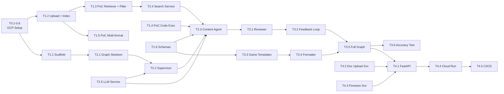

# Project Planning & Task Breakdown

## Milestones

**What are the major checkpoints?**

- [ ] **M0: GCP Project Setup** (Ngày 1-2) — Enable APIs, tạo resources, verify billing
- [ ] **M1: PoC & Scaffold** (Tuần 1) — AI Search Data Store, Code Execution test, LangGraph skeleton, schemas
- [ ] **M2: Core LangGraph Pipeline** (Tuần 2) — Full graph: Supervisor → Content Agent → Reviewer → Formatter
- [ ] **M3: Quality & Tuning** (Tuần 3) — Feedback loop, game templates, prompt tuning, accuracy ≥ 98%
- [ ] **M4: Deploy & API** (Tuần 4) — Cloud Run, REST API, document upload, handoff

## Task Breakdown

**What specific work needs to be done?**

### Phase 0: GCP Project Setup (Ngày 1-2)

- [ ] **T0.1: Enable required GCP APIs**

  ```bash
  gcloud config set project green-mercury-485016-n1

  # Core APIs
  gcloud services enable aiplatform.googleapis.com
  gcloud services enable discoveryengine.googleapis.com
  gcloud services enable run.googleapis.com
  gcloud services enable firestore.googleapis.com
  gcloud services enable storage.googleapis.com
  gcloud services enable secretmanager.googleapis.com

  # CI/CD & Monitoring
  gcloud services enable cloudbuild.googleapis.com
  gcloud services enable logging.googleapis.com
  gcloud services enable cloudtrace.googleapis.com
  ```

  - **Validate:** `gcloud services list --enabled | grep -c googleapis` ≥ 9

- [ ] **T0.2: Create GCS bucket cho document upload**

  ```bash
  # Tạo bucket với uniform access
  gsutil mb -b on -l asia-southeast1 gs://edu-game-docs-green-mercury-485016-n1

  # Verify
  gsutil ls gs://edu-game-docs-green-mercury-485016-n1
  ```

- [ ] **T0.3: Create Firestore database**

  ```bash
  gcloud firestore databases create --location=asia-southeast1
  ```

- [ ] **T0.4: Create Vertex AI Search Data Store**
  - Option A (Console): Agent Builder → Data Stores → Create → Cloud Storage → point to bucket
  - Option B (gcloud):
    ```bash
    # Create data store
    curl -X POST \
      -H "Authorization: Bearer $(gcloud auth print-access-token)" \
      -H "Content-Type: application/json" \
      "https://discoveryengine.googleapis.com/v1/projects/green-mercury-485016-n1/locations/global/collections/default_collection/dataStores?dataStoreId=edu-game-docs" \
      -d '{
        "displayName": "edu-game-docs",
        "industryVertical": "GENERIC",
        "contentConfig": "CONTENT_REQUIRED",
        "solutionTypes": ["SOLUTION_TYPE_SEARCH"]
      }'
    ```
  - Tạo Search App linking to Data Store
  - **Validate:** Data Store visible trong Console

- [ ] **T0.5: Create Service Account & IAM**

  ```bash
  # Create service account
  gcloud iam service-accounts create edu-game-ai \
    --display-name="Edu Game AI Service"

  SA_EMAIL=edu-game-ai@green-mercury-485016-n1.iam.gserviceaccount.com

  # Grant roles
  gcloud projects add-iam-policy-binding green-mercury-485016-n1 \
    --member="serviceAccount:$SA_EMAIL" \
    --role="roles/aiplatform.user"
  gcloud projects add-iam-policy-binding green-mercury-485016-n1 \
    --member="serviceAccount:$SA_EMAIL" \
    --role="roles/discoveryengine.editor"
  gcloud projects add-iam-policy-binding green-mercury-485016-n1 \
    --member="serviceAccount:$SA_EMAIL" \
    --role="roles/storage.objectAdmin"
  gcloud projects add-iam-policy-binding green-mercury-485016-n1 \
    --member="serviceAccount:$SA_EMAIL" \
    --role="roles/datastore.user"
  gcloud projects add-iam-policy-binding green-mercury-485016-n1 \
    --member="serviceAccount:$SA_EMAIL" \
    --role="roles/secretmanager.secretAccessor"
  ```

- [ ] **T0.6: Create API Key secret + Admin Key secret**

  ```bash
  # Generate and store API key (user)
  echo -n "$(openssl rand -hex 32)" | \
    gcloud secrets create edu-game-api-key \
    --data-file=- --replication-policy=automatic

  # Generate and store Admin key
  echo -n "$(openssl rand -hex 32)" | \
    gcloud secrets create edu-game-admin-key \
    --data-file=- --replication-policy=automatic
  ```

- [ ] **T0.7: Upload initial system docs**
  - Upload SGK/giáo trình chuẩn vào GCS: `system/2026-03-03/initial/`
  - Import vào Vertex AI Search Data Store với metadata: `user_id="__system__"`, `subject`, `grade`
  - Chờ indexing (~10-15 phút)
  - **Validate:** Query system docs trong Console → verify extractive answers

### Phase 1: PoC & Scaffold (Tuần 1)

- [ ] **T1.1: Project scaffold**
  - Python 3.12+ project (pyproject.toml, uv)
  - Folder structure theo design doc (`src/api/`, `src/graph/`, `src/templates/`, `src/services/`)
  - Dependencies: `langgraph`, `langchain-google-vertexai`, `langchain-google-community[vertexai]`, `google-cloud-discoveryengine`, `fastapi`, `google-cloud-firestore`, `google-cloud-storage`, `structlog`
  - Linter/formatter: ruff, mypy
  - `.env.example` + `src/config/settings.py` (Pydantic Settings)

- [ ] **T1.2: Upload test documents & verify AI Search indexing**
  - Upload 1 PDF (SGK Toán) vào GCS bucket: `system/2026-03-03/session-1/` (system doc)
  - Upload 1 PDF (giáo án user) vào GCS bucket: `user/test-user/2026-03-03/session-1/` (user doc)
  - Import cả 2 vào Vertex AI Search Data Store với metadata tương ứng
  - Chờ indexing (~10-15 phút)
  - **Validate:** Query trong Console → verify extractive answers tiếng Việt cho cả system và user docs

- [ ] **T1.3: PoC VertexAISearchRetriever + metadata filter + doc_scope**
  - Viết script test `VertexAISearchRetriever` query vào Data Store
  - Test metadata filtering: chỉ trả docs có `user_id == "test-user"` (user scope)
  - Test metadata filtering: chỉ trả docs có `user_id == "__system__"` (system scope)
  - Test combined filter: `user_id: ANY("test-user", "__system__")` (all scope)
  - Test lấy extractive answers/segments từ tài liệu tiếng Việt
  - Đo latency, evaluate chất lượng retrieval
  - **Validate:** Retriever scoped per doc_scope + context đủ quality

- [ ] **T1.4: PoC Gemini Code Execution**
  - Test Gemini Pro Code Execution (advanced mode)
  - Gửi bài toán đạo hàm/tích phân → verify kết quả
  - Xác nhận sandbox hỗ trợ SymPy/NumPy
  - **Validate:** Đáp án chính xác 100% cho 10 bài test

- [ ] **T1.5: PoC multi-format upload**
  - Test upload PDF, DOCX, PPTX vào GCS
  - Test Vertex AI Search indexing cho cả 3 format
  - **Validate:** AI Search trả results cho tất cả formats

- [ ] **T1.6: Pydantic schemas**
  - Tạo all models: `GenerationRequest` (với `doc_scope`), `ContentItem`, `QuizQuestion`, `Flashcard`, `FillBlankQuestion`, `GameContentResponse`, `DocumentRecord` (với `scope`), `AgentState`
  - Game Template registry: `GAME_TEMPLATES` dict
  - Unit tests cho schema validation

### Phase 2: Core LangGraph Pipeline (Tuần 2)

- [ ] **T2.1: LangGraph State & Graph skeleton**
  - `AgentState` TypedDict
  - `StateGraph` trong `graph/builder.py` — nodes + edges placeholder
  - Compile graph, test basic flow

- [ ] **T2.2: Supervisor node**
  - Nhận request → phân tích nội dung → routing decision
  - Xác định `doc_scope` từ request (default: "all")
  - MVP: route tất cả sang Content Agent (single path)
  - Future: conditional edges sang Story/Visual agents
  - Output: updated state với routing info + doc_scope

- [ ] **T2.3: Content Agent node**
  - Tích hợp `VertexAISearchRetriever` → query context (filter by `doc_scope`)
    - `doc_scope="user"`: filter `user_id` only
    - `doc_scope="system"`: filter `user_id="__system__"` only
    - `doc_scope="all"`: filter `user_id` OR `"__system__"` + **post-retrieval re-ranking (user docs xếp trước)**
  - Prompt engineering: sinh **content items** (generic Q&A) từ retrieved context
  - Tích hợp Code Execution tool cho tính toán (khi detected math/physics/chemistry)
  - Handle difficulty levels
  - Output: `content_items` trong state

- [ ] **T2.4: Vertex AI Search service wrapper**
  - `services/vertex_search.py` — factory cho `VertexAISearchRetriever`
  - Config: project_id, data_store_id, location, max_documents
  - Metadata filter builder: `doc_scope`, `user_id`, optional `subject`, `document_id`
  - Support 3 modes: user-only, system-only, combined (all) with user-first re-ranking

- [ ] **T2.5: LLM service factory**
  - `services/llm.py` — factory cho `ChatVertexAI` Pro/Flash
  - Config-driven model selection
  - Retry logic + error handling
  - Token usage tracking

### Phase 3: Quality & Game Templates (Tuần 3)

- [ ] **T3.1: Reviewer node**
  - Prompt: check accuracy, grounding, quality, relevance to user's docs
  - Gemini Flash (cheap, fast)
  - Output: pass/fail + reason per content item
  - Update state: `reviewed_items` + `rejected_items`

- [ ] **T3.2: Feedback loop**
  - Conditional edge: Reviewer fail → Supervisor → Content Agent retry
  - Max iteration: 3 (configurable)
  - Track `iteration_count` trong state
  - Graceful termination: partial results nếu max reached

- [ ] **T3.3: Game template system**
  - `templates/registry.py` — GAME_TEMPLATES dict
  - `templates/quiz.py` — QuizQuestion schema + prompt
  - `templates/flashcard.py` — Flashcard schema + prompt
  - `templates/fill_blank.py` — FillBlankQuestion schema + prompt
  - Unit tests: content items → game-specific output

- [ ] **T3.4: Formatter node**
  - Nhận reviewed content items + `game_types[]`
  - Lấy template cho mỗi game type từ registry
  - `with_structured_output()` per game type schema
  - Dedup check
  - Output: `final_output` trong state

- [ ] **T3.5: Full graph assembly & test**
  - Connect tất cả nodes + edges trong `builder.py`
  - Checkpoint persistence (Firestore)
  - Integration test: full pipeline E2E

- [ ] **T3.6: Prompt tuning & accuracy testing**
  - Test với bộ 50+ bài toán/lý/hóa
  - Measure accuracy rate
  - Tune prompts cho Supervisor, Content Agent, Reviewer
  - Target: ≥ 98% accuracy

### Phase 4: Deploy & API (Tuần 4)

- [ ] **T4.1: FastAPI endpoints**
  - POST /api/v1/documents/upload (user docs)
  - GET /api/v1/documents/{document_id}/status
  - GET /api/v1/users/{user_id}/documents
  - POST /api/v1/admin/documents/upload (system docs, admin key)
  - GET /api/v1/admin/documents (list system docs, admin key)
  - DELETE /api/v1/admin/documents/{document_id} (admin key)
  - POST /api/v1/generate (với doc_scope param)
  - GET /api/v1/generations/{request_id}
  - GET /api/v1/game-types
  - API Key middleware (Secret Manager) + user_id header
  - Admin Key middleware for /admin/\* routes
  - Error handling & validation

- [ ] **T4.2: Document upload service**
  - `services/document_store.py` — GCS upload (`system/` for admin, `user/{user_id}/` for users) + trigger AI Search import
  - File validation: PDF/DOCX/PPTX only, 50MB max (magic bytes)
  - Track indexing status in Firestore
  - Metadata attachment: user_id (or `__system__`), upload_date, session_id, scope
  - Privacy: consent flag trong upload request (tham khảo Requirements → Privacy & Data Consent)

- [ ] **T4.3: Firestore service**
  - `services/firestore.py` — CRUD cho generations, documents, user records
  - LangGraph checkpoint storage

- [ ] **T4.4: Docker & Cloud Run deploy**
  - Dockerfile (multi-stage build)
  - docker-compose.yml cho local dev
  - Deploy Cloud Run
  - Environment variables via Secret Manager
  - IAM: service account permissions cho Vertex AI, Firestore, GCS, AI Search

- [ ] **T4.5: CI/CD**
  - GitHub Actions: lint → test → build → deploy Cloud Run
  - Auto deploy on push to main

- [ ] **T4.6: Documentation & handoff**
  - OpenAPI docs (auto-generated by FastAPI)
  - README: GCP setup guide, architecture diagram
  - Sample request/response cho Game Client team
  - Game Template how-to: guide thêm game types mới

## Dependencies

**What needs to happen in what order?**



### External Dependencies

- GCP project `green-mercury-485016-n1` + billing account
- Tài liệu test: giáo án/giáo trình/slide (PDF, DOCX, PPTX) tiếng Việt
- Game Client team: JSON schema agreement

## Timeline & Estimates

| Phase                        | Duration   | Effort   | Deliverable                                                         |
| ---------------------------- | ---------- | -------- | ------------------------------------------------------------------- |
| Phase 0: GCP Setup           | 2 ngày     | ~4h      | All APIs enabled, resources created                                 |
| Phase 1: PoC & Scaffold      | 4 ngày     | ~18h     | PoC passed (retriever + filter + code exec + multi-format), schemas |
| Phase 2: Core Pipeline       | 5 ngày     | ~25h     | Full LangGraph pipeline working E2E                                 |
| Phase 3: Quality & Templates | 5 ngày     | ~24h     | Game templates, feedback loop, accuracy ≥ 98%                       |
| Phase 4: Deploy & API        | 4 ngày     | ~20h     | API live on Cloud Run, CI/CD, doc upload                            |
| **Total**                    | **4 tuần** | **~91h** | **MVP live**                                                        |

## Risks & Mitigation

| Risk                                                | Impact | Prob   | Mitigation                                                            |
| --------------------------------------------------- | ------ | ------ | --------------------------------------------------------------------- |
| Vertex AI Search kém với DOCX/PPTX tiếng Việt       | High   | Medium | PoC T1.5 validate sớm. Fallback: convert to PDF trước khi upload      |
| Vertex AI Search metadata filtering không chính xác | High   | Medium | PoC T1.3 validate. Fallback: separate Data Store per user (expensive) |
| Code Execution sandbox thiếu thư viện               | Medium | Medium | PoC T1.4 validate. Fallback: custom Python REPL tool                  |
| Accuracy < 98%                                      | High   | Medium | Thêm iteration round. Heavy prompt tuning                             |
| Cloud Run cold start chậm                           | Medium | Medium | `min-instances=1`, warm-up endpoint                                   |
| Vertex AI Search pricing vượt budget                | Medium | Low    | Monitor query volume. Budget alert GCP                                |
| GCP project billing chưa setup                      | High   | Low    | T0 bao gồm verify billing trước khi enable APIs                       |

## Resources Needed

### Team

- 1 AI/Backend Engineer (primary)
- 1 Game Developer (coordinate JSON schema)

### GCP Services (TẤT CẢ cần setup từ đầu)

| Service          | API                              | Status       |
| ---------------- | -------------------------------- | ------------ |
| Vertex AI        | `aiplatform.googleapis.com`      | ✅ Đã enable |
| Vertex AI Search | `discoveryengine.googleapis.com` | ✅ Đã enable |
| Cloud Run        | `run.googleapis.com`             | ✅ Đã enable |
| Firestore        | `firestore.googleapis.com`       | ✅ Đã enable |
| Cloud Storage    | `storage.googleapis.com`         | ✅ Đã enable |
| Secret Manager   | `secretmanager.googleapis.com`   | ✅ Đã enable |
| Cloud Build      | `cloudbuild.googleapis.com`      | ✅ Đã enable |
| Cloud Logging    | `logging.googleapis.com`         | ✅ Đã enable |
| Cloud Trace      | `cloudtrace.googleapis.com`      | ✅ Đã enable |

### Estimated Monthly Cost

- Cloud Run: $0-10 (free tier)
- Gemini API: $3-10
- Vertex AI Search: $2-10 (query-based pricing)
- Firestore: $0-5 (free tier covers MVP)
- Cloud Storage: < $1
- **Total: ~$10-25/month**
