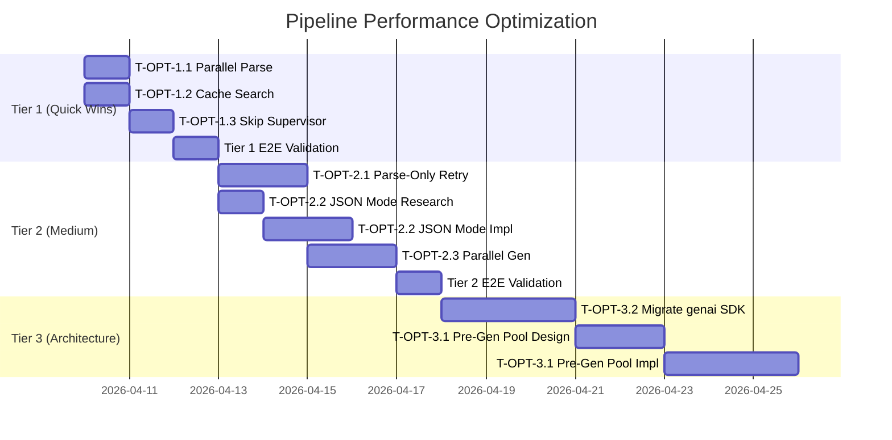

# Pipeline Performance Optimization Plan

> **Tham chiếu:** [100% Delivery Plan](pipeline-100-percent-delivery-plan.md) (✅ validated 2026-03-31)  
> **Trạng thái:** 📋 Planning — chưa bắt đầu implementation  
> **Mục tiêu:** Giảm thời gian xử lý pipeline từ **~35 phút (4 levels) → ≤15 phút**, ưu tiên `high_application` từ **~21 phút → ≤7 phút**

---

## 0. Baseline — E2E Results (2026-04-09)

| Difficulty | Delivered | Time | Iterations | LLM Calls/Iter | Bottleneck |
|---|---|---|---|---|---|
| recall | 10/10 | **125s** | 1 | 4 (supervisor + gen + parse + review) | — |
| comprehension | 10/10 | **123s** | 1 | 4 | — |
| application | 10/10 | **540s** | 2 | 8 | Parse errors iter 1 |
| high_application | 10/10 | **1291s** | 4 | 16+ | Parse errors + escalating overshoot |
| **TOTAL** | **40/40** | **2079s** | | | |

### Test Pyramid (115/115 ✅)

- Unit: 57/57, Integration: 10/10, System: 44/44, E2E live: 4/4

---

## 1. Root Cause Analysis — Thời gian xử lý

### RCA-1: Tuần tự hoàn toàn (Sequential execution)

**Hiện trạng:** Mỗi iteration chạy tuần tự:
```
supervisor (LLM) → vertex_search (API) → math_agent gen (LLM+code) → parse (LLM×N batches) → reviewer (LLM) → [retry?]
```
- Parse batches (`PARSE_BATCH_SIZE=7`) cũng chạy **tuần tự** (P4 reliability)
- high_application 38 items = 6 parse batches × ~15s/batch = ~90s chỉ riêng parsing

### RCA-2: Generation + Parse là 2 LLM calls riêng

**Hiện trạng:** Math agent dùng 2-phase approach:
1. **Phase 1**: Generate raw text + code execution → `AIMessage` (text + code traces)
2. **Phase 2**: Parse raw text → `ContentItemList` (structured output)

Mỗi item = 2 LLM roundtrips. Nếu parse fail → retry generation + parse lại.

### RCA-3: Lặp lại work không cần thiết trên retry

**Hiện trạng:** Khi `review_router` trả `"fail"`:
- **Supervisor chạy lại** → classify content type (kết quả luôn giống nhau)
- **Vertex AI Search chạy lại** → cùng query, cùng kết quả
- Mỗi retry lãng phí ~10-15s cho 2 bước này

### RCA-4: Overshoot cao tạo volume lớn

**Hiện trạng:** `high_application` overshoot = `2.5 × (1 + 0.3 × iter)`:
- Iter 0: `2.5 × 1.0` = 25 items cho 10 requested
- Iter 1: `2.5 × 1.3` = 33 items
- Iter 2: `2.5 × 1.6` = 40 items
- Iter 3: `2.5 × 1.9` = 48 items

Volume lớn → generation lâu hơn + parse lâu hơn + review lâu hơn.

---

## 2. Dependencies & Constraints

### Technical Constraints
- LangGraph StateGraph: retry loop phải đi qua conditional edge (`review_router`)
- Vertex AI Search rate limit: ~60 QPS (không phải bottleneck)
- Gemini API rate limit: managed by `rate_limiter.py` (token bucket + semaphore)
- `ChatVertexAI` deprecated LangChain 3.2.0 — migration sẽ diễn ra song song

### Human Dependencies
- Không cần approval từ team khác — internal optimization
- Performance testing cần live LLM → cost ~$0.50-1.00/full run

---

## 3. Task Breakdown — 3 Tiers

### Tier 1: Quick Wins (giảm ~30-50% thời gian)

#### T-OPT-1.1: Parallel Parse Batches ⏱️ 0.5 ngày

**File:** `src/graph/nodes/math_agent.py` → `_parse_raw_content()`

**Hiện trạng:** Parse batches chạy tuần tự (sequential for-loop)
```python
# Hiện tại (sequential):
for batch_idx in range(num_batches):
    batch_items = await _parse_batch(...)
    all_items.extend(batch_items)
```

**Thay đổi:**
```python
# Parallel với semaphore:
sem = asyncio.Semaphore(3)
async def _guarded_parse(batch_idx, ...):
    async with sem:
        return await _parse_batch(...)

tasks = [_guarded_parse(i, ...) for i in range(num_batches)]
results = await asyncio.gather(*tasks, return_exceptions=True)
```

**Tác động:** 6 parse batches: 90s → ~30s (3 concurrent)
**Risk:** Tăng concurrent LLM calls → rate limiter đã handle

**Kiểm tra:**
- [ ] Unit test: parallel parse returns same items as sequential
- [ ] E2E test: high_application vẫn 10/10 delivery
- [ ] Verify rate limiter không bị trip circuit breaker

---

#### T-OPT-1.2: Cache Vertex AI Search trên Retry ⏱️ 0.5 ngày

**File:** `src/graph/nodes/math_agent.py` → `math_agent_node()`

**Hiện trạng:** `retrieve_context()` gọi lại mỗi iteration (`iteration_count > 0`)
```python
# Gọi mỗi iteration — cùng query, cùng kết quả
search_context, search_sources = await retrieve_context(
    user_id=request.user_id, query=query, doc_scope=doc_scope, max_documents=10,
)
```

**Thay đổi:** Cache search results trong AgentState
```python
# Reuse từ state nếu đã có
if iteration_count > 0 and state.get("search_context"):
    search_context = state["search_context"]
    search_sources = state.get("search_sources", [])
else:
    search_context, search_sources = await retrieve_context(...)
```

**Tác động:** Tiết kiệm ~5-10s/retry × 3 retries = ~15-30s cho high_application
**Risk:** Rất thấp — search context không thay đổi giữa các iteration

**Kiểm tra:**
- [ ] Unit test: math_agent skips search on retry
- [ ] E2E test: delivery vẫn 100%

---

#### T-OPT-1.3: Skip Supervisor trên Retry ⏱️ 1 ngày

**File:** `src/graph/builder.py`, `src/graph/nodes/reviewer.py`

**Hiện trạng:** Khi reviewer trả "fail", flow quay lại supervisor → classify lại content type
```python
# builder.py
graph.add_conditional_edges("reviewer", review_router, {
    "pass": "formatter",
    "fail": "supervisor",  # ← Retry: đi qua supervisor không cần thiết
})
```

**Thay đổi:** Thêm edge `"fail" → "math_agent"` trực tiếp
```python
graph.add_conditional_edges("reviewer", review_router, {
    "pass": "formatter",
    "fail": "math_agent",  # ← Skip supervisor on retry
})
```

**Tác động:** Tiết kiệm 1 LLM call/retry (~3-5s × 3 retries = ~10-15s)
**Risk:** Medium — cần đảm bảo math_agent nhận đủ state (content_type đã set từ iter 0)

**Kiểm tra:**
- [ ] Unit test: graph compiles với edge mới
- [ ] Unit test: math_agent hoạt động đúng khi không đi qua supervisor
- [ ] Integration test: retry loop vẫn converge
- [ ] E2E test: 4 levels 100% delivery

---

### Tier 2: Medium Effort (giảm thêm ~30-40%)

#### T-OPT-2.1: Parse-Only Retry (không retry generation) ⏱️ 1.5 ngày

**File:** `src/graph/nodes/math_agent.py` → Phase 1+2 retry loop

**Hiện trạng:** Khi parse fail → retry cả generation + parse (2 LLM calls)
```python
for gen_attempt in range(MAX_GENERATION_RETRIES):
    raw_response = await code_exec_llm.ainvoke(...)  # Phase 1: ~30-60s
    all_parsed_items = await _parse_raw_content(...)  # Phase 2: ~15-30s
    if all_parsed_items:
        break  # Retry cả 2 phases nếu parse fail
```

**Thay đổi:** Cache raw_response, chỉ retry parse với prompt rõ ràng hơn
```python
raw_response = await code_exec_llm.ainvoke(...)  # Phase 1: 1 lần
for parse_attempt in range(MAX_PARSE_RETRIES):
    all_parsed_items = await _parse_raw_content(
        ..., stricter_schema=(parse_attempt > 0)
    )
    if all_parsed_items:
        break
# Chỉ retry Phase 1 nếu tất cả parse attempts fail
```

**Tác động:** Tiết kiệm ~30-60s mỗi lần parse fail (cost of generation + code execution)
**Risk:** Low — raw content vẫn còn, chỉ thay đổi parsing strategy

**Kiểm tra:**
- [ ] Unit test: parse-only retry path
- [ ] Unit test: fallback to full generation retry khi parse hoàn toàn fail
- [ ] E2E test: high_application recovery

---

#### T-OPT-2.2: JSON Mode — Bỏ 2-Phase Generate+Parse ⏱️ 2 ngày

**File:** `src/graph/nodes/math_agent.py` (major refactor)

**Hiện trạng:** Math agent dùng 2-phase:
1. Generate text + code execution → raw AIMessage
2. Parse raw text → ContentItemList via separate LLM call

**Thay đổi:** Dùng `response_mime_type="application/json"` + `response_schema`
```python
# Thay vì 2-phase, dùng structured output trực tiếp
llm = get_generation_llm(...)
structured_llm = llm.with_structured_output(ContentItemList)
result = await structured_llm.ainvoke(generation_messages)
```

**Lưu ý quan trọng:** Code execution tool **không tương thích** với JSON mode trên một số model.
Cần research: Gemini 3 Flash có hỗ trợ `code_execution` + `response_schema` đồng thời không?

**Tác động:** Bỏ hoàn toàn parsing step → giảm N LLM calls per iteration
**Risk:** High — code execution + structured output compatibility chưa xác nhận

**Kiểm tra:**
- [ ] **Research trước:** Test code_execution + JSON mode trên Gemini 3 Flash
- [ ] Nếu tương thích: refactor math_agent, unit test + E2E
- [ ] Nếu không tương thích: bỏ task này, focus T-OPT-2.1

---

#### T-OPT-2.3: Parallel Micro-Batch Generation ⏱️ 1.5 ngày

**File:** `src/graph/nodes/math_agent.py` → `math_agent_node()`

**Hiện trạng:** 1 generation call cho toàn bộ `num_to_generate` items (25-48 câu)

**Thay đổi:** Tách thành 2 micro-batches chạy song song
```python
half = num_to_generate // 2
batch_a = generate_batch(half, ...)
batch_b = generate_batch(num_to_generate - half, ...)
results = await asyncio.gather(batch_a, batch_b)
```

**Tác động:** Giảm ~40-50% thời gian generation cho large batches
**Risk:** Medium — 2 concurrent code execution calls, prompt consistency

**Kiểm tra:**
- [ ] Unit test: merged results có đủ items
- [ ] E2E test: quality không giảm (review pass rate tương đương)

---

### Tier 3: Architectural Changes (giảm 50-70%)

#### T-OPT-3.1: Pre-Generate Pool (Background Job) ⏱️ 3-5 ngày

**Kiến trúc:**
```
┌─────────────────┐     ┌──────────────────┐     ┌───────────────┐
│ Background Job   │────▶│ Firestore Pool    │◀────│ API Request   │
│ (Cloud Tasks)    │     │ topic×difficulty  │     │ GET /generate │
│ Sinh sẵn câu hỏi│     │ pre-generated     │     │ Lấy từ pool   │
└─────────────────┘     └──────────────────┘     └───────────────┘
```

- Background job chạy hàng ngày/tuần: sinh câu hỏi cho top topics × 4 difficulty levels
- API request: lấy từ pool trước, chỉ generate thêm nếu thiếu
- Pool management: TTL, refresh policy, popularity-based priority

**Tác động:** Request time: phút → giây (~2-5s lấy từ Firestore)
**Risk:** High — cần infrastructure mới (Cloud Tasks scheduling, Firestore schema)

**Kiểm tra:**
- [ ] Design doc cho pool schema + refresh policy
- [ ] Implement background job
- [ ] Implement pool lookup + fallback
- [ ] Load test: concurrent requests từ pool

---

#### T-OPT-3.2: Migrate sang `langchain-google-genai` ⏱️ 2-3 ngày

**Hiện trạng:** `ChatVertexAI` deprecated trong LangChain 3.2.0.
`langchain-google-genai` / `ChatGoogleGenerativeAI` là replacement chính thức.

**Tác động:**
- Model mới (gemini-3-flash) qua google-genai SDK nhanh hơn
- Ít parse error hơn (better structured output support)
- Tương lai-proof: không bị deprecation warning

**Risk:** Medium — cần test tương thích: code_execution, structured_output, rate_limiter

**Kiểm tra:**
- [ ] Research: ChatGoogleGenerativeAI API compatibility
- [ ] Migrate `src/services/llm.py`
- [ ] Test tất cả node: supervisor, math_agent, reviewer, formatter
- [ ] Regression E2E: 4 levels 100%

---

## 4. Sequencing & Dependencies



### Dependency Graph

```
T-OPT-1.1 ──┐
T-OPT-1.2 ──┼──▶ Tier 1 E2E ──▶ T-OPT-2.1 ──▶ T-OPT-2.3 ──┐
T-OPT-1.3 ──┘                └──▶ T-OPT-2.2 ──────────────┼──▶ Tier 2 E2E ──▶ T-OPT-3.x
                                                            │
```

- **T-OPT-1.1 + 1.2** có thể chạy song song (independent files)
- **T-OPT-1.3** phụ thuộc T-OPT-1.1 (cùng graph topology change)
- **T-OPT-2.2** cần research trước, có thể bỏ nếu không khả thi
- **T-OPT-3.1** cần design doc + team review trước implementation

---

## 5. Performance Targets

| Milestone | Target | Metric |
|---|---|---|
| **After Tier 1** | high_application ≤ 800s, total ≤ 1400s | E2E live test |
| **After Tier 2** | high_application ≤ 400s, total ≤ 900s | E2E live test |
| **After Tier 3** | request time ≤ 10s (from pool) | API latency p95 |

### Success Criteria

- ✅ 100% delivery maintained (không trade accuracy cho speed)
- ✅ Mỗi tier phải pass full test pyramid trước khi chuyển tier tiếp theo
- ✅ Performance improvement đo bằng E2E live test (không phải mock)

---

## 6. Current Status

### Done ✅
- [x] 100% delivery validated (115/115 tests passing)
- [x] Baseline metrics captured (E2E 2026-04-09)
- [x] Root cause analysis completed (RCA-1 to RCA-4)
- [x] Optimization plan created

### Tier 1 — Not Started
- [ ] T-OPT-1.1: Parallel parse batches
- [ ] T-OPT-1.2: Cache Vertex AI Search
- [ ] T-OPT-1.3: Skip supervisor on retry
- [ ] Tier 1 E2E validation

### Tier 2 — Not Started
- [ ] T-OPT-2.1: Parse-only retry
- [ ] T-OPT-2.2: JSON mode (needs research)
- [ ] T-OPT-2.3: Parallel micro-batch generation
- [ ] Tier 2 E2E validation

### Tier 3 — Not Started
- [ ] T-OPT-3.1: Pre-generate pool
- [ ] T-OPT-3.2: Migrate to langchain-google-genai

### Risks & Blockers
- [ ] **RISK:** JSON mode + code_execution compatibility chưa xác nhận (T-OPT-2.2)
- [ ] **RISK:** Parallel generation có thể giảm quality nếu model không consistent
- [ ] **RISK:** Pre-generate pool cần Firestore schema design + team alignment

---

## 7. Next Steps (Immediate Priority)

1. **Bắt đầu Tier 1** — T-OPT-1.1 + T-OPT-1.2 song song (không phụ thuộc nhau)
2. **Research T-OPT-2.2** — Test Gemini 3 Flash: `code_execution` + `response_schema` compatibility
3. **Review plan** — Team review trước khi bắt đầu Tier 2+
