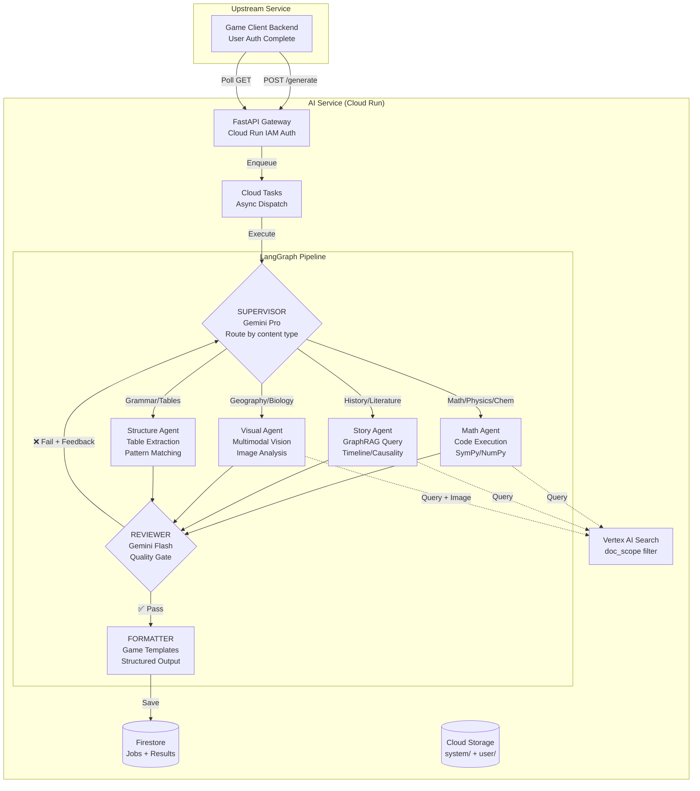
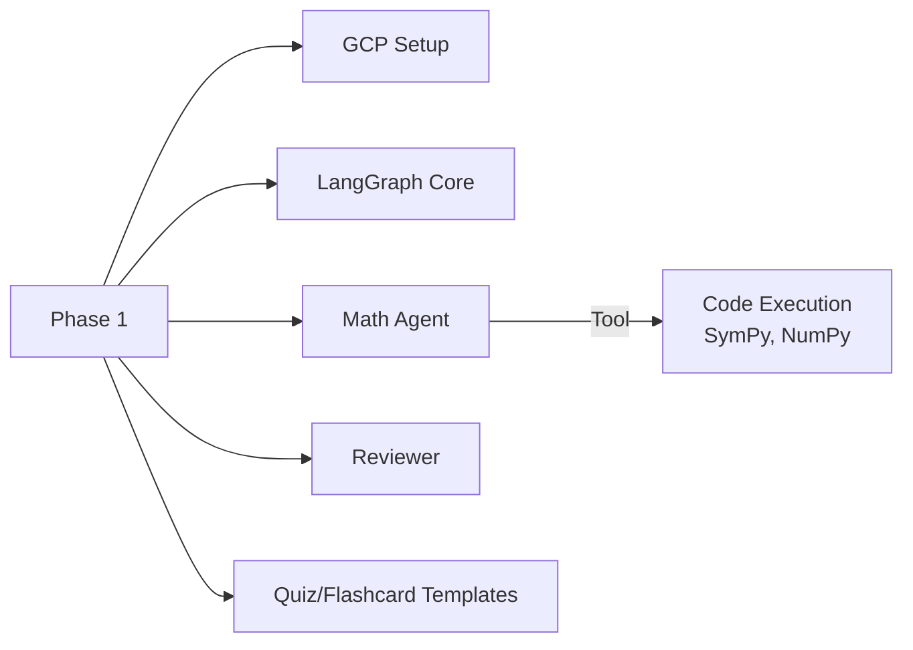
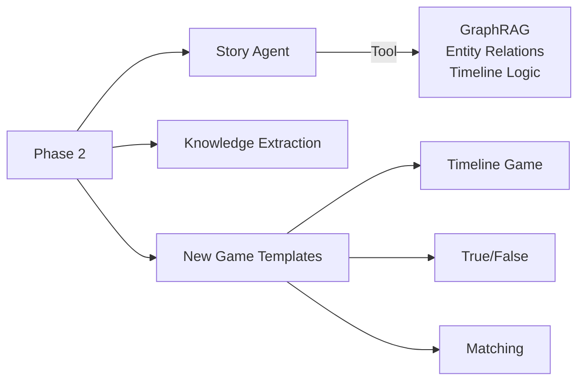
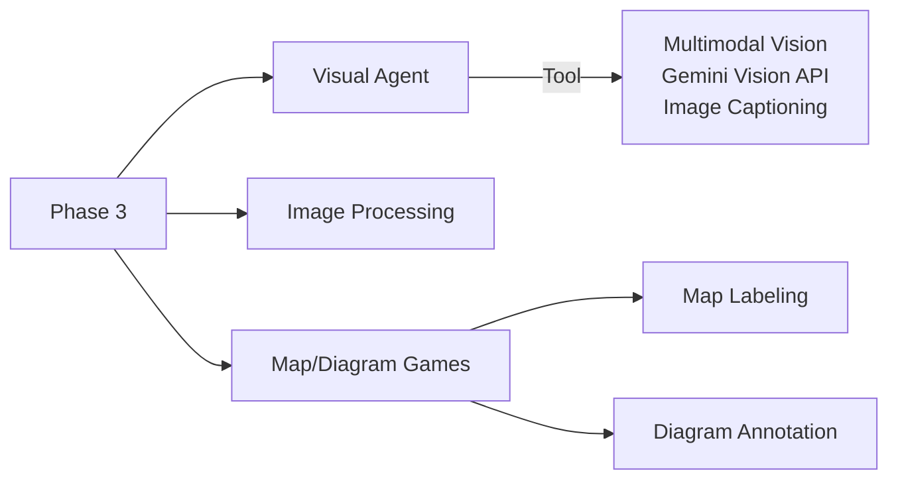
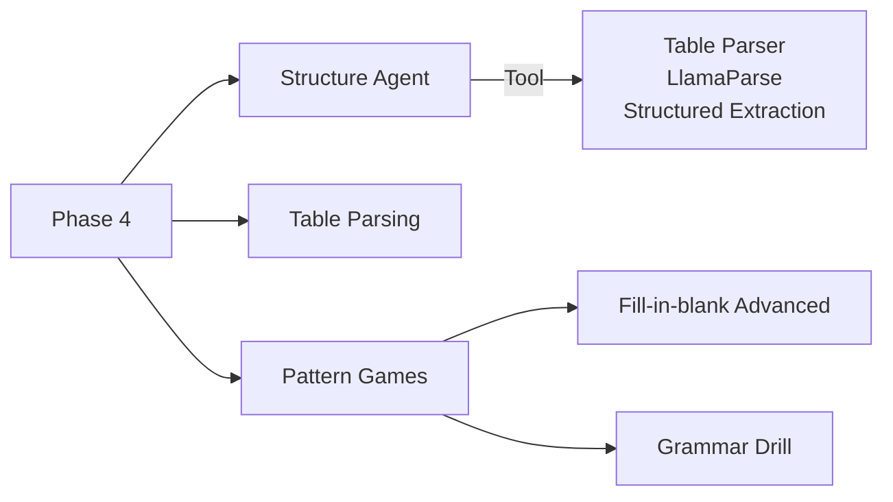
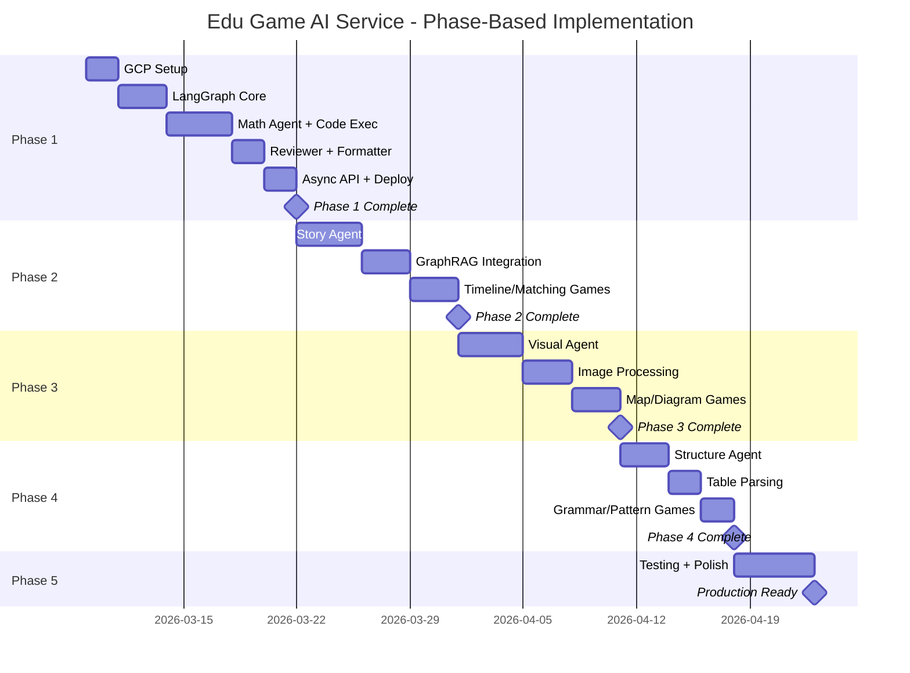

# Project Workflow Proposal: Edu Game AI Service

## Original Vision Recap

The system follows the **4-Pillar Strategy** for handling different educational content types:

| Pillar       | Data Type             | Subjects                         | Key Challenge                      | Solution                       |
| ------------ | --------------------- | -------------------------------- | ---------------------------------- | ------------------------------ |
| **Pillar 1** | Logic & Computational | Math, Physics, Chemistry         | LLM calculates incorrectly         | **Python Code Execution**      |
| **Pillar 2** | Narrative & Semantic  | Literature, History, Civics      | Context loss, causal relationships | **GraphRAG / Knowledge Graph** |
| **Pillar 3** | Spatial & Visual      | Geography, Biology, Technology   | Info in images/diagrams            | **Multimodal LLM (Vision)**    |
| **Pillar 4** | Structured & Taxonomy | English grammar, Chemical tables | Table/list structure breaking      | **Structured Extraction**      |

---

## Corrected LangGraph Architecture

The original design requires **multiple specialized agents**, not one generic Content Agent.



### Key Differences from Current Design

| Aspect           | Current (Wrong)         | Original Vision (Correct)                  |
| ---------------- | ----------------------- | ------------------------------------------ |
| Agent Structure  | 1 generic Content Agent | 4 specialized agents                       |
| Routing          | Simple pass-through     | Supervisor analyzes & routes to specialist |
| Math Handling    | Mixed with general      | Dedicated Math Agent + Code Execution      |
| History Handling | Same as Math            | Dedicated Story Agent + GraphRAG           |
| Image Handling   | Not addressed           | Dedicated Visual Agent + Multimodal        |
| Table Handling   | Not addressed           | Dedicated Structure Agent                  |

---

## Phase-Based Implementation

### Phase 1: Foundation + Math Agent (2 weeks)

**Focus:** Logic & Computational pillar — Math, Physics, Chemistry



**Deliverables:**

- [ ] GCP project setup (Storage, Firestore, Vertex AI Search, Cloud Tasks)
- [ ] LangGraph StateGraph skeleton
- [ ] Supervisor Node (routing logic)
- [ ] **Math Agent Node** with:
  - Vertex AI Search retriever (doc_scope filter)
  - Gemini Code Execution for calculations
  - SymPy/NumPy for symbolic math
- [ ] Reviewer Node (Gemini Flash)
- [ ] Formatter Node with Quiz + Flashcard templates
- [ ] Async API (POST → Cloud Tasks → poll)
- [ ] Cloud Run deployment with IAM auth

**Success Criteria:**

- Generate 10 Math quiz questions with ≥98% accuracy
- Code Execution solves derivative/integral problems correctly
- Async flow works end-to-end

---

### Phase 2: Story Agent + Game Expansion (2 weeks)

**Focus:** Narrative & Semantic pillar — History, Literature, Civics



**Deliverables:**

- [ ] **Story Agent Node** with:
  - Timeline/chronology understanding
  - Cause-effect relationship extraction
  - Entity relationship awareness
- [ ] Knowledge extraction from historical documents
- [ ] GraphRAG integration (optional: Neo4j, or use Vertex AI Search metadata)
- [ ] New Game Templates:
  - Timeline ordering game
  - True/False questions
  - Matching game (connect related concepts)
- [ ] Supervisor routing: Math → Math Agent, History/Lit → Story Agent

**Success Criteria:**

- Generate History timeline questions correctly
- Cause-effect questions about historical events
- Story Agent respects chronological accuracy

---

### Phase 3: Visual Agent + Multimedia (2 weeks)

**Focus:** Spatial & Visual pillar — Geography, Biology, Technical drawings



**Deliverables:**

- [ ] **Visual Agent Node** with:
  - Gemini Multimodal Vision for image understanding
  - Image captioning and spatial analysis
  - Diagram/map interpretation
- [ ] Image extraction from PDF/PPTX
- [ ] New Game Templates:
  - Map labeling game
  - Diagram annotation game
  - Image-based quiz
- [ ] Supervisor routing includes Visual Agent path

**Success Criteria:**

- Extract information from Geography maps
- Generate Biology diagram questions
- Visual Agent correctly identifies spatial relationships

---

### Phase 4: Structure Agent + Polish (1-2 weeks)

**Focus:** Structured & Taxonomy pillar — Grammar rules, Chemical tables, Taxonomy



**Deliverables:**

- [ ] **Structure Agent Node** with:
  - Table parsing and preservation
  - Pattern/rule extraction
  - Structured data handling
- [ ] Enhanced structured extraction from documents
- [ ] New Game Templates:
  - Advanced fill-in-blank (grammar patterns)
  - Grammar drill games
  - Chemical formula matching
- [ ] Full 4-agent routing in Supervisor

**Success Criteria:**

- Parse and preserve table structures from documents
- Generate grammar pattern questions correctly
- Chemical table questions with accurate data

---

### Phase 5: Production Hardening (1 week)

**Focus:** Quality, Performance, Monitoring

**Deliverables:**

- [ ] Golden test set: 100 questions per pillar (400 total)
- [ ] Accuracy validation: ≥98% across all pillars
- [ ] Performance tuning: <60s for 10 questions
- [ ] Monitoring dashboards
- [ ] Complete documentation
- [ ] Game Client integration testing

---

## Agent Specifications

### Supervisor Node

```python
def supervisor_node(state: AgentState) -> dict:
    """Analyze request and route to appropriate specialist agent."""
    # Input: topic, subject, document content
    # Output: next_agent = "math" | "story" | "visual" | "structure"

    # Use Gemini Pro to classify content type
    classification = classify_content(state["request"])

    # Route based on 4-Pillar Strategy
    if classification.pillar == "computational":
        return {"next_agent": "math_agent"}
    elif classification.pillar == "narrative":
        return {"next_agent": "story_agent"}
    elif classification.pillar == "visual":
        return {"next_agent": "visual_agent"}
    else:  # structured
        return {"next_agent": "structure_agent"}
```

### Math Agent Node (Phase 1)

```python
def math_agent_node(state: AgentState) -> dict:
    """Handle Logic & Computational content."""
    # Tools: Code Execution, SymPy, NumPy
    # Retrieval: Vertex AI Search with doc_scope filter

    # 1. Retrieve relevant math content
    docs = retriever.invoke(state["query"], filter=doc_scope_filter)

    # 2. Generate content items with Code Execution
    model = ChatVertexAI(
        model="gemini-2.0-flash",
        tools=[{"code_execution": {"mode": "advanced"}}]
    )

    # 3. Return computed results with trace
    return {"content_items": items, "computation_traces": traces}
```

### Story Agent Node (Phase 2)

```python
def story_agent_node(state: AgentState) -> dict:
    """Handle Narrative & Semantic content."""
    # Tools: GraphRAG query, timeline extraction
    # Focus: cause-effect, chronology, entity relationships

    # 1. Retrieve historical/literary content
    docs = retriever.invoke(state["query"], filter=doc_scope_filter)

    # 2. Extract entities and relationships
    entities = extract_entities(docs)
    timeline = extract_timeline(docs)

    # 3. Generate content respecting narrative logic
    return {"content_items": items, "timeline": timeline}
```

### Visual Agent Node (Phase 3)

```python
def visual_agent_node(state: AgentState) -> dict:
    """Handle Spatial & Visual content."""
    # Tools: Gemini Vision API, image captioning
    # Focus: maps, diagrams, biological illustrations

    # 1. Retrieve documents with images
    docs = retriever.invoke(state["query"], include_images=True)

    # 2. Process images with Multimodal LLM
    image_analysis = analyze_images(docs.images)

    # 3. Generate content from visual information
    return {"content_items": items, "image_contexts": image_analysis}
```

### Structure Agent Node (Phase 4)

```python
def structure_agent_node(state: AgentState) -> dict:
    """Handle Structured & Taxonomy content."""
    # Tools: Table parser, pattern matcher
    # Focus: grammar rules, chemical tables, taxonomies

    # 1. Parse structured content preserving format
    tables = parse_tables(docs)
    patterns = extract_patterns(docs)

    # 2. Generate content from structured data
    return {"content_items": items, "structures": tables}
```

---

## Updated Graph Definition

```python
from langgraph.graph import StateGraph, END

graph = StateGraph(AgentState)

# Nodes
graph.add_node("supervisor", supervisor_node)
graph.add_node("math_agent", math_agent_node)
graph.add_node("story_agent", story_agent_node)      # Phase 2
graph.add_node("visual_agent", visual_agent_node)    # Phase 3
graph.add_node("structure_agent", structure_agent_node)  # Phase 4
graph.add_node("reviewer", reviewer_node)
graph.add_node("formatter", formatter_node)

# Routing from Supervisor
graph.set_entry_point("supervisor")
graph.add_conditional_edges(
    "supervisor",
    route_to_agent,
    {
        "math_agent": "math_agent",
        "story_agent": "story_agent",
        "visual_agent": "visual_agent",
        "structure_agent": "structure_agent",
    }
)

# All agents → Reviewer
graph.add_edge("math_agent", "reviewer")
graph.add_edge("story_agent", "reviewer")
graph.add_edge("visual_agent", "reviewer")
graph.add_edge("structure_agent", "reviewer")

# Reviewer → Formatter or back to Supervisor
graph.add_conditional_edges(
    "reviewer",
    review_router,
    {
        "pass": "formatter",
        "fail": "supervisor",  # Feedback loop
    }
)

graph.add_edge("formatter", END)

app = graph.compile(checkpointer=firestore_checkpointer)
```

---

## Timeline Overview



---

## Summary

| Phase       | Duration  | Focus             | Key Deliverables                                 |
| ----------- | --------- | ----------------- | ------------------------------------------------ |
| **Phase 1** | 2 weeks   | Foundation + Math | GCP setup, LangGraph, Math Agent, Quiz/Flashcard |
| **Phase 2** | 2 weeks   | Story Agent       | History/Literature, GraphRAG, Timeline games     |
| **Phase 3** | 2 weeks   | Visual Agent      | Geography/Biology, Image analysis, Map games     |
| **Phase 4** | 1-2 weeks | Structure Agent   | Grammar/Tables, Pattern extraction               |
| **Phase 5** | 1 week    | Production        | Testing, Polish, Integration                     |

**Total: ~8-9 weeks** for complete 4-Pillar implementation.
