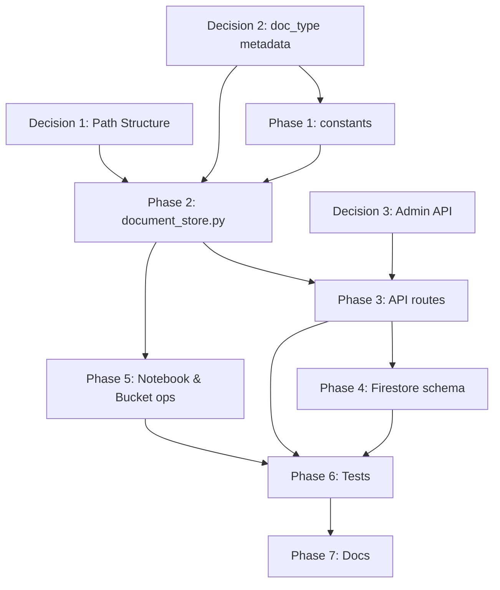

# Refactor Plan: Bucket Structure & Document Store

> **Created:** 2026-03-26  
> **Status:** COMPLETED — 798 PDFs uploaded, Vertex AI Search re-import triggered (2026-03-26)  
> **Decisions:** D1=Option A (structured), D2=Yes (doc_type metadata), D3=No (admin API unchanged)

---

## 1. Problem Statement

Hiện tại có **xung đột cấu trúc path** giữa:

| Component                                 | GCS Path Pattern                                 | Ví dụ                                  |
| ----------------------------------------- | ------------------------------------------------ | -------------------------------------- |
| **Code** (`document_store.py`)            | `system/{date}/{session_id}/{filename}`          | `system/2026-03-09/abc123/toan-10.pdf` |
| **Notebook** (`manage_bucket_data.ipynb`) | `system/{grade}/{doc_type}/{subject}/{filename}` | `system/lop-10/sgk/toan/toan-10.pdf`   |
| **Local data folder**                     | `data/{grade}/{doc_type}/{subject}/{filename}`   | `data/lop-10/sgk/toan/toan-10.pdf`     |
| **Planning doc** (T1.6)                   | `system/sgk/{grade}/{subject}/`                  | `system/sgk/lop-10/toan/`              |

**Hệ quả:**

- Upload qua API (code) và upload batch (notebook) tạo path khác nhau → khó quản lý
- Vertex AI Search filter dựa vào **metadata** (`user_id`, `scope`), **không** dựa vào path → path chỉ ảnh hưởng tổ chức, không ảnh hưởng search
- `list_system_documents()` scan prefix `system/` → hoạt động với cả 2 pattern

---

## 2. Scope of Impact

### 2.1 Files cần thay đổi

| File                                             | Thay đổi                                      | Mức độ                |
| ------------------------------------------------ | --------------------------------------------- | --------------------- |
| `src/services/document_store.py`                 | `build_gcs_path()`, docstring, metadata       | **HIGH** — Core logic |
| `src/api/routes/admin.py`                        | Thêm `grade`, `doc_type` param nếu cần        | **MEDIUM**            |
| `src/api/routes/user.py`                         | Không đổi (user path giữ nguyên)              | **NONE**              |
| `src/services/vertex_search.py`                  | Không đổi (filter by metadata, không by path) | **NONE**              |
| `src/config/constants.py`                        | Thêm `DOC_TYPES`, `VALID_GRADES` nếu cần      | **LOW**               |
| `notebooks/exploration/manage_bucket_data.ipynb` | Sync path pattern với code mới                | **LOW**               |
| `tests/test_pipeline_core.py`                    | Update test cho `build_gcs_path`              | **LOW**               |

### 2.2 Files KHÔNG cần thay đổi

- `src/services/vertex_search.py` — filter bằng metadata `user_id`, không phụ thuộc path
- `src/services/firestore.py` — lưu `gcs_uri` trọn vẹn, không parse path
- `src/config/settings.py` — `gcs_bucket` config không đổi
- `.env.develop` / `.env.product` — bucket name giữ nguyên

---

## 3. Quyết định cần hỏi ý kiến

### ❓ Decision 1: Chọn GCS Path Structure cho system docs

**Option A — Structured path** (mirror local folder):

```
system/{grade}/{doc_type}/{subject}/{filename}
system/lop-10/sgk/toan/sach-giao-khoa-toan-10.pdf
system/lop-10/sbt/hoa-hoc/de-thi-hoc-ki-1-hoa-10.pdf
```

- ✅ Dễ browse trên GCS Console, gsutil
- ✅ Mapping 1:1 với `data/` folder
- ✅ Dễ delete/replace từng grade/subject
- ❌ `build_gcs_path()` cần thêm param `grade`, `doc_type`
- ❌ Admin API upload cần thêm `doc_type` field

**Option B — Flat path** (giữ code hiện tại):

```
system/{date}/{session_id}/{filename}
system/2026-03-26/abc123/sach-giao-khoa-toan-10.pdf
```

- ✅ Code không cần đổi
- ✅ Tự động group by upload date
- ❌ Không thể browse theo grade/subject trên GCS
- ❌ Notebook upload phải theo pattern này (mất cấu trúc thư mục)

**Option C — Hybrid** (structured path + backward-compatible API):

```
# Batch upload (notebook): structured
system/{grade}/{doc_type}/{subject}/{filename}

# API upload (real-time): giữ date-based
system/{date}/{session_id}/{filename}
```

- ✅ Batch có cấu trúc rõ ràng
- ✅ API upload không cần đổi
- ❌ 2 pattern khác nhau trong cùng bucket → phức tạp
- ❌ `list_system_documents()` vẫn hoạt động (scan prefix `system/`)

### ❓ Decision 2: Metadata enrichment cho `doc_type`

Hiện tại metadata trên GCS blob gồm:

```python
{
    "user_id": "__system__",
    "upload_date": "2026-03-26",
    "session_id": "abc123",
    "scope": "system",
    "subject": "toan",      # optional
    "grade": "lop-10",      # optional
}
```

**Có nên thêm `doc_type` vào metadata?**

```python
{
    ...
    "doc_type": "sgk",  # sgk | sbt | de-thi | chuyen-de | trac-nghiem
}
```

- ✅ Vertex AI Search có thể filter theo `doc_type` trong tương lai
- ✅ Phục vụ game logic cần phân biệt sách giáo khoa vs đề thi
- ❌ Thêm 1 field → cần update upload API, constants

### ❓ Decision 3: Admin API upload — cần refactor không?

Hiện tại admin upload API:

```
POST /api/v1/admin/documents/upload
  - file: UploadFile
  - subject: str (required)
  - grade: str | None
```

**Có cần thêm `doc_type` param?**

- Nếu Option A → **Cần** thêm `doc_type` để build path
- Nếu Option B → **Không cần**
- Nếu Option C → **Tùy chọn** (API giữ nguyên, notebook dùng structured)

---

## 4. Refactor Steps (sau khi có quyết định)

### Phase 1: Update constants & config

| Step | Task                                           | File                      |
| ---- | ---------------------------------------------- | ------------------------- |
| 1.1  | Thêm `DOC_TYPES` tuple/set vào constants       | `src/config/constants.py` |
| 1.2  | Thêm `VALID_GRADES` tuple/set nếu cần validate | `src/config/constants.py` |

### Phase 2: Refactor `document_store.py`

| Step | Task                                       | Detail                                                                                     |
| ---- | ------------------------------------------ | ------------------------------------------------------------------------------------------ |
| 2.1  | Update `build_gcs_path()` signature        | Thêm `grade`, `doc_type` params (optional, dùng cho system scope)                          |
| 2.2  | Update path logic trong `build_gcs_path()` | System: `system/{grade}/{doc_type}/{subject}/{filename}` hoặc fallback nếu thiếu thông tin |
| 2.3  | Update `upload_document()` signature       | Thêm `doc_type` param, pass vào `build_gcs_path()`                                         |
| 2.4  | Update metadata dict                       | Thêm `doc_type` vào `blob.metadata`                                                        |
| 2.5  | Update docstring module-level              | Sửa "GCS Path Structure" comment                                                           |
| 2.6  | Update return dict                         | Thêm `doc_type` nếu cần                                                                    |

### Phase 3: Update API routes

| Step | Task                                            | File                      |
| ---- | ----------------------------------------------- | ------------------------- |
| 3.1  | Thêm `doc_type` param vào admin upload endpoint | `src/api/routes/admin.py` |
| 3.2  | Pass `doc_type` vào `upload_document()`         | `src/api/routes/admin.py` |
| 3.3  | Pass `doc_type` vào `save_document_record()`    | `src/api/routes/admin.py` |
| 3.4  | User routes — **không đổi**                     | `src/api/routes/user.py`  |

### Phase 4: Update Firestore schema (nếu cần)

| Step | Task                                             | File                           |
| ---- | ------------------------------------------------ | ------------------------------ |
| 4.1  | `save_document_record()` — thêm `doc_type` field | `src/services/firestore.py`    |
| 4.2  | Update `DocumentResponse` schema                 | `src/api/schemas/responses.py` |

### Phase 5: Sync notebook & bucket operations

| Step | Task                                                | File                                             |
| ---- | --------------------------------------------------- | ------------------------------------------------ |
| 5.1  | Sync `manage_bucket_data.ipynb` cell 5 path pattern | `notebooks/exploration/manage_bucket_data.ipynb` |
| 5.2  | Execute: delete old bucket data                     | Cell 3-4                                         |
| 5.3  | Execute: upload 798 PDFs                            | Cell 5-7                                         |
| 5.4  | Execute: trigger Vertex AI Search FULL re-import    | Cell 8                                           |

### Phase 6: Update tests

| Step | Task                                       | File                                       |
| ---- | ------------------------------------------ | ------------------------------------------ |
| 6.1  | Update `build_gcs_path` unit test          | `tests/test_pipeline_core.py`              |
| 6.2  | Test admin upload endpoint với `doc_type`  | `notebooks/tests/test_services.ipynb`      |
| 6.3  | Test Vertex AI Search filter vẫn hoạt động | `notebooks/tests/test_vertex_search.ipynb` |

### Phase 7: Documentation

| Step | Task                                    | File                |
| ---- | --------------------------------------- | ------------------- |
| 7.1  | Update design doc — GCS path structure  | `docs/ai/design/`   |
| 7.2  | Update planning doc — mark T1.6 updated | `docs/ai/planning/` |

---

## 5. Risk Assessment

| Risk                                            | Impact | Mitigation                                          |
| ----------------------------------------------- | ------ | --------------------------------------------------- |
| Vertex AI Search indexing fails với new path    | HIGH   | Test FULL import trên dev bucket trước              |
| Existing Firestore records trỏ tới old GCS URIs | MEDIUM | Old records sẽ invalid → cần cleanup hoặc chấp nhận |
| Admin API breaking change (thêm param)          | LOW    | `doc_type` optional với default `None`              |
| User upload path bị ảnh hưởng                   | NONE   | User path hoàn toàn tách biệt                       |

---

## 6. Dependency Graph



---

## 7. Estimated Changes Summary

| Metric               | Count                       |
| -------------------- | --------------------------- |
| Files to modify      | 5-7                         |
| Files to create      | 0                           |
| Lines changed (est.) | ~80-120                     |
| Tests to update/add  | 3-5                         |
| Breaking API changes | 0 (all new params optional) |
