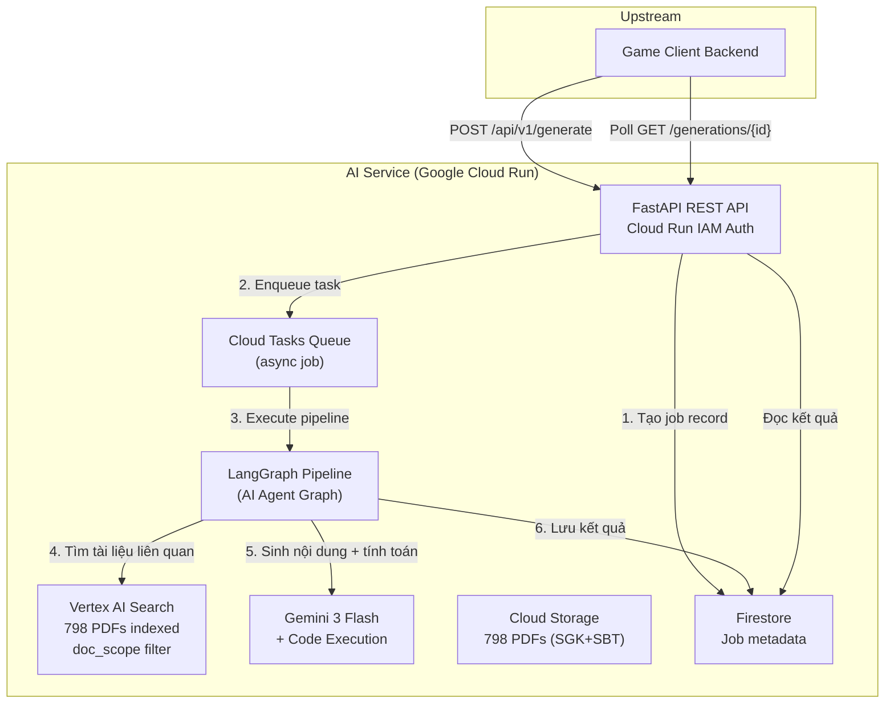
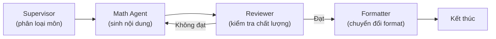

# Báo cáo Tổng hợp: Edu Game AI Service

> **Ngày báo cáo:** 2026-04-10  
> **Người thực hiện:** AI Engineer  
> **Dự án:** Edu Game AI Service — Internal Microservice  
> **GCP Project:** `green-mercury-485016-n1`  
> **Trạng thái chung:** Phase 1 hoàn thành chức năng cốt lõi, tối ưu hiệu suất đạt mục tiêu (74.9% speedup)

---

## Mục lục

1. [Tổng quan dự án](#1-tổng-quan-dự-án)
2. [Vấn đề cần giải quyết](#2-vấn-đề-cần-giải-quyết)
3. [Kiến trúc hệ thống](#3-kiến-trúc-hệ-thống)
4. [Công nghệ sử dụng](#4-công-nghệ-sử-dụng)
5. [Quá trình phát triển theo thời gian](#5-quá-trình-phát-triển-theo-thời-gian)
6. [Các mốc quan trọng đã đạt được](#6-các-mốc-quan-trọng-đã-đạt-được)
7. [Chi tiết kỹ thuật pipeline](#7-chi-tiết-kỹ-thuật-pipeline)
8. [Tối ưu hiệu suất](#8-tối-ưu-hiệu-suất)
9. [Kiểm thử và chất lượng](#9-kiểm-thử-và-chất-lượng)
10. [Trạng thái hiện tại](#10-trạng-thái-hiện-tại)
11. [Rủi ro và vấn đề đã biết](#11-rủi-ro-và-vấn-đề-đã-biết)
12. [Kế hoạch tiếp theo](#12-kế-hoạch-tiếp-theo)
13. [Phụ lục: Cấu trúc mã nguồn](#13-phụ-lục-cấu-trúc-mã-nguồn)

---

## 1. Tổng quan dự án

### Service này là gì?

**Edu Game AI Service** là một **microservice nội bộ** (internal) cung cấp khả năng **tự động tạo nội dung game giáo dục** bằng AI. Service nhận tài liệu giáo dục (PDF sách giáo khoa, bài tập) và tự động sinh ra:

- **Quiz** (câu hỏi trắc nghiệm 4 đáp án)
- **Flashcard** (thẻ ghi nhớ: mặt trước/sau)
- **Fill-in-the-blank** (điền vào chỗ trống)

### Ai sử dụng service này?

Service KHÔNG tiếp xúc trực tiếp với end-user. Luồng sử dụng:

```
Giáo viên/Học sinh → Game Client (frontend) → Game Client Backend → [AI Service] → Trả kết quả
```

- **Game Client Backend** (upstream) gọi AI Service qua REST API
- **Giáo viên**: Upload giáo án PDF → tạo đề trắc nghiệm từ nội dung
- **Học sinh**: Tạo flashcard/quiz từ sách giáo khoa hệ thống hoặc tài liệu cá nhân

### Phạm vi Phase 1 (hiện tại)

Tập trung vào **3 môn STEM: Toán, Lý, Hóa** — những môn yêu cầu tính toán chính xác (đây là thách thức lớn nhất với AI).

**Chiến lược 4-Pillar (lộ trình dài hạn):**

| Phase | Nhóm môn | Agent chuyên biệt | Trạng thái |
|---|---|---|---|
| **Phase 1** | Toán, Lý, Hóa | Math Agent + Code Execution | ✅ Đang triển khai |
| Phase 2 | Văn, Sử, GDCD | Story Agent + GraphRAG | 📋 Kế hoạch |
| Phase 3 | Địa, Sinh | Visual Agent + Multimodal | 📋 Kế hoạch |
| Phase 4 | Ngữ pháp, Bảng | Structure Agent + Table Parser | 📋 Kế hoạch |

---

## 2. Vấn đề cần giải quyết

### Hiện trạng (trước khi có service)

| Vấn đề | Mô tả | Hậu quả |
|---|---|---|
| **Tốn thời gian** | Tạo 50 câu hỏi chất lượng mất 2-4 giờ thủ công | Không scale được |
| **Không cá nhân hóa** | Dùng ngân hàng câu hỏi tĩnh, không bám sát giáo án | Trải nghiệm kém |
| **Sai sót tính toán** | AI thông thường hay sai công thức toán/lý/hóa | Mất tin tưởng |
| **Khó mở rộng** | Thêm môn/chủ đề đòi hỏi biên soạn thủ công | Chi phí cao |

### Mục tiêu đặt ra

- **Độ chính xác ≥ 98%** cho câu hỏi STEM (sử dụng Code Execution để tính toán thay vì để AI "đoán")
- **Hỗ trợ 3 loại game**: quiz, flashcard, fill-in-the-blank
- **Multi-tenant**: Mỗi user chỉ truy cập tài liệu của mình (trừ sách giáo khoa hệ thống)
- **Async processing**: Tạo 10 câu hỏi < 60 giây (polling pattern)
- **API JSON chuẩn** để Game Client Backend gọi trực tiếp

---

## 3. Kiến trúc hệ thống

### Sơ đồ tổng quan



### Luồng xử lý chính (Async Pattern)

```
1. Game Client gửi POST /api/v1/generate
   → AI Service tạo job, trả 202 Accepted + request_id

2. Cloud Tasks trigger pipeline chạy ngầm:
   Supervisor → Math Agent → Reviewer → Formatter → Lưu kết quả

3. Game Client poll GET /generations/{request_id}
   → Trả {status: "processing"} hoặc {status: "completed", content: {...}}
```

### Bảo mật

- **Authentication**: Cloud Run IAM (service-to-service). Deploy `--no-allow-unauthenticated`
- **User isolation**: `user_id` từ upstream (đã xác thực). Mỗi user chỉ query được docs của mình
- **Document scoping**: `doc_scope` = "user" | "system" | "all"
  - `user`: chỉ docs user upload
  - `system`: chỉ sách giáo khoa hệ thống (798 PDFs)
  - `all`: cả hai, user docs ưu tiên trước

---

## 4. Công nghệ sử dụng

### Tech Stack

| Thành phần | Công nghệ | Phiên bản/Chi tiết |
|---|---|---|
| **Language** | Python | 3.12.12 |
| **Framework** | FastAPI | REST API, async |
| **AI Orchestration** | LangGraph | Agent graph framework |
| **LLM** | Google Gemini 3 Flash Preview | `gemini-3-flash-preview` @ region `global` |
| **SDK** | LangChain Google GenAI | `ChatGoogleGenerativeAI` (đã migrate từ ChatVertexAI) |
| **Document Search** | Vertex AI Search (Enterprise) | 798 PDFs, extractive answers |
| **Storage** | Google Cloud Storage | Bucket: `edu-game-docs-green-mercury-485016-n1` |
| **Database** | Firestore | Database: `aiservice-store` |
| **Task Queue** | Cloud Tasks | Queue: `generation-queue` |
| **Hosting** | Cloud Run | _(chưa deploy — deferred)_ |
| **Environment** | Conda | Env: `AIservice` |

### Dữ liệu tài liệu

- **798 PDF** đã upload và index:
  - 226 file SGK (sách giáo khoa) lớp 10, 11, 12
  - 556 file SBT (sách bài tập) lớp 10, 11, 12
  - 16 file tài liệu khác
- **12 môn học** × 3 khối lớp (Toán, Vật lí, Hóa học, Sinh học, Ngữ văn, Lịch sử, Địa lí, GDCD, Tiếng Anh, Tin học, Công nghệ, GDQP-AN)
- **100% indexing coverage**: 798/798 documents indexed trong Vertex AI Search

---

## 5. Quá trình phát triển theo thời gian

### Timeline tổng quan

```
Tuần 1 (06-11/03/2026): Nền tảng
├── Setup dự án, conda env, GCP config
├── LangGraph pipeline core (4 nodes)
├── Vertex AI Search integration
└── Merge PR #2 → main (feat/mvp)

Tuần 2 (11-23/03/2026): Tính năng + API
├── Async API generation + local fallback
├── Document upload service (user + system)
├── Admin API (upload/list/delete system docs)
├── 4-level difficulty system (Bloom's taxonomy)
├── Bug audit B1-B4 fix
├── Reviewer difficulty-aware + formatter parallel batch
└── 6 math_agent optimizations

Tuần 3 (23-29/03/2026): Data + Quality
├── Refactor bucket structure (226→798 PDFs)
├── Client-side rate limiting (8 call sites)
├── Singleton/cache refactoring + ChatVertexAI migration
├── Pipeline pass rate: 84.6% → 100%
│   ├── P0-P4: 5 root cause fixes
│   ├── High_application optimization
│   └── 100% delivery: 5 targeted fixes (C1-C5)
└── ALL 4 difficulty levels: 100% delivery ✅

Tuần 4 (09-10/04/2026): Performance Optimization
├── E2E verification: 40/40 items, 2078.5s baseline
├── Tier 1: Parallel parse, cache search, skip supervisor (commit 4c1464b)
├── Tier 2: Parse-only retry, parallel micro-batch (commit 11a8d66)
├── Tier 3: Deterministic supervisor, parallel formatter (commit 221c20e)
├── Performance regression fix: MICRO_BATCH_THRESHOLD 12→20
├── Final benchmark: 40/40 items, tất cả targets đạt
└── Result: 74.9% total speedup (2078s → 522s)
```

### Commit History (18 commits trên nhánh chính)

| Ngày | Commit | Nội dung |
|---|---|---|
| 2026-03-11 | `a33ca68` | Core AI pipeline implementation |
| 2026-03-11 | `a658a90` | Async generation API + local fallback |
| 2026-03-11 | `cd5d520` | Merge PR #2 → main (MVP) |
| 2026-03-23 | `4fcbbab` | 4-level difficulty (Bloom's taxonomy) |
| 2026-03-23 | `481bd98` | Bug audit B1-B4 fix |
| 2026-03-23 | `820ce76` | Reviewer difficulty-aware + formatter parallel |
| 2026-03-23 | `d431e3e` | 6 math_agent optimizations |
| 2026-03-26 | `9a52089` | Client-side rate limiting (8 call sites) |
| 2026-03-26 | `9b66658` | Merge PR #3: Bucket refactor + 798 PDFs |
| 2026-03-29 | `d9ce293` | Singleton/cache + ChatVertexAI migration |
| 2026-03-29 | `285d6d9` | P0-P4 pipeline pass rate fixes |
| 2026-03-29 | `f422d8c` | High_application optimization |
| 2026-03-29 | `315ea22` | **Pipeline 100% delivery** — core fix |
| 2026-04-09 | `61bf514` | 100% delivery validation + optimization plan |
| 2026-04-09 | `4c1464b` | **Tier 1**: parallel parse, cache, skip supervisor |
| 2026-04-10 | `11a8d66` | **Tier 2**: parse-only retry, parallel micro-batch |
| 2026-04-10 | `221c20e` | **Tier 3**: deterministic supervisor, parallel formatter |

---

## 6. Các mốc quan trọng đã đạt được

### M1: Nền tảng ✅ (Tuần 1)

- LangGraph pipeline 4 nodes chạy local
- Vertex AI Search integration hoạt động với doc_scope filter
- 225 PDF sách giáo khoa đã index

### M2: Async + Multi-tenant ✅ (Tuần 2)

- `POST /api/v1/generate` → async qua Cloud Tasks → poll kết quả
- Document upload API (user + system scope)
- Admin API (upload/list/delete system docs)
- 4 mức độ khó theo Bloom's Taxonomy: recall, comprehension, application, high_application

### M3: API Ready ✅ (Tuần 2)

- 10 API endpoints hoạt động (OpenAPI spec generated)
- Error handling thống nhất
- Pydantic schemas cho tất cả request/response

### M3.5: Pipeline 100% Delivery + Performance ✅ (Tuần 3-4)

**Đây là milestone quan trọng nhất** — đảm bảo pipeline **luôn trả đủ** số câu hỏi yêu cầu.

Kết quả verification (2026-04-09):

| Mức độ | Delivery | Thời gian | Iterations |
|---|---|---|---|
| Recall (nhớ) | **10/10 ✅** | 125s | 1 |
| Comprehension (hiểu) | **10/10 ✅** | 123s | 1 |
| Application (áp dụng) | **10/10 ✅** | 540s | 2 |
| High Application (vận dụng cao) | **10/10 ✅** | 1291s | 4 |
| **TỔNG** | **40/40 (100%)** | **2079s** | — |

### M4: Production Ready — ⏸️ DEFERRED

Quyết định hoãn deploy production cho đến khi hoàn thành tất cả 4 Pillars (Phase 1-4), vì chỉ deploy Phase 1 riêng lẻ không có ý nghĩa kinh doanh đủ lớn.

---

## 7. Chi tiết kỹ thuật Pipeline

### LangGraph Pipeline Flow



### Mô tả từng node

#### 1. Supervisor (Phân loại)
- **Chức năng**: Xác định loại nội dung → định tuyến đến agent phù hợp
- **Hiện tại**: Deterministic routing (trả về "math" trực tiếp, không cần LLM call)
- **Tương lai**: LLM classification khi có nhiều agents (Phase 2+)

#### 2. Math Agent (Sinh nội dung) — Node phức tạp nhất
- **Chức năng**: Tìm tài liệu liên quan + sinh câu hỏi + tính toán
- **Quy trình 2 pha**:
  1. **Phase 1 — Generation**: Gọi Gemini với Code Execution → LLM viết Python code để tính toán → trả về kết quả + code trace
  2. **Phase 2 — Parsing**: Parse output thành structured ContentItemList (batch parsing)
- **Tính năng đặc biệt**:
  - **Code Execution**: LLM viết Python code thật để tính toán (không "đoán" đáp án)
  - **Adaptive Overshoot**: Sinh thừa câu hỏi (dự phòng reviewer loại). Hệ số theo mức độ: recall×1.1, comprehension×1.2, application×1.4, high_application×2.5
  - **Escalating Overshoot**: Mỗi vòng retry, hệ số tăng thêm 30% → đảm bảo đủ câu hỏi
  - **Few-shot Exemplars**: Mẫu câu hỏi theo mức độ khó + theo domain (Toán/Hóa)
  - **Rejection Feedback**: Khi reviewer từ chối câu hỏi → feedback chi tiết được inject vào prompt của vòng retry
  - **Parse-only Retry**: Nếu parsing thất bại, thử parse lại raw text trước khi re-generate (tiết kiệm 30-60s)
  - **Parallel Micro-batch**: Khi cần sinh >20 câu, chia thành 2 batch chạy song song

#### 3. Reviewer (Kiểm tra chất lượng)
- **Chức năng**: Đánh giá từng câu hỏi, accept/reject
- **Ngưỡng theo mức độ**: recall/comprehension: 70%, application: 65%, high_application: 50%
- **Reviewer yêu cầu 100% delivery**: Nếu chưa đủ số câu → gửi về Math Agent
- **Max iterations**: 5 lần retry (tăng từ 3)

#### 4. Formatter (Chuyển đổi format)
- **Chức năng**: Chuyển ContentItem → game-specific format (quiz/flashcard/fill_blank)
- **Parallel processing**: 3 format functions chạy song song qua `asyncio.gather()`

### Hệ thống 4 mức độ khó (Bloom's Taxonomy)

| Mức | Tên | Mô tả | Ví dụ |
|---|---|---|---|
| 1 | **Recall** (Nhớ) | Nhắc lại công thức, định nghĩa | "Đạo hàm của x⁴ là?" |
| 2 | **Comprehension** (Hiểu) | Giải thích ý nghĩa, liên hệ | "Ý nghĩa hình học của f'(a)?" |
| 3 | **Application** (Áp dụng) | Giải bài toán cụ thể | "Tìm GTNN của f(x) trên [0,2]" |
| 4 | **High Application** (VD cao) | Tổng hợp, phân tích, sáng tạo | "Bài toán tối ưu thực tế + nhiều phương pháp" |

---

## 8. Tối ưu hiệu suất

### Vấn đề ban đầu

Sau khi đạt 100% delivery, pipeline chạy quá lâu — đặc biệt mức `high_application` (~21.5 phút cho 10 câu, tổng ~35 phút cho 40 câu).

### Nguyên nhân gốc (Root Cause Analysis)

| RCA | Nguyên nhân | Tác động |
|---|---|---|
| RCA-1 | Tất cả bước chạy tuần tự (sequential) | Không tận dụng I/O wait time |
| RCA-2 | 2 pha generate + parse = 2 LLM calls | Tăng gấp đôi latency mỗi pha |
| RCA-3 | Mỗi retry chạy lại Supervisor + Vertex Search (không cần thiết) | Lãng phí 5-10s/retry |
| RCA-4 | High_application sinh 25-48 items/iteration | Tăng thời gian toàn bộ |

### Kế hoạch tối ưu 3 tầng (3 Tiers)

#### Tier 1: Quick Wins (Commit `4c1464b`)

| Task | Mô tả | Tác động |
|---|---|---|
| **T-OPT-1.1** | Parse batches chạy song song (`asyncio.gather` + `Semaphore(3)`) | Giảm parse time ~60% |
| **T-OPT-1.2** | Cache search context khi retry (không gọi Vertex Search lại) | Tiết kiệm ~5s/retry |
| **T-OPT-1.3** | Reviewer fail → Math Agent trực tiếp (bỏ qua Supervisor) | Tiết kiệm ~3-5s/retry |

#### Tier 2: Medium Impact (Commit `11a8d66`)

| Task | Mô tả | Tác động |
|---|---|---|
| **T-OPT-2.1** | Parse-only retry: thử parse lại raw text trước khi re-generate | Tiết kiệm 30-60s/failure |
| **T-OPT-2.2** | JSON mode output — **BỎ QUA** (Gemini 3 Flash bị infinite loop) | _(rủi ro quá cao)_ |
| **T-OPT-2.3** | Parallel micro-batch: khi >20 items, chia 2 batch song song | Giảm ~30% cho high_application |

#### Tier 3: Architecture (Commit `221c20e`)

| Task | Mô tả | Tác động |
|---|---|---|
| **T-OPT-3.1** | Pre-generation pool — **BLOCKED** (cần Firestore + Cloud Tasks infra) | _(hoãn Phase 4)_ |
| **T-OPT-3.2** | SDK migration → `ChatGoogleGenerativeAI` — **ĐÃ LÀM** (2026-03-27) | ✅ |
| **T-OPT-3.3** | Deterministic Supervisor: trả "math" trực tiếp, bỏ LLM call | Tiết kiệm ~3-5s đầu |
| **T-OPT-3.4** | Formatter 3 functions chạy song song (`asyncio.gather`) | Giảm format time |

### Kết quả benchmark (sau 3 tầng tối ưu + fix threshold)

> **Benchmark chính thức** chạy ngày 2026-04-10 với `MICRO_BATCH_THRESHOLD=20` (đã fix regression).

| Mức độ | Baseline | Sau tối ưu | Thay đổi |
|---|---|---|---|
| Recall | 125.1s | 68.7s | ✅ **-45.1%** |
| Comprehension | 122.7s | 87.7s | ✅ **-28.5%** |
| Application | 539.9s | 178.2s | ✅ **-67.0%** |
| High Application | 1290.8s | 187.5s | ✅ **-85.5%** |
| **TỔNG** | **2078.5s** | **522.1s** | ✅ **-74.9%** |

Tất cả 4 mức độ: **40/40 delivery (100%)**. Total wall clock: **522.2s (~8.7 phút)**, giảm từ 2078.5s (~34.6 phút).

### Chi tiết micro-batch analysis

| Mức độ | num_to_generate | Micro-batch? | Iterations | Ghi chú |
|---|---|---|---|---|
| Recall | 13 | Không (< 20) | 1 | Single batch, fastest |
| Comprehension | 13 | Không (< 20) | 1 | Single batch |
| Application | 14 | Không (< 20) | 2 | 1st iter got 3 items → retry |
| High Application | 25 | **Có** (split 12+13) | 1 | Parallel micro-batch, 1 iter đủ |

### Mục tiêu Performance

| Target | Metric | Kết quả |
|---|---|---|
| Tier 1 | high_application ≤ 800s | ✅ 187.5s |
| Tier 1 | total ≤ 1400s | ✅ 522.1s |
| Tier 2 | high_application ≤ 400s | ✅ 187.5s |
| Tier 2 | total ≤ 900s | ✅ 522.1s |

> **Tất cả performance targets đã đạt**, bao gồm cả Tier 2 (target khó nhất).

---

## 9. Kiểm thử và chất lượng

### Test Pyramid

| Loại | Số lượng | Trạng thái |
|---|---|---|
| Unit tests | ~110+ | ✅ 140/145 pass |
| Integration tests | ~10 | ✅ Pass |
| System tests | ~20+ | ✅ Pass |
| E2E (live LLM) | 4 levels | ✅ 40/40 delivery |
| **Tổng** | **~145** | **140/145 pass** |

### 5 test thất bại (pre-existing, không ảnh hưởng chức năng)

- `test_llm_service.py` (3 tests): Settings mock dùng `project='test-project'` nhưng config thực tế là `project='green-mercury-485016-n1'`
- `test_singleton_clients.py` (2 tests): Cùng vấn đề settings mock

→ **Không phải bug chức năng**, chỉ là mock configuration chưa cập nhật.

### Test files cho pipeline optimization

| File | Tests | Purpose |
|---|---|---|
| `test_tier1_optimizations.py` | 16 | Parallel parse, cache search, skip supervisor |
| `test_tier2_optimizations.py` | 12 | Parse-only retry, parallel micro-batch |
| `test_tier3_optimizations.py` | 13 | Deterministic supervisor, parallel formatter |
| `test_pipeline_fixes.py` | 33 | P0-P4 root cause fixes, feedback loop |
| **Tổng optimization tests** | **74** | — |

### Notebook tests (integration với real services)

| Notebook | Purpose |
|---|---|
| `test_vertex_search.ipynb` | Vertex AI Search, indexing coverage 798/798 |
| `test_services.ipynb` | Singleton/cache verification |
| `test_graph_pipeline.ipynb` | Full pipeline benchmark |
| `test_pipeline_performance_final.ipynb` | 3-tier optimization final benchmark |

---

## 10. Trạng thái hiện tại

### Đã hoàn thành ✅

- [x] LangGraph pipeline 4 nodes hoạt động end-to-end
- [x] 3 game types: quiz, flashcard, fill_blank
- [x] 4 mức độ khó: recall, comprehension, application, high_application
- [x] Vertex AI Search với 798 PDFs indexed (100% coverage)
- [x] Document upload API (user + system scope)
- [x] Async generation via Cloud Tasks (local fallback)
- [x] Admin API (upload/list/delete system docs)
- [x] Rate limiting (token bucket + circuit breaker)
- [x] Singleton/cache cho GCP clients
- [x] SDK migration: ChatVertexAI → ChatGoogleGenerativeAI
- [x] 100% delivery tất cả 4 mức độ khó
- [x] 3 tầng tối ưu hiệu suất (**74.9% speedup** — 2078s → 522s)
- [x] Tất cả performance targets đạt (bao gồm Tier 2)
- [x] 140/145 unit tests pass
- [x] Code Execution cho tính toán chính xác
- [x] 10 API endpoints (OpenAPI spec documented)

### Đang xử lý 🔧

- [ ] Commit fix `MICRO_BATCH_THRESHOLD` 12→20 (đã verify benchmark, chưa commit)
- [ ] Tier 2 target đã đạt — cần commit kết quả chính thức

### Chưa làm (deferred) 📋

- [ ] T4.2: Accuracy testing golden set (100 câu STEM)
- [ ] T4.3: Performance testing (concurrent requests)
- [ ] T4.4: Cloud Run deployment + IAM verification
- [ ] T-OPT-3.1: Pre-generation pool (cần infrastructure)
- [ ] Phase 2-4: Story/Visual/Structure Agents

---

## 11. Rủi ro và vấn đề đã biết

### Rủi ro kỹ thuật

| Rủi ro | Mức | Giảm thiểu |
|---|---|---|
| **Gemini 3 Flash Preview** là preview model, có thể thay đổi/bị gỡ | Trung bình | Monitor model availability, sẵn sàng switch model |
| **JSON mode + Code Execution** không tương thích (infinite loop) | Thấp | Đã bỏ qua T-OPT-2.2, dùng 2-phase approach |
| **Rate limit 60 RPM** | Thấp | Đã có client-side rate limiter + circuit breaker |
| **High_application** vẫn chậm (~3.1 phút/10 câu) | Thấp | Đã đạt 187.5s (Tier 2 target ≤400s). Pre-gen pool có thể giảm thêm |
| **LangChain deprecation** `ChatVertexAI` | Đã xử lý | Đã migrate sang `ChatGoogleGenerativeAI` |

### Vấn đề đã biết

1. **5 test failures** — Settings mock chưa cập nhật (cosmetic, không ảnh hưởng chức năng)
2. **Threshold fix chưa commit** — MICRO_BATCH_THRESHOLD 12→20 đã verify benchmark thành công, cần commit
3. **Production deploy deferred** — Chờ hoàn thành 4 Pillars

### Ràng buộc kinh doanh

- **Team**: 1 AI engineer
- **Budget**: ~$500/tháng GCP credits
- **Timeline gốc**: Phase 1 trong 2-3 tuần → thực tế ~5 tuần (thêm thời gian tối ưu quality + performance)
- **Lý do kéo dài**: Focus vào đảm bảo 100% delivery + performance optimization (không phải scope creep)

---

## 12. Kế hoạch tiếp theo

### Ngắn hạn (Tuần tới)

1. **Commit threshold fix** + benchmark results chính thức
2. **Accuracy testing** (T4.2): Golden test set 100 câu STEM
3. **Concurrent performance testing** (T4.3)

### Trung hạn (2-4 tuần)

4. **Phase 2**: Story Agent cho Văn/Sử (GraphRAG approach)
5. **Phase 3**: Visual Agent cho Địa/Sinh (Multimodal)
6. **Phase 4**: Structure Agent cho Ngữ pháp/Bảng

### Dài hạn (sau khi hoàn thành 4 Pillars)

7. **Cloud Run deployment** + IAM setup
8. **Pre-generation pool** (T-OPT-3.1) cho < 10s response time
9. **Integration testing** với Game Client team
10. **Production monitoring** + error budget tracking

---

## 13. Phụ lục: Cấu trúc mã nguồn

```
AIServices/
├── src/                          # Source code chính
│   ├── main.py                   # FastAPI app entrypoint
│   ├── api/                      # REST API layer
│   │   ├── routes/               # 4 routers: generation, admin, internal, user
│   │   ├── schemas/              # Pydantic request/response schemas
│   │   └── errors.py             # Unified error handling
│   ├── config/                   # Configuration
│   │   ├── settings.py           # Environment variables (via .env files)
│   │   ├── constants.py          # Tuning constants (overshoot, thresholds)
│   │   └── logging.py            # Structured logging (structlog)
│   ├── graph/                    # LangGraph pipeline
│   │   ├── builder.py            # StateGraph construction
│   │   ├── state.py              # AgentState TypedDict definition
│   │   └── nodes/                # Pipeline nodes
│   │       ├── supervisor.py     # Content type routing
│   │       ├── math_agent.py     # STEM generation (Phase 1)
│   │       ├── reviewer.py       # Quality gate
│   │       └── formatter.py      # Game format conversion
│   └── services/                 # External service integrations
│       ├── llm.py                # LLM factory (singleton + cache)
│       ├── vertex_search.py      # Vertex AI Search retrieval
│       ├── document_store.py     # GCS document management
│       ├── firestore.py          # Firestore job/doc CRUD
│       ├── task_queue.py         # Cloud Tasks enqueue
│       └── rate_limiter.py       # Token bucket + circuit breaker
├── tests/                        # Test suite (145 tests)
│   ├── unit/                     # Unit tests
│   └── fixtures/                 # Test data
├── notebooks/                    # Jupyter notebooks
│   ├── tests/                    # Integration test notebooks
│   └── exploration/              # Data exploration
├── data/                         # Textbook PDFs (lop-10/11/12 × 12 môn)
├── docs/
│   ├── ai/                       # Phase documentation
│   │   ├── requirements/         # Problem & scope definition
│   │   ├── design/               # Architecture decisions
│   │   ├── planning/             # Task breakdown & milestones
│   │   ├── implementation/       # Implementation guides
│   │   └── testing/              # Testing strategy
│   └── timeline/                 # Daily development logs
└── .env.develop / .env.product   # Environment configs
```

### API Endpoints (10 endpoints)

| Method | Path | Mô tả |
|---|---|---|
| GET | `/health` | Liveness probe |
| POST | `/api/v1/generate` | Tạo generation request (async) |
| GET | `/api/v1/generations/{id}` | Poll job status/result |
| GET | `/api/v1/game-types` | List supported game types |
| POST | `/api/v1/admin/documents/upload` | Upload system document |
| GET | `/api/v1/admin/documents` | List system documents |
| DELETE | `/api/v1/admin/documents/{id}` | Delete system document |
| POST | `/api/v1/users/{id}/documents/upload` | Upload user document |
| GET | `/api/v1/users/{id}/documents` | List user documents |
| POST | `/internal/execute-generation/{id}` | Cloud Tasks callback |

---

## Phụ lục: Thuật ngữ

| Thuật ngữ | Giải thích |
|---|---|
| **LangGraph** | Framework của LangChain để xây dựng AI agent workflows dạng graph |
| **Vertex AI Search** | Dịch vụ tìm kiếm tài liệu của Google Cloud (semantic search trên PDF) |
| **Gemini** | Mô hình AI của Google (tương tự GPT của OpenAI) |
| **Code Execution** | Tính năng cho phép Gemini viết và chạy Python code thật (không "đoán" đáp số) |
| **RAG** | Retrieval-Augmented Generation — tìm tài liệu liên quan trước khi sinh nội dung |
| **Async pattern** | Client gửi request → nhận ID → poll định kỳ đến khi có kết quả |
| **Bloom's Taxonomy** | Phân loại mức độ nhận thức trong giáo dục (nhớ → hiểu → áp dụng → phân tích...) |
| **SGK** | Sách giáo khoa |
| **SBT** | Sách bài tập |
| **Pipeline** | Chuỗi các bước xử lý tuần tự/song song từ input đến output |
| **Overshoot** | Sinh thừa câu hỏi để dự phòng bị loại bởi reviewer |
