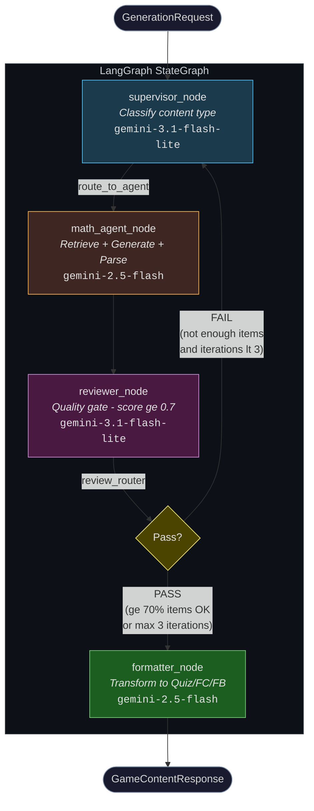

# Pipeline Test Report - 2026-03-21

> **Notebook:** `notebooks/tests/test_pipeline_results.ipynb`  
> **Pipeline:** supervisor --> math_agent --> reviewer --> formatter --> END  
> **Models:** gemini-2.5-flash (asia-southeast1), gemini-3.1-flash-lite-preview (global)

---

## 0. Mô tả luồng hoạt động

### Tổng quan kiến trúc

Pipeline dùng **LangGraph** (`StateGraph`) với state trung tâm `AgentState` (TypedDict) chảy qua 4 nodes. Graph được compile thành app, invoke bất đồng bộ (`app.ainvoke(initial_state)`).

### Sơ đồ luồng



### Chi tiết từng node

#### 1. `supervisor_node` - Phân loại & Định tuyến

|            |                                                                                  |
| ---------- | -------------------------------------------------------------------------------- |
| **Model**  | `gemini-3.1-flash-lite-preview` (review LLM, temp=0.1)                           |
| **Input**  | `request.topic`, `request.doc_scope`, `request.game_types`, `request.difficulty` |
| **Output** | `content_type` (hiện tại luôn = `"math"`)                                        |
| **Logic**  | Gọi LLM classify nội dung --> Phase 1 chỉ route `"math"` --> `math_agent`        |

> **Phase 2+:** Sẽ thêm `story_agent`, `visual_agent`, `structure_agent` cho Sử, Văn, Địa, Sinh.

#### 2. `math_agent_node` - Sinh nội dung STEM

|            |                                                                      |
| ---------- | -------------------------------------------------------------------- |
| **Model**  | `gemini-2.5-flash` (generation LLM, temp=0.7), có **code execution** |
| **Input**  | `request` (topic, num_questions, difficulty)                         |
| **Output** | `content_items: list[dict]`, `search_context`, `search_sources`      |

**Quy trình 3 bước:**

```
[1] Vertex AI Search        [2] LLM + Code Execution       [3] Batch Structured Parse
    retrieve_context()          MATH_AGENT_PROMPT               PARSE_PROMPT
    query=topic+difficulty      "Generate N questions"          ContentItemList
    -> search_context[]         Gemini chay Python code         PARSE_BATCH_SIZE=7
                                verify tinh toan                split neu > 7 items
                                -> raw text + code traces       -> list[GeneratedContentItem]
```

- **Bước 1:** Query Vertex AI Search với `"{topic} {difficulty} level educational content"` --> lấy document chunks làm context.
- **Bước 2:** Gọi Gemini với code execution tool. LLM viết Python code để verify tính toán (đạo hàm, tích phân...), sau đó sinh câu hỏi. Output = raw text + code execution traces.
- **Bước 3:** Parse raw output thành `ContentItemList` bằng structured output. Nếu > 7 items --> chia batch (fix cho bug `with_structured_output()` trả về `None` với batch lớn).

Mỗi item là dict:

```python
{
    "question": "...",        "answer": "...",
    "explanation": "...",     "topic": "Đạo hàm",
    "difficulty": "medium",   # <-- gan cung tu request, KHONG tu LLM
    "computation_trace": "Code:\n...\nOutput:\n...",
    "context_source": "...",  "doc_scope": "system"
}
```

#### 3. `reviewer_node` - Cổng chất lượng

|            |                                                                                 |
| ---------- | ------------------------------------------------------------------------------- |
| **Model**  | `gemini-3.1-flash-lite-preview` (review LLM, temp=0.0)                          |
| **Input**  | `content_items`                                                                 |
| **Output** | `reviewed_items` (pass), `rejected_items` (fail, tích lũy), `iteration_count++` |

**Tiêu chí đánh giá:**

| Tiêu chí           | Trọng số | Mô tả                              |
| ------------------ | -------- | ---------------------------------- |
| Accuracy           | 40%      | Đáp án đúng? Giải thích chính xác? |
| Clarity            | 25%      | Câu hỏi rõ ràng, không mơ hồ?      |
| Educational Value  | 20%      | Kiểm tra hiệu quả kiến thức?       |
| Vietnamese Quality | 15%      | Tiếng Việt tự nhiên?               |

- Score >= 0.7 --> **PASS**, score < 0.7 --> **REJECT** (kem feedback).
- Neu exception --> **fail-open** (pass tat ca items de dam bao pipeline khong crash).

**`review_router` quyết định:**

- `"pass"` nếu `len(reviewed_items) >= 70% * num_questions` hoặc `iteration >= 3`
- `"fail"` nếu chưa đủ --> quay lại supervisor (sinh batch mới)

#### 4. `formatter_node` - Chuyển đổi format game

|            |                                               |
| ---------- | --------------------------------------------- |
| **Model**  | `gemini-2.5-flash` (structured LLM, temp=0.3) |
| **Input**  | `reviewed_items`, `request.game_types`        |
| **Output** | `final_output: GameContentResponse`           |

**Transform per game type:**

```
reviewed_items (dict[]) --+-- quiz       -> QuizBatch     -> QuizQuestion[]      (4 options, 1 correct)
                          +-- flashcard  -> FlashcardBatch -> Flashcard[]         (front/back)
                          +-- fill_blank -> FillBlankBatch -> FillBlankQuestion[] (template + blanks)
```

- Mỗi game type dùng prompt riêng + `with_structured_output()`.
- `FORMATTER_BATCH_SIZE = 7`: chia batch nếu items > 7 (cùng fix như math_agent).
- Output cuối = `GameContentResponse` chứa `GameContentMap` + `GenerationMetadata`.

### State flow qua pipeline

```mermaid
flowchart LR
    subgraph State["AgentState"]
        direction TB
        S1["request: GenerationRequest"]
        S2["content_items: list of dict"]
        S3["reviewed_items: list of dict"]
        S4["rejected_items: list of dict -- add --"]
        S5["iteration_count: int"]
        S6["final_output: GameContentResponse"]
    end

    IN([request]) --> SUP[supervisor]
    SUP -->|content_type| MA[math_agent]
    MA -->|content_items| REV[reviewer]
    REV -->|reviewed_items| FMT[formatter]
    REV -.->|rejected - retry| SUP
    FMT --> OUT([final_output])

    style State fill:#0d1117,stroke:#30363d,color:#c9d1d9
    style S1 fill:#1a1a2e,stroke:#7f8fa6,color:#d4d4d4
    style S2 fill:#1a1a2e,stroke:#7f8fa6,color:#d4d4d4
    style S3 fill:#1a1a2e,stroke:#7f8fa6,color:#d4d4d4
    style S4 fill:#4a1942,stroke:#ce93d8,color:#e0e0e0
    style S5 fill:#1a1a2e,stroke:#7f8fa6,color:#d4d4d4
    style S6 fill:#1a1a2e,stroke:#7f8fa6,color:#d4d4d4
    style SUP fill:#1b3a4b,stroke:#4fc3f7,color:#e0e0e0
    style MA fill:#3e2723,stroke:#ffb74d,color:#e0e0e0
    style REV fill:#4a1942,stroke:#ce93d8,color:#e0e0e0
    style FMT fill:#1b5e20,stroke:#81c784,color:#e0e0e0
    style IN fill:#1a1a2e,stroke:#7f8fa6,color:#d4d4d4
    style OUT fill:#1a1a2e,stroke:#7f8fa6,color:#d4d4d4
```



> **Lưu ý quan trọng:** `reviewed_items` bị **ghi đè** mỗi iteration (không tích lũy), trong khi `rejected_items` dùng `Annotated[..., add]` nên **tích lũy**. Xem mục 2.3 để hiểu hệ quả.

---

## 1. Tổng kết kết quả

| Test          | Yêu cầu                 | Kết quả         | Pass Rate | Thời gian           |
| ------------- | ----------------------- | --------------- | --------- | ------------------- |
| accuracy_10q  | 10 quiz                 | 10 quiz         | 100%      | 113s                |
| vietnamese    | 10 quiz + 10 FC         | 10 quiz + 10 FC | 62%       | 199s                |
| diversity_20q | 20 quiz                 | 19 quiz         | 95%       | 143s                |
| scale_30q     | 30 quiz                 | 24 quiz         | 100%      | 245s                |
| all_types     | 20 quiz + 20 FC + 20 FB | 19 + 19 + 19    | 95%       | 223s                |
| **TOTAL**     |                         | **130 items**   | **90%**   | **923s (15.4 min)** |

**Tất cả 5 test đều PASSED**, nhưng có nhiều vấn đề tiềm ẩn dưới đây.

---

## 2. Vấn đề phát hiện được

### 2.1. Difficulty luôn là MEDIUM - không có phân hóa độ khó

**Mức nghiêm trọng: CAO**

Tất cả câu hỏi sinh ra đều mang `difficulty: DifficultyLevel.MEDIUM` bất kể yêu cầu. Nguyên nhân:

- Test chỉ gửi `difficulty='medium'` (hardcoded trong `make_request()`).
- Nhưng quan trọng hơn: **math_agent gán difficulty cứng** từ `request.difficulty.value` cho tất cả items (line 324 math_agent.py), không cho LLM tự classify difficulty theo nội dung câu hỏi.
- Prompt chỉ nói `"Questions should be at {difficulty} difficulty level"` nhưng **schema `GeneratedContentItem` không có field `difficulty`** --> LLM không output difficulty --> agent gán cùng một giá trị cho toàn bộ batch.
- Kết quả: Nếu request `hard`, tất cả sẽ gán `hard` - kể cả câu hỏi đơn giản. Không có cơ chế verify độ khó thực sự.

**Hệ quả:**

- Game Kahoot cần mix easy/medium/hard --> hiện tại pipeline không hỗ trợ.
- Reviewer không check difficulty phù hợp --> câu hỏi dễ nhưng gán `hard` sẽ lọt qua.

### 2.2. Reviewer reject rate không ổn định - 62% ở Vietnamese test

**Mức nghiêm trọng: TRUNG BÌNH**

| Test           | Generated | Passed Review | Bị reject   |
| -------------- | --------- | ------------- | ----------- |
| accuracy_10q   | 10        | 10            | 0 (0%)      |
| **vietnamese** | **16**    | **10**        | **6 (38%)** |
| diversity_20q  | 20        | 19            | 1 (5%)      |
| scale_30q      | 24        | 24            | 0 (0%)      |
| all_types      | 20        | 19            | 1 (5%)      |

Vietnamese test chạy **2 iterations** (duy nhất), reject 6/16 items. Các test khác chỉ reject 0-1 item.

Nguyên nhân có thể:

- Reviewer dùng `gemini-3.1-flash-lite-preview` (review model) - model nhỏ, behavior không ổn định giữa các lần chạy.
- Reviewer prompt yêu cầu đánh giá "Vietnamese Quality" (15% weight) nhưng tiêu chí mơ hồ - "Is the Vietnamese natural and correct?" không đủ cụ thể.
- Không có feedback loop hiệu quả: khi rejected items quay lại supervisor --> math_agent, agent sinh **toàn bộ batch mới** thay vì chỉ fix rejected items.

### 2.3. Retry loop không tái sử dụng items đã pass

**Mức nghiêm trọng: CAO**

Khi reviewer reject quá nhiều items và `review_router` return `"fail"`:

1. Pipeline quay lại supervisor --> math_agent --> **sinh toàn bộ batch mới**
2. `reviewed_items` **bị ghi đè** (không dùng `Annotated[..., add]`) --> **items đã pass ở iteration trước bị mất**
3. `rejected_items` thì **tích lũy** (dùng `add` operator) --> con số "rejected" tăng nhưng hệ thống không dùng nó để cải thiện

State definition:

```python
reviewed_items: list[dict]                        # <-- GHI DE moi iteration
rejected_items: Annotated[list[dict], add]        # <-- TICH LUY
```

**Hệ quả:** Nếu iteration 1 pass 8/10, iteration 2 pass 5/10 --> kết quả cuối chỉ có 5 items (không phải 8+5=13). Đây là bug thiết kế nghiêm trọng.

### 2.4. Scale test chỉ đạt 80% yield (24/30)

**Mức nghiêm trọng: THẤP**

Yêu cầu 30 quiz, chỉ nhận 24. Dù pass rate 100% (24/24 passed review), pipeline không sinh đủ số lượng:

- math_agent prompt yêu cầu `"Generate exactly {num_questions} questions"` nhưng LLM không luôn tuân thủ.
- Batch parsing (`PARSE_BATCH_SIZE=7`) có thể mất items khi split/merge.
- Không có retry mechanism khi số items < yêu cầu nhưng review pass hết.

### 2.5. `with_structured_output()` trả về None cho batch lớn

**Mức nghiêm trọng: ĐÃ PATCH (vẫn là rủi ro)**

Đã fix bằng `PARSE_BATCH_SIZE=7` (math_agent) và `FORMATTER_BATCH_SIZE=7` (formatter). Nhưng:

- Magic number `7` chọn dựa trên thực nghiệm, không có guarantee từ Gemini API.
- Nếu model update (gemini-2.5-flash --> 2.6) hoặc schema phức tạp hơn, con số này có thể cần thay đổi.
- Fallback khi batch parsing fail: trả về list rỗng --> mất items, không retry.

### 2.6. Formatter không validate mapping 1:1 với reviewed items

**Mức nghiêm trọng: TRUNG BÌNH**

Formatter dùng LLM structured output để transform items --> quiz/flashcard/fill_blank. Nhưng:

- Không verify mỗi reviewed item --> đúng 1 formatted item.
- LLM có thể skip hoặc merge items --> mất câu hỏi mà không có warning.
- `all_types` test yêu cầu 20 quiz nhưng chỉ được 19 --> 1 item bị mất ở formatter (không phải reviewer).

### 2.7. Performance: 7.5-11.3s per item

**Mức nghiêm trọng: THẤP**

| Test         | Items/sec  | Bottleneck                     |
| ------------ | ---------- | ------------------------------ |
| accuracy_10q | 11.3s/item | Code execution + batch parse   |
| all_types    | 3.9s/item  | Parallel format 3 game types   |
| scale_30q    | 10.2s/item | Sequential generation + review |

Với Kahoot session cần 30 câu: ~5 phút latency. Chấp nhận được cho offline generation, nhưng quá chậm cho real-time.

---

## 3. Các vấn đề tiềm ẩn chưa test

### 3.1. Không test difficulty easy/hard

- Tất cả test dùng `difficulty='medium'`. Chưa verify pipeline hoạt động đúng với easy/hard.
- Prompt dùng `{difficulty}` nhưng không có ví dụ hay tiêu chí rõ ràng cho mỗi mức.

### 3.2. Không test topic ngoài Toán/Lý

- Tất cả test: Đạo hàm, Phương trình bậc hai, Hàm số, Tích phân, Chuyển động thẳng đều.
- Chưa test: Hóa học, Sinh học, Lịch sử, Ngữ văn.
- math_agent hardcoded cho STEM --> các môn xã hội sẽ bị route sai hoặc sinh nội dung kém.

### 3.3. Không test error recovery

- Network timeout, quota exceeded, model unavailable --> chưa test.
- Reviewer fail-open (exception --> pass all items) --> nếu reviewer crash, nội dung kém chất lượng lọt qua.

### 3.4. Không test concurrent requests

- Pipeline dùng global state --> chưa rõ có thread-safe không.
- `compile_graph()` tạo graph mới mỗi lần --> OK nhưng `get_settings()` là singleton --> có thể có race condition.

### 3.5. doc_scope luôn là "system"

- Test chỉ dùng `doc_scope='system'`. Chưa verify `doc_scope='user'` (user-uploaded documents).
- Vertex AI Search retrieval phụ thuộc `doc_scope` nhưng chưa có test riêng.

### 3.6. Computation trace coverage

- accuracy_10q: 10/10 co computation trace (OK)
- Nhưng chưa verify **trace đúng hay sai** - chỉ check "có hay không".
- Nếu code execution fail silently --> trace = None, câu hỏi vẫn lọt qua.

---

## 4. Đề xuất cải thiện (ưu tiên)

| #   | Vấn đề                    | Ưu tiên | Giải pháp                                                                                     |
| --- | ------------------------- | ------- | --------------------------------------------------------------------------------------------- |
| 1   | reviewed_items bị ghi đè  | **P0**  | Đổi sang `Annotated[list[dict], add]` hoặc merge manual trong reviewer_node                   |
| 2   | Difficulty không phân hóa | **P1**  | Thêm field `difficulty` vào `GeneratedContentItem` schema, reviewer verify difficulty phù hợp |
| 3   | Reviewer không ổn định    | **P1**  | Thêm examples/rubric cụ thể vào reviewer prompt, hoặc chuyển sang model lớn hơn               |
| 4   | Yield < 100%              | **P2**  | Sinh thừa 20% + trim, hoặc retry khi count < requested                                        |
| 5   | Batch size magic number   | **P2**  | Auto-detect optimal batch size, hoặc ít nhất move sang config/constants.py                    |
| 6   | Formatter 1:1 check       | **P2**  | Validate len(output) == len(input) sau mỗi batch format                                       |
| 7   | Test coverage             | **P2**  | Thêm test cho easy/hard difficulty, non-math subjects, error injection                        |
