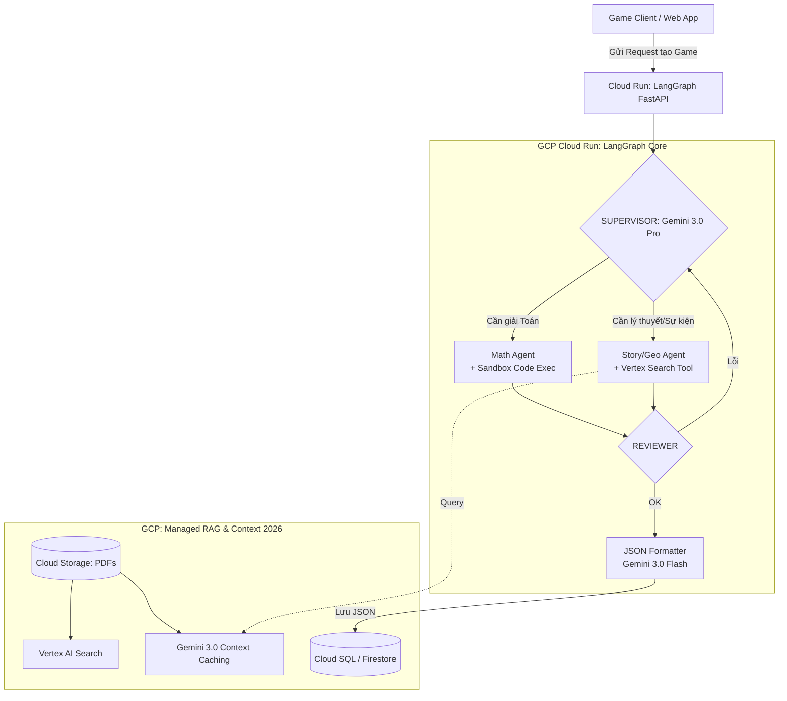

# Kiến trúc Cloud-Native: Hệ thống AI Tạo Game Giáo dục (Cập nhật 2026)

## 1. Đánh giá Tính khả thi (Feasibility Assessment 2026)

Vào thời điểm 2026, việc loại bỏ Local LLM và chuyển sang Cloud AI APIs là **tiêu chuẩn công nghiệp tuyệt đối** cho các startup AI, mang lại lợi thế vượt trội nhờ hệ sinh thái Agentic thế hệ mới:

- **Về Hạ tầng (Zero Infrastructure):** Không lo lỗi OOM (Out of Memory), không cần săn lùng GPU đắt đỏ. Các dịch vụ Serverless Cloud (Cloud Run) tự động scale từ 0 lên hàng nghìn request trong vài giây.
- **Về Ingestion (Xử lý tài liệu):** Các API thế hệ mới (Gemini 3.0, Claude 4) xử lý Native Multimodal xuất sắc. Không chỉ đọc hiểu biểu đồ, chúng có thể bóc tách tương quan không gian 3D và hiểu sâu các khái niệm vật lý/hóa học từ hình ảnh tĩnh mà không cần model phụ trợ.
- **Về Công cụ (Native Agentic Tools):** Lõi của LLM năm 2026 đã tích hợp sẵn tư duy Agent. Khả năng **Native Code Execution** (Tự chạy code Python bên trong API) nay đã đạt mức độ hoàn hảo, model có thể tự debug vòng lặp nhiều lần trước khi trả kết quả cuối cùng cho LangGraph.
- **Về Chi phí (Hyper Context Caching):** Việc cache một cuốn SGK vài nghìn trang vào RAM của Google/AWS nay có giá gần như bằng không (Zero-cost Caching cho các truy vấn lặp lại). LangGraph chỉ đóng vai trò điều phối luồng logic thay vì phải lo nhồi nhét RAG.

## 2. Lựa chọn Hệ sinh thái: GCP vs AWS (Tiêu chuẩn 2026)

Đối với bài toán **Giáo dục Đa phương tiện**, cả GCP và AWS đều trang bị những "vũ khí hạng nặng" của thế hệ AI 2026.

### Ưu tiên 1: Google Cloud Platform (GCP) - Khuyến nghị cho Đa phương tiện

- **Model:** **Gemini 3.0 Pro / Flash**.
- **Lý do chọn:** Dòng Gemini 3.0 sở hữu kiến trúc **Native Agentic**, tự động lập kế hoạch và chia nhỏ task ngay trong một prompt. Khả năng "Spatial & Video Understanding" cực mạnh giúp nó giải quyết hoàn hảo các bản đồ Địa lý hay sơ đồ Mạch điện Vật lý. Context Caching nay được lưu vĩnh viễn với chi phí siêu rẻ.
- **AI Search:** **Vertex AI Agent Builder**. Tự động parsing PDF, bóc tách cấu trúc và làm Grounding (chống bịa đặt dữ liệu) với Wikipedia/Google Search chuẩn xác.

### Ưu tiên 2: Amazon Web Services (AWS) - Khuyến nghị cho Logic/Toán

- **Model:** **Claude 4.0 Sonnet / Opus** (Thông qua Amazon Bedrock).
- **Lý do chọn:** Claude 4.0 sở hữu chế độ **Deep Continuous Thinking** (Tư duy sâu liên tục). Đây là đỉnh cao cho việc làm "Math Agent", model có thể tự nháp hàng nghìn dòng suy luận toán học, tự phản biện (self-critique) trước khi chốt đáp án định dạng JSON.
- **AI Search:** **Amazon Bedrock Knowledge Bases** tích hợp GraphRAG mặc định.

## 3. Kiến trúc Hệ thống Cloud-Native (GCP Reference 2026)

Sử dụng GCP làm ví dụ, kiến trúc sẽ là sự kết hợp của các Managed Services hiện đại nhất.

### A. Core Services (Các dịch vụ sử dụng)

1. **Orchestration (LangGraph):** Chạy trên **Google Cloud Run** (Serverless container). Đóng vai trò là hệ thần kinh trung ương.
2. **Bộ não LLM:** \* `Gemini 3.0 Pro` (Làm Supervisor, Giải Toán, Viết lách).
   - `Gemini 3.0 Flash` (Làm Reviewer, định dạng JSON - độ trễ tính bằng mili-giây, siêu rẻ).
3. **Kho Tri thức (RAG & Cache):** **Vertex AI Search** kết hợp **Gemini Context Caching**. Cuốn SGK được ném thẳng vào Cache, LangGraph chỉ việc query mà không cần setup Vector DB phức tạp.
4. **Math Tool:** Sử dụng tính năng **Advanced Code Execution** của Gemini 3.0 (tự động cài đặt thư viện phụ trợ như SymPy, NumPy trên sandbox để giải các bài toán đại số/giải tích phức tạp).
5. **Database:** Cloud SQL (PostgreSQL) hoặc Firestore (lưu JSON output của Game).

### B. Sơ đồ Luồng xử lý (LangGraph trên Cloud)

## 4. Giải quyết 4 Trụ cột bằng Cloud Services 2026

Sự phức tạp nay được giải quyết tự động hoàn toàn:

| **Nhóm Dữ liệu**            | **Giải pháp 2026 (Cloud - GCP/AWS)**                                                                                                                                                           |
| --------------------------- | ---------------------------------------------------------------------------------------------------------------------------------------------------------------------------------------------- |
| **Trực quan (Hình/Bản đồ)** | Ném thẳng file PDF/Ảnh vào API của **Gemini 3.0 Pro**. Model tự động nhận diện lớp layout, trích xuất text trong ảnh và hiểu bố cục không gian chuẩn xác 99.9%.                                |
| **Tường thuật (Văn/Sử)**    | Dùng **Dynamic Context Caching**. Cache toàn bộ bộ sách giáo khoa từ lớp 10-12. LangGraph chỉ việc prompt: "Dựa vào nội dung Lịch sử 12 trong cache, tạo 10 sự kiện dạng timeline".            |
| **Logic & Toán**            | Kích hoạt tính năng `tools=[{"code_execution": {"mode": "advanced"}}]` của Gemini. Model tự viết Python, import thư viện tính toán, tự chạy, tự bắt lỗi (try-catch) và lấy kết quả làm đáp án. |
| **Đóng gói JSON**           | Bật tính năng **Strict Structured Outputs** (JSON Schema cấp độ native). API cam kết trả về 100% đúng định dạng Pydantic khai báo, không bao giờ cần parse chuỗi thủ công.                     |

## 5. Ước tính Chi phí (Cost Estimation 2026)

Với sự cạnh tranh khốc liệt năm 2026, giá token đã chạm đáy, làm cho mô hình OpEx cực kỳ hấp dẫn:

- **Cloud Run (Host LangGraph):** ~$0 đến $10/tháng (Free tier của Google).
- **Gemini 3.0 Flash API:** Siêu rẻ, ~$0.01 - $0.03 / 1 triệu token. Dùng làm formatter và reviewer là gần như miễn phí.
- **Gemini 3.0 Pro API (Kèm Context Caching):**
  - Lưu trữ Cache: ~$0.25 / 1 triệu token / giờ lưu trữ.
  - Truy vấn vào Cache: Giảm 80% giá token so với gửi prompt thông thường (chỉ còn ~$0.30 / 1 triệu token).
  - _Ước tính:_ Sinh 1000 câu hỏi khó từ cuốn SGK dày cộp chỉ tốn khoảng **$1 - $3**.
- **Database (Cloud SQL/Firestore):** ~$10 - $20/tháng.

**=> Tổng chi phí MVP:** Dao động trong khoảng **$10 - $25/tháng**, cực kỳ lý tưởng cho một backend có độ tin cậy cấp doanh nghiệp.

## 6. Lộ trình Triển khai Cloud-First (2026 Roadmap)

### Tuần 1: Kiến trúc & PoC (Proof of Concept) trên Cloud

- Tạo tài khoản GCP, kích hoạt Vertex AI API.
- Upload 1 cuốn SGK (PDF) lên Cloud Storage, tạo **Context Cache** thông qua SDK của Gemini 3.0.
- Viết script Python test thử truy vấn vào Cache với độ trễ siêu thấp.

### Tuần 2: Xây dựng LangGraph với Gemini 3.0

- Dựng LangGraph ở máy Local, trỏ `LLM_PROVIDER` sang Gemini 3.0 Pro.
- Kích hoạt tool `Code Execution` nâng cao cho Node Math Agent.
- Dùng `with_structured_output(GameSchema)` của LangChain để ép kiểu JSON cho Node Structure Agent một cách hoàn hảo.

### Tuần 3: Reviewer & Graph Tuning

- Bổ sung luồng Feedback Loop: Dùng Gemini 3.0 Flash làm Reviewer Node để chấm điểm chéo các câu hỏi vừa tạo ra. Tận dụng khả năng phản hồi mili-giây của bản Flash để không làm chậm luồng tạo game.

### Tuần 4: Deploy & Kết nối Game Client

- Đóng gói LangGraph app thành Docker Image.
- Deploy lên GCP Cloud Run (Tích hợp CI/CD qua GitHub Actions).
- Cấu hình Firestore lưu JSON. Mở API endpoint cho Game Client gọi lấy câu hỏi.
